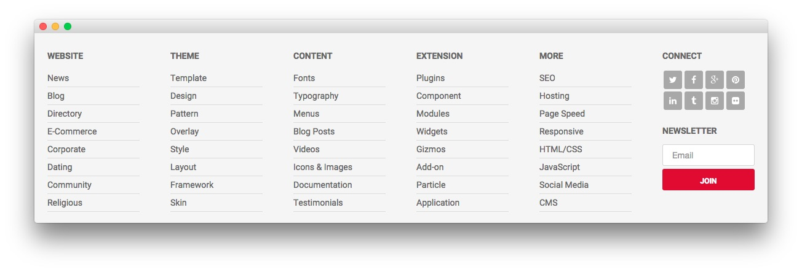

Footer Section
-----

:   1. **Text 1** [20%, 5%, se]
    2. **Text 2** [20%, 21%, se]
    3. **Text 3** [20%, 35%, se]
    4. **Text 4** [20%, 52%, se]
    5. **Text 5** [20%, 67%, se]
    6. **Text 6** [20%, 82%, se]
    7. **Text 7** [50%, 82%, se]

Here is the widget breakdown for the Footer section:

* [Text](#text-1)
* [Gantry Divider](#gantry-divider)
* [Text](#text-2)
* [Gantry Divider](#gantry-divider)
* [Text](#text-3)
* [Gantry Divider](#gantry-divider)
* [Text](#text-4)
* [Gantry Divider](#gantry-divider)
* [Text](#text-5)
* [Gantry Divider](#gantry-divider)
* [Text](#text-6)
* [Text](#text-7)

#### Text 1

This section of the page is a standard text widget. You will need to enter the following in the main text field.

~~~ .html
<ul>
    <li><a href="#">News</a></li>
    <li><a href="#">Blog</a></li>
    <li><a href="#">Directory</a></li>
    <li><a href="#">E-Commerce</a></li>
    <li><a href="#">Corporate</a></li>
    <li><a href="#">Dating</a></li>
    <li><a href="#">Community</a></li>
    <li><a href="#">Religious</a></li>
</ul>
~~~

Here is a breakdown of options changes you will want to make to match the demo.

| Option            | Setting                        |
| :-----            | :-----                         |
| Title             | `Website`                      |
| Custom Variations | `fp-footer-lists hidden-phone` |

Leaving everything else at its default setting, select **Save**.

#### Gantry Divider

This widget tells WordPress to start a new widget column beginning with the widget placed directly below the divider in the section.

#### Text 2

This section of the page is a standard text widget. You will need to enter the following in the main text field.

~~~ .html
<ul>
    <li><a href="#">Template</a></li>
    <li><a href="#">Design</a></li>
    <li><a href="#">Pattern</a></li>
    <li><a href="#">Overlay</a></li>
    <li><a href="#">Style</a></li>
    <li><a href="#">Layout</a></li>
    <li><a href="#">Framework</a></li>
    <li><a href="#">Skin</a></li>
</ul>
~~~

Here is a breakdown of options changes you will want to make to match the demo.

| Option            | Setting                        |
| :-----            | :-----                         |
| Title             | `Theme`                        |
| Custom Variations | `fp-footer-lists hidden-phone` |

Leaving everything else at its default setting, select **Save**.

#### Text 3

This section of the page is a standard text widget. You will need to enter the following in the main text field.

~~~ .html
<ul>
    <li><a href="#">Fonts</a></li>
    <li><a href="#">Typography</a></li>
    <li><a href="#">Menus</a></li>
    <li><a href="#">Blog Posts</a></li>
    <li><a href="#">Videos</a></li>
    <li><a href="#">Icons & Images</a></li>
    <li><a href="#">Documentation</a></li>
    <li><a href="#">Testimonials</a></li>
</ul>
~~~

Here is a breakdown of options changes you will want to make to match the demo.

| Option            | Setting                        |
| :-----            | :-----                         |
| Title             | `Content`                      |
| Custom Variations | `fp-footer-lists hidden-phone` |

Leaving everything else at its default setting, select **Save**.

#### Text 4

This section of the page is a standard text widget. You will need to enter the following in the main text field.

~~~ .html
<ul>
    <li><a href="#">Plugins</a></li>
    <li><a href="#">Component</a></li>
    <li><a href="#">Modules</a></li>
    <li><a href="#">Widgets</a></li>
    <li><a href="#">Gizmos</a></li>
    <li><a href="#">Add-on</a></li>
    <li><a href="#">Particle</a></li>
    <li><a href="#">Application</a></li>
</ul>
~~~

Here is a breakdown of options changes you will want to make to match the demo.

| Option            | Setting                        |
| :-----            | :-----                         |
| Title             | `Extension`                    |
| Custom Variations | `fp-footer-lists hidden-phone` |

Leaving everything else at its default setting, select **Save**.

#### Text 5

This section of the page is a standard text widget. You will need to enter the following in the main text field.

~~~ .html
<ul>
    <li><a href="#">SEO</a></li>
    <li><a href="#">Hosting</a></li>
    <li><a href="#">Page Speed</a></li>
    <li><a href="#">Responsive</a></li>
    <li><a href="#">HTML/CSS</a></li>
    <li><a href="#">JavaScript</a></li>
    <li><a href="#">Social Media</a></li>
    <li><a href="#">CMS</a></li>
</ul>
~~~

Here is a breakdown of options changes you will want to make to match the demo.

| Option            | Setting                        |
| :-----            | :-----                         |
| Title             | `More`                         |
| Custom Variations | `fp-footer-lists hidden-phone` |

Leaving everything else at its default setting, select **Save**.

#### Text 6

This section of the page is a standard text widget. You will need to enter the following in the main text field.

~~~ .html

    <a href="#" class="social-button">
        
    </a>        
    <a href="#" class="social-button">
        
    </a>        
    <a href="#" class="social-button">
        
    </a>        
    <a href="#" class="social-button">
        
    </a>
    <a href="#" class="social-button">
        
    </a>        
    <a href="#" class="social-button">
        
    </a>        
    <a href="#" class="social-button">
        
    </a>        
    <a href="#" class="social-button">
        
    </a>        
    

~~~

Here is a breakdown of options changes you will want to make to match the demo.

| Option            | Setting       |
| :-----            | :-----        |
| Title             | `Connect`     |
| Custom Variations | `fp-footer-f` |

Leaving everything else at its default setting, select **Save**.

#### Text 7

This section of the page is a standard text widget. You will need to enter the following in the main text field.

~~~ .html
<form class="fp-bottom-form" onsubmit="window.open('http://feedburner.google.com/fb/a/mailverify?uri=rocketthemeblog', 'popupwindow', 'scrollbars=yes,width=550,height=520');return true" target="popupwindow" method="post" action="http://feedburner.google.com/fb/a/mailverify">
    <input type="text" name="email" class="inputbox" placeholder="Email" />
    <input type="hidden" name="uri" value="rocketthemeblog" />
    <input type="hidden" value="en_US" name="loc" />
    <input type="submit" value="Join" class="readon" name="Submit" />
</form>

<!--
We will not spam you. You can unsubscribe at anytime.
-->
~~~

Here is a breakdown of options changes you will want to make to match the demo.

| Option            | Setting                       |
| :-----            | :-----                        |
| Title             | `Connect`                     |
| Widget Variations | No Padding Top, No Margin Top |
| Custom Variations | `fp-footer-f`                 |

Leaving everything else at its default setting, select **Save**.