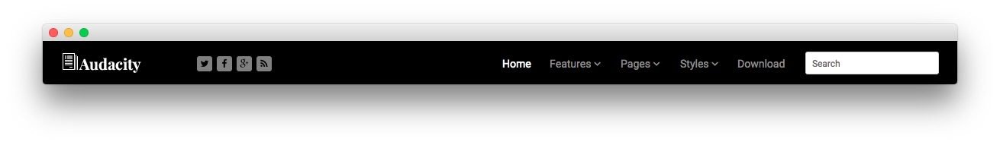

Header Section
-----

:   1. **Gantry Logo** [40%, 5%, se]
    2. **Gantry Social Buttons** [40%, 20%, se]
    3. **Gantry Menu** [40%, 50%, se]
    4. **RokAjaxSearch** [40%, 80%, se]

Here is the widget breakdown for the Header section:

* [Gantry Logo](#gantry-logo)
* [Gantry Divider](#gantry-divider)
* [Gantry Social Buttons](#gantry-social-buttons)
* [Gantry Divider](#gantry-divider)
* [Gantry Menu](#gantry-menu)
* [Gantry Divider](#gantry-divider)
* [RokAjaxSearch](#rokajaxsearch)

#### Gantry Logo

The first thing you will need to do is click and drag the **Gantry Logo** widget from the **Available Widgets** area of the Widgets menu to the appropriate section. Once this is done, the logo should appear in as it does in the demo. You can further customize this logo by following the instructions in our [FAQ](faq.md).

#### Gantry Divider

This widget tells WordPress to start a new widget column beginning with the widget placed directly below the divider in the section.

#### Gantry Social Buttons

The Gantry Social Buttons widget creates a set of social buttons on the top of the page. Filling this out is fairly straightforward. Once you have clicked and dragged the **Gantry Social Buttons** widget in place, you will want to add your various social URLs to their respective fields. Once this is done, simply hit **Save** and check the site.

Here is a breakdown of the settings we used:

| Field       | Setting                                          |
| :---------- | :----------                                      |
| Icon 1      | `fa fa-twitter`                                  |
| Text 1      |                                                  |
| Link 1      | `https://twitter.com/rockettheme`                |
| Icon 2      | `fa fa-facebook`                                 |
| Text 2      |                                                  |
| Link 2      | `https://www.facebook.com/RocketTheme`           |
| Icon 3      | `fa fa-google-plus`                              |
| Text 3      |                                                  |
| Link 3      | `https://plus.google.com/+rockettheme`           |
| Icon 4      | `fa fa-rss`                                      |
| Text 4      |                                                  |
| Link 4      | `http://www.rockettheme.com/product-updates?rss` |

#### Gantry Menu

The Gantry Menu widget should be set to match your site's main menu as it serves as the primary menu widget for the entire site. You can customize this menu by navigating to **Administration -> Appearance -> Menus** and creating or modifying your selected menu there.

Here is a breakdown of the widget options for this menu widget. Any options not present in this breakdown are left at default and should not be adjusted.

| Option            | Setting      |  
| :---------------- | :----------- |  
| Menu              | Main Menu    |  
| Menu Theme        | Dropdown     |  
| SplitMenu Style   | Sidebar Menu |  
| Limit Levels      | No           |  
| Start Level       | 0            |  
| End Level         | 0            |  
| Show All Children | Yes          |  
| Show Empty Menu   | No           |  
| Maximum Depth     | 10           |  
| Custom Chrome     | Menu         |  

#### RokAjaxSearch

The RokAjaxSearch widget allows users to search your site for interesting content. Here is a breakdown of the options you will want to change to match the demo.

| Option            | Setting                         |
| :-----            | :-----                          |
| Custom Variations | `fp-rokajaxsearch hidden-phone` |

Leaving everything else at its default setting, select **Save**.
