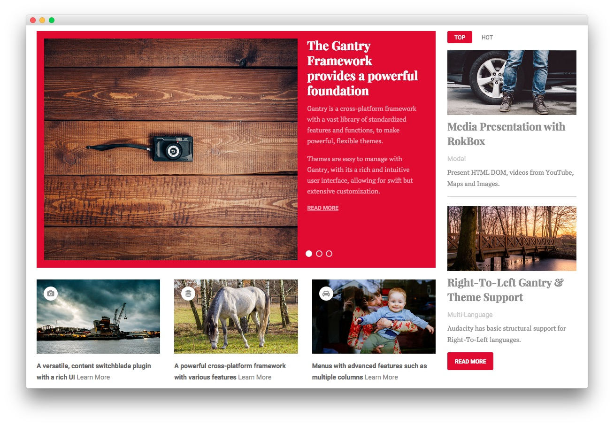

Main Top Section
-----

:   1. **RokSprocket (Features)** [9%, 7%, se]
    2. **Text** [67%, 7%, se]
    3. **RokSprocket (Tabs)** [9%, 73%, se]

Here is the widget breakdown for the Main Top section:

* [RokSprocket (Features)](#roksprocket-(features))
* [Text](#text)
* [Gantry Divider](#gantry-divider)
* [RokSprocket (Tabs)](#roksprocket-(tabs))

#### RokSprocket (Features)

This area of the demo is a RokSprocket widget. You will need to do two things to prepare this widget so that it looks similar to the one in the demo.

First, you will need to create the RokSprocket Widget. You can do this by navigating to **Administration -> RokSprocket Admin** and creating a new **Features** widget.

You can find out more about RokSprocket and how to set up and modify widgets by visiting our [RokSprocket documentation](../../plugins/roksprocket).

##### Simple Provider

We used the **Simple Provider** to enable us to create custom RokSprocket content without having to create separate articles or pages to do so. Here are the details of one of the **Simple Items** in the **Featured Article List**.

| Option | Setting |
| :----- | :-----  |
| Image  | Custom  |
| Link   | Custom  |

**Title**

~~~ .html
The Gantry Framework provides, a powerful foundation
~~~

**Description**

~~~ .html

Gantry is a cross-platform framework with a vast library of standardized features and functions, to make powerful, flexible themes.

Themes are easy to manage with Gantry, with its a rich and intuitive user interface, allowing for swift but extensive customization.

~~~

Here is a look at the **Features Layout Options** for this widget.

| Option           | Setting        |
| :--------------- | :------------- |
| Display Limit    | ∞              |
| Theme            | Showcase       |
| Article Titles   | Show           |
| Article Text     | Show           |
| Preview Length   | ∞              |
| Strip HTML Tags  | No             |
| Arrow Navigation | Hide           |
| Pagination       | Show           |
| Animation        | Crossfade      |
| Autoplay         | Disable        |
| Autoplay Delay   | 5              |
| Image Resize     | Disable        |

You can set the RokSprocket filters to include any category, specific articles, or otherwise you would like to have featured in this widget.

Once you have created this widget, you can add it via the Widgets menu by clicking **RokSprocket** and dragging it to the appropriate section. When you have done this, you will need to return to the Widgets settings and fill them out as noted below:

| Option            | Setting                                          |
| :---------------- | :----------------------------------------------- |
| Choose Widget     | (Select the RokSprocket Widget You Just Created) |
| Widget Variations | Box 1                                            |
| Custom Variations | `fp-roksprocket-showcase-maintop`                |

Leaving everything else at its default setting, select **Save**.

#### Text

This section of the page is a standard text widget. You will need to enter the following in the main text field.

~~~ .html

    

        

            

                
                <i class="fa fa-camera"></i>
            

            
A versatile, content switchblade plugin with a rich UI <a class="learnmore" href="#">Learn More</a>

        

    

    

        

            

                
                <i class="fa fa-database"></i>
            

            
A powerful cross-platform framework with various features <a class="learnmore" href="#">Learn More</a>

        

    

    

        

            

                
                <i class="fa fa-car"></i>
            

            
Menus with advanced features such as multiple columns <a class="learnmore" href="#">Learn More</a>

        

    
      
    

~~~

Here is a breakdown of options changes you will want to make to match the demo.

| Option            | Setting        |
| :---------------- | :---------     |
| Custom Variations | `fp-maintop-a` |

Leaving everything else at its default setting, select **Save**.

#### Gantry Divider

This widget tells WordPress to start a new widget column beginning with the widget placed directly below the divider in the section.

#### RokSprocket Tabs

You will need to do two things to prepare this widget so that it looks similar to the one in the demo.

First, you will need to create the RokSprocket Widget. You can do this by navigating to **Administration -> RokSprocket Admin** and creating a new **Tabs** widget.

You can find out more about RokSprocket and how to set up and modify widgets by visiting our [RokSprocket documentation][roksprocket].

**Simple Content Provider**

We used the **Simple** Content Provider to allow us to make custom tabs without having to build posts on the back-end. In this case, the **Tab Label**, **Link**, and **Description** are custom, while the other options are left at default or **None** settings. You will find the settings used in one of these items below.

| Option    | Setting |
| :-----    | :-----  |
| Tab Label | `Top`   |
| Icon      | None    |
| Link      | Custom  |

*Description*

~~~ .html

    

    <h2 class="title">Media Presentation
    with RokBox</h2>

    
Modal

    
Present HTML DOM, videos from YouTube, Maps and
    Images.

    

    <h2 class="title">Right-To-Left Gantry &amp;
    Theme Support</h2>

    
Multi-Language

    
Audacity has basic structural
    support for Right-To-Left languages.

~~~

Here is a look at the **Tabs Layout Options** for this widget.

| Option          | Setting        |
| :-------------- | :------------  |
| Theme           | Default        |
| Display Limit   | ∞              |
| Tabs Position   | Top            |
| Animation       | Slide and Fade |
| Autoplay        | Disable        |
| Autoplay Delay  | 5              |
| Image Resize    | Disable        |
| Preview Length  | 0              |
| Strip HTML Tags | No             |

You can set the RokSprocket filters to include any category, specific articles, or otherwise you would like to have featured in this widget.

Once you have created this widget, you can add it via the Widgets menu by clicking **RokSprocket** and dragging it to the appropriate section. When you have done this, you will need to return to the Widgets settings and fill them out as noted below:

|       Option      |                     Setting                      |
| :---------------- | :----------------------------------------------- |
| Choose Widget     | (Select the RokSprocket Widget You Just Created) |
| Custom Variations | `fp-roksprocket-tabs-maintop`                  |

Leaving everything else at its default setting, select **Save**.