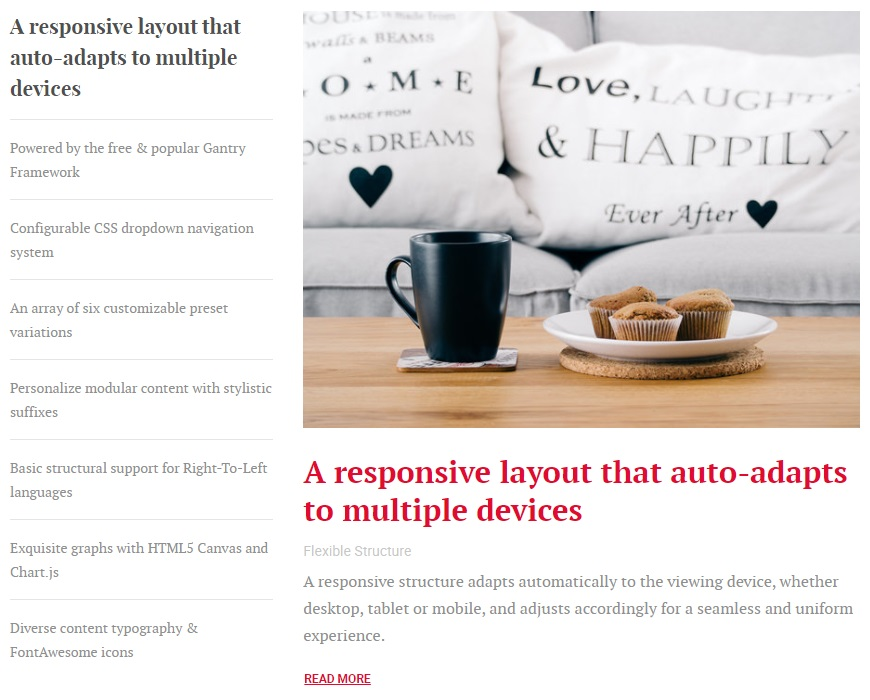
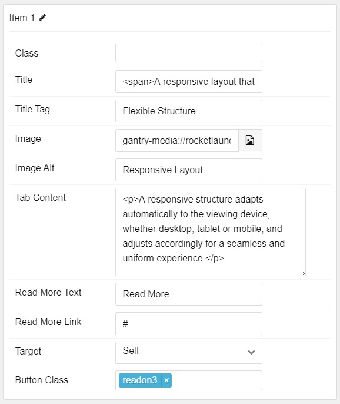

## Introduction

The **Feature Tabs** particle lets you display an abundance of different categories of featured content in a small space using tab navigation.

Here are the topics covered in this guide:

* [Configuration](#configuration)
  * [Main Options](#main-options)
  * [Item Options](#item-options)

## Configuration

### Main Options

These options affect the main area of the particle, and not the individual items within.

| Option         | Description                                                                     |
|:-------------- |:------------------------------------------------------------------------------- |
| CSS Classes    | Set the CSS class(es) you would like to have apply at the particle level.       |
| Title          | Enter the title of the particle you would like to have appear on the front end. |

### Item Options

These items make up the individual featured items in the particle.

| Option         | Description                                                             |
| :------------  | :--------------------------------------------------------               |
| Name           | This is the name of the tab, appearing on the front end.                |
| Class          | Enter any CSS class(es) you want to apply to the item as a whole.       |
| Title          | Enter a title for the item.                                             |
| Title Tag      | Enter a tag to appear under the title when the tab is expanded.         |
| Image          | Enter an image for the item.                                            |
| Image Alt      | Enter alt text for the image.                                           |
| Tab Content    | Enter content for the item.                                             |
| Read More Text | Enter text to appear in the read more button.                           |
| Read More Link | Enter a URL the icon will send visitors to.                             |
| Target         | Select the window the icon link opens in.                               |
| Button Class   | Enter any CSS class(es) you wish to have apply to the Read More button. |
