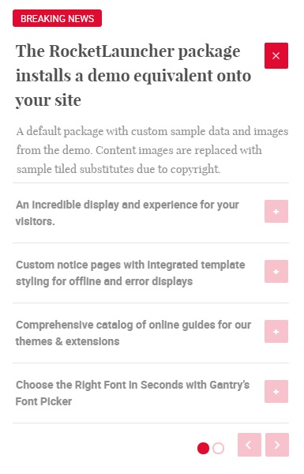

 ---
title: Audacity: Lists Particle
description: Your Guide to Using Particles in Audacity for WordPress
breadcrumb: /wordpress:WordPress/!themes:Themes/audacity:Audacity

---

## Introduction

The **Lists** particle displays a series of text blocks in a list, enabling visitors to expand and compress individual items as they navigate without taking up too much layout space.

Here are the topics covered in this guide:

* [Configuration](#configuration)
    - [Main Options](#main-options)
    - [Item Options](#item-options)

## Configuration

### Main Options

These options affect the main area of the particle, and not the individual items within.

| Option              | Setting                                                               |
| :-----              | :-----                                                                |
| Particle Name       | The name of the particle for organizational use in the backend.       |
| CSS Classes         | CSS Class(es) you would like to have apply to the particle's content. |
| Title               | Title of the particle as it will appear on the front end.             |
| Description         | A text description to appear on the front end for the particle.       |
| Display at Once     | Set the number of items to display at one time.                       |
| Collapsible Preview | Enable or Disable collapsible preview.                                |
| Prev Next           | Enable or Disable the Prev/Next Buttons.                              |
| Dots                | Enable or Disable navigation dots.                                    |
| Autoplay            | **Enable** or **Disable** autoplay for the particle.                  |
| Autoplay Speed      | Set the speed (in milliseconds) of the particle's animation.          |
| Pause on Hover      | **Enable** or **Disable** the pause-on-hover effect for the particle. |

### Item Options

These items make up the individual featured items in the particle.

| Option         | Description                                                               |
|:-------------- |:------------------------------------------------------------------------- |
| Name           | Enter a name for your item. This only appears on the back end.            |
| Title          | Enter a title for the item.                                               |
| Description    | Enter a description for the item.                                         |
