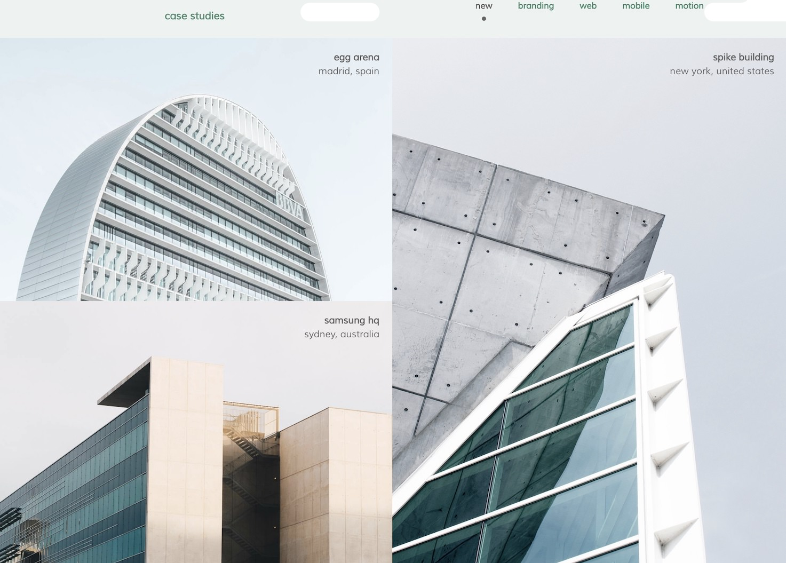
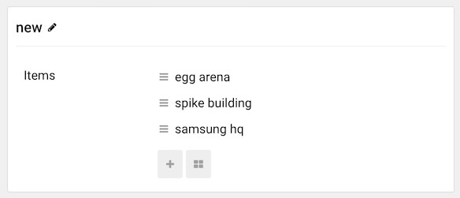

## Introduction

The **Case Studies** particle is an excellent particle for displaying image content in a clean, modern way.

Here are the topics covered in this guide:

* [Configuration](#configuration)
    - [Main Options](#main-options)
    - [Item Options](#item-options)

## Configuration

### Main Options 

These options affect the main area of the particle, and not the individual items within. You can set the title of the particle, as well as give it an introductory paragraph here.

| Option       | Description                                                               |
| :-----       | :-----                                                                    |
| CSS Classes  | Set the CSS class(es) you would like to have apply at the particle level. |
| Title        | Enter a title for the particle that appears on the front end.             |
| Grid Columns | Select a number of columns to display.                                    |

The items in this section create categories with the names assigned to the items. Sub-items include individual images in these categories.

### Item Options

These items make up the individual featured items in the particle.

| Option    | Description                                               |
| :-----    | :-----                                                    |
| Item Name | Enter a title for the item that appears on the front end. |
| Image     | Select an image.                                          |
| Title     | Enter title text.                                         |
| URL       | Enter a URL you wish to have the item link to.            |
| Target    | Choose a target tab for the URL.                          |
