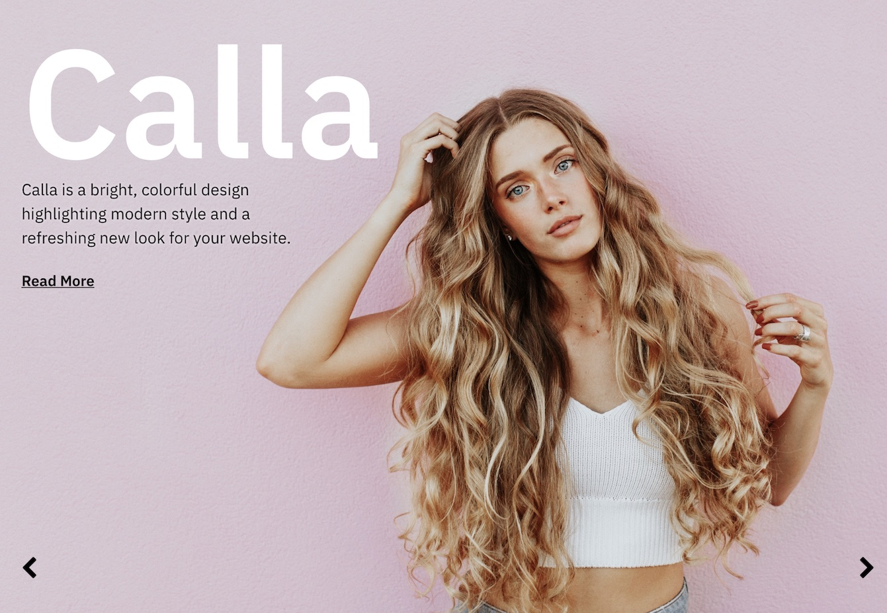
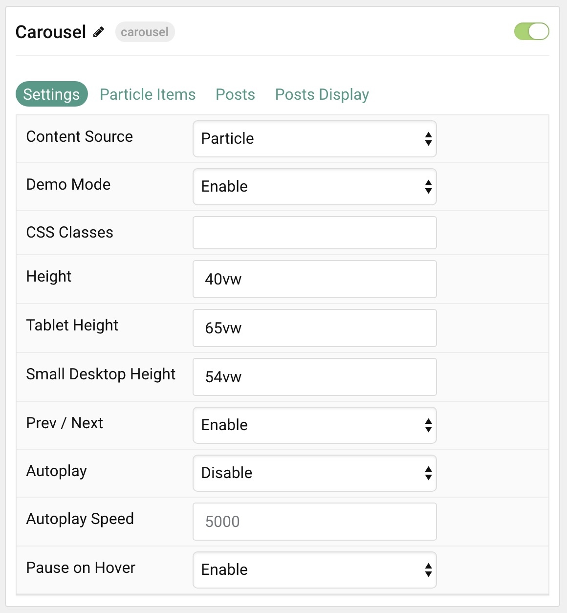
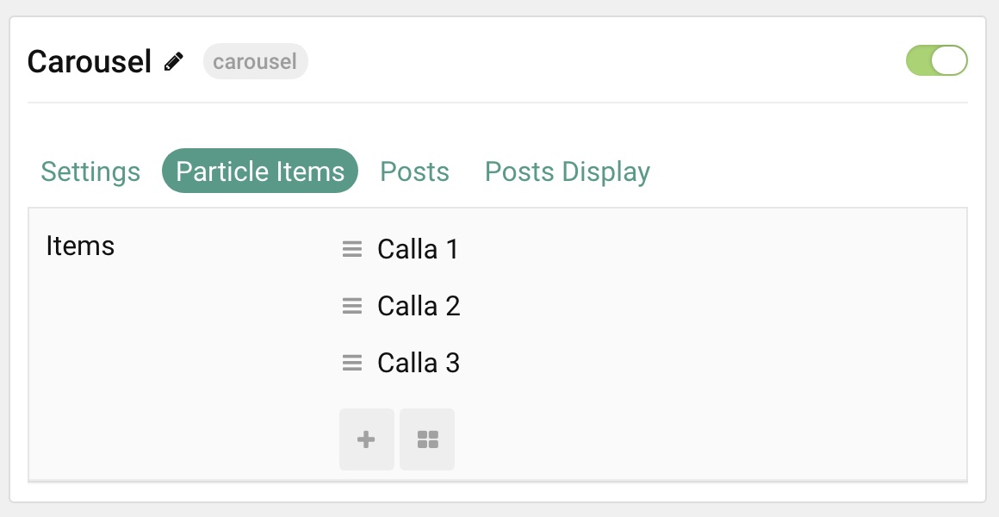
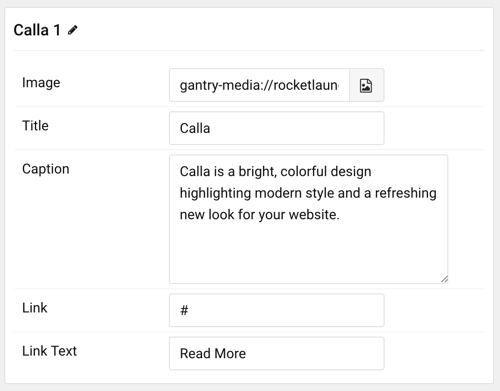
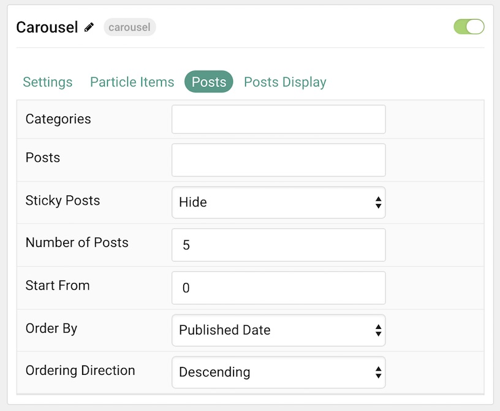
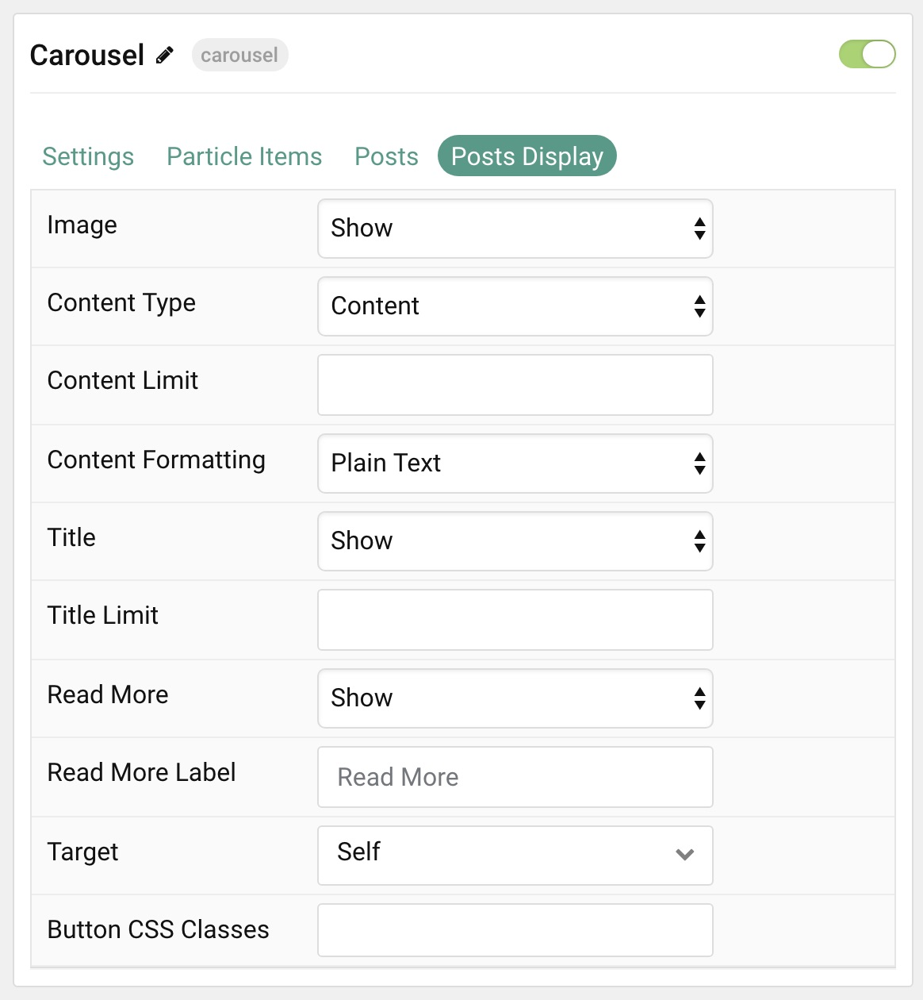

## Introduction

The **Carousel** particle displays images in a side-scrolling carousel that can be easily dragged left or right by touch or with a click of the mouse. This particle enables you to populate content either manually or directly from the CMS.

The background found in the instance on the front page of our demo is set in the **Styles** area of the Gantry 5 Administrator. Simply navigate to the **Bottom** section and choose a new background image. Items have their own individual images set in the particle settings below.

Here are the topics covered in this guide:

* [Configuration](#configuration)
    - [Main Options](#settings)
    - [Item Options](#particle-item-options)
    - [Posts](#posts)
    - [Display](#display)

## Configuration

### Settings 

These options affect the main area of the particle, and not the individual items within. You can set the title of the particle, as well as give it an introductory paragraph here.

| Option               | Description                                                                                             |
| :-----               | :-----                                                                                                  |
| Particle Name        | This is the name of the particle used for back end management. It does not appear on the front end.     |
| Content Source       | Choose between **Particle** and **WordPress** as the Content Source.                                    |
| Demo Mode            | **Enables** or **Disables** Demo Mode. If enabled the preset number will be synced with the set number. |
| CSS Classes          | Enter any CSS class(es) you wish to have apply to the particle.                                         |
| Height               | Enter a height for the particle.                                                                        |
| Tablet Height        | Enter a height for the particle to appear on tablets.                                                   |
| Small Desktop Height | Enter a height for the particle to appear on smaller desktop browsers.                                  |
| Prev / Next          | **Enable** or **Disable** the prev / next navigation.                                                   |
| Autoplay             | **Enable** or **Disable** autoplay.                                                                     |
| Autoplay Speed       | Enter (in milliseconds) the delay between automatic switching between items.                            |
| Pause on Hover       | **Enable** or **Disable** pausing of autoplay on hover.                                                 |

### Particle Item Options

These items make up the individual featured items in the particle. Items in this section will only appear if **Particle** is selected as the **Content Source**.

| Option    | Description                                                      |
| :-----    | :-----                                                           |
| Item Name | This is the name of the item. This only appears in the back end. |
| Image     | Set an image to appear in the item.                              |
| Title     | Enter a title for the item.                                      |
| Caption   | Enter a text caption for the item.                               |
| Link      | Enter a URL you would like the item to link to.                  |
| Target    | Choose the target tab you would like the URL to open to.         |

### Posts

| Option             | Description                                                                            |
| :-----             | :-----                                                                                 |
| Categories         | Select the categories of posts this particle will display.                             |
| Posts              | Select the number of posts you would like the particle to fetch.                       |
| Sticky Posts       | Choose how Sticky Posts should be displayed. Choose between **Hide** or **Show**.      |
| Number of Posts    | Enter the maximum number of posts to display.                                          |
| Start From         | Enter offset specifying the first post to return. The default is '0' (the first post). |
| Order By           | Choose the type of factor to order by.                                                 |
| Ordering Direction | Choose between **Ascending** and **Descending** as the post ordering method.           |

### Display

This section configures how posts are displayed.

| Option             | Description                                                                                        |
| :-----             | :-----                                                                                             |
| Image              | Display the image assigned to the post's **Featured Image**. Choose between **Hide** and **Show**. |
| Content Type       | Choose between **Content**, **Exerpt**, and **Hide**.                                              |
| Content Limit      | Set a limit (in characters) for the article text displayed.                                        |
| Content Formatting | Choose between **HTML** and **Plain Text** formatting for the post's text.                         |
| Title              | **Show** or **Hide** the post's title.                                                             |
| Title Limit        | Enter the maximum number of characters in the title to display.                                    |
| Read More          | **Show** or **Hide** the Read More link.                                                           |
| Read More Label    | Enter a text label to appear as the read more link                                                 |
| Target             | Set a target window for the read more link.                                                        |
| Button CSS Classes | Enter any CSS Class(es) to apply to the items.                                                     |
