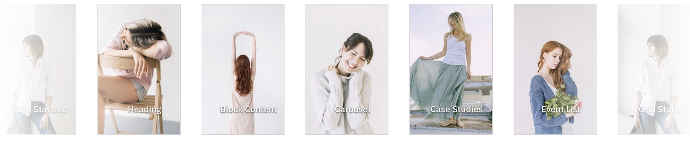
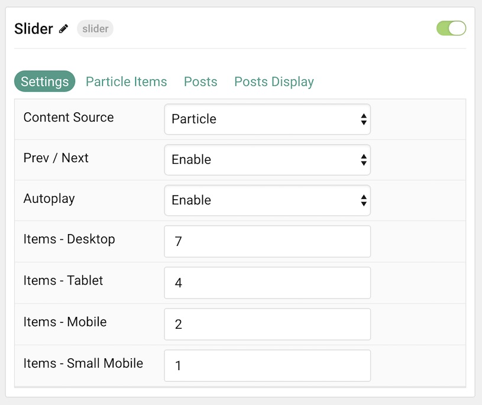
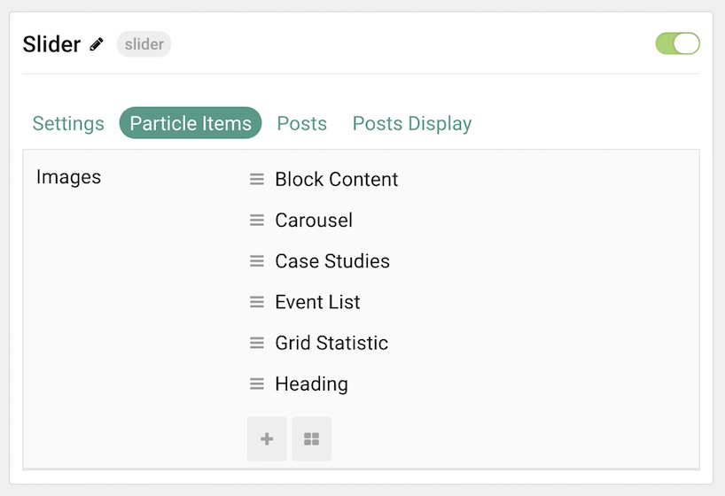
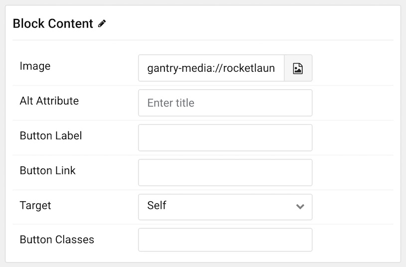
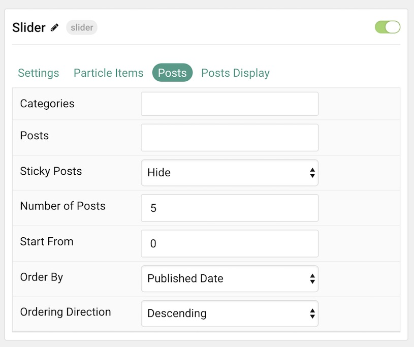
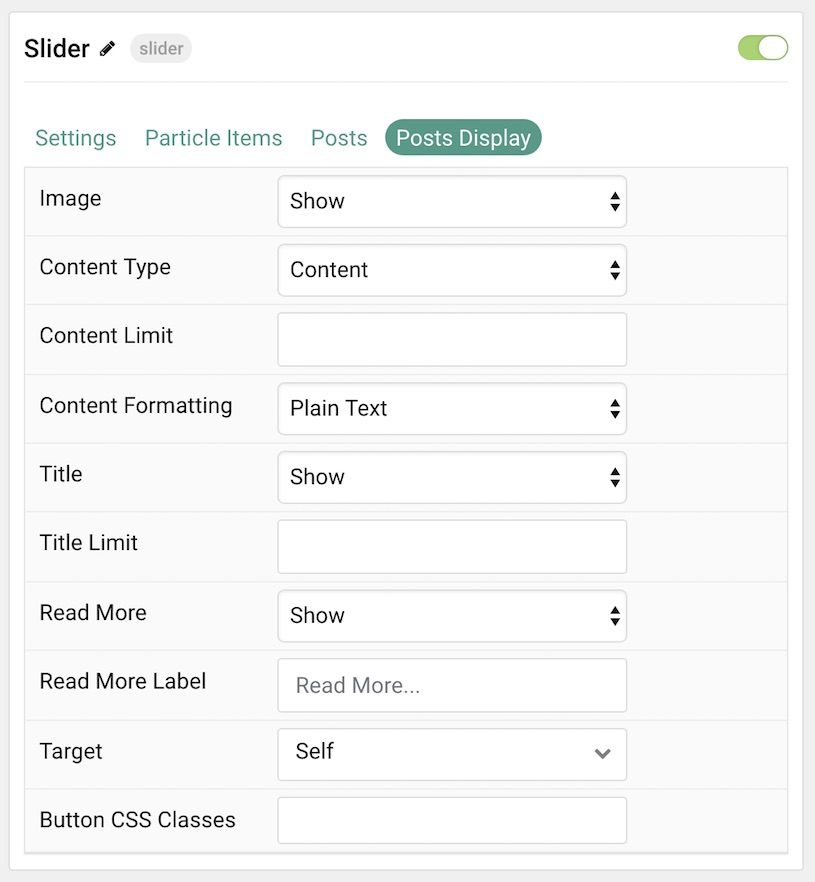

## Introduction

The **Slider** particle is a great way to display images in your website.

Here are the topics covered in this guide:

* [Configuration](#configuration)
    - [Main Options](#settings)
    - [Item Options](#particle-item-options)
    - [Posts](#articles)
    - [Display](#display)

## Configuration

### Settings 

These options affect the main area of the particle, and not the individual items within.

| Option               | Description                                                                                         |
| :-----               | :-----                                                                                              |
| Particle Name        | This is the name of the particle used for back end management. It does not appear on the front end. |
| Content Source       | Choose between **Particle** and **WordPress** as the Content Source.                                   |
| Prev / Next          | **Enable** or **Disable** the prev / next navigation.                                               |
| Autoplay             | **Enable** or **Disable** autoplay.                                                                 |
| Items - Desktop      | Select the number of items to display on a Desktop browser.                                         |
| Items - Tablet       | Select the number of items to display on a Tablet browser.                                          |
| Items - Mobile       | Select the number of items to display on a Mobile browser.                                          |
| Items - Small Mobile | Select the number of items to display on a Small Mobile browser.                                    |

### Particle Item Options

These items make up the individual featured items in the particle. Items in this section will only appear if **Particle** is selected as the **Content Source**.

| Option    | Description                                                      |
| :-----    | :-----                                                           |
| Item Name | This is the name of the item. This only appears in the back end. |
| Icon      | Select a Font Awesome icon for the item.                         |
| Caption   | Enter a text caption for the item.                               |
| Link      | Enter a URL you would like the item to link to.                  |
| Target    | Choose the target tab you would like the URL to open to.         |

### Posts

| Option             | Description                                                                            |
| :-----             | :-----                                                                                 |
| Categories         | Select the categories of posts this particle will display.                             |
| Posts              | Select the number of posts you would like the particle to fetch.                       |
| Sticky Posts       | Choose how Sticky Posts should be displayed. Choose between **Hide** or **Show**.      |
| Number of Posts    | Enter the maximum number of posts to display.                                          |
| Start From         | Enter offset specifying the first post to return. The default is '0' (the first post). |
| Order By           | Choose the type of factor to order by.                                                 |
| Ordering Direction | Choose between **Ascending** and **Descending** as the post ordering method.           |

### Display

This section configures how posts are displayed.

| Option             | Description                                                                                        |
| :-----             | :-----                                                                                             |
| Image              | Display the image assigned to the post's **Featured Image**. Choose between **Hide** and **Show**. |
| Content Type       | Choose between **Content**, **Exerpt**, and **Hide**.                                              |
| Content Limit      | Set a limit (in characters) for the post text displayed.                                        |
| Content Formatting | Choose between **HTML** and **Plain Text** formatting for the post's text.                         |
| Title              | **Show** or **Hide** the post's title.                                                             |
| Title Limit        | Enter the maximum number of characters in the title to display.                                    |
| Read More          | **Show** or **Hide** the Read More link.                                                           |
| Read More Label    | Enter a text label to appear as the read more link                                                 |
| Target             | Set a target window for the read more link.                                                        |
| Button CSS Classes | Enter any CSS Class(es) to apply to the items.                                                     |