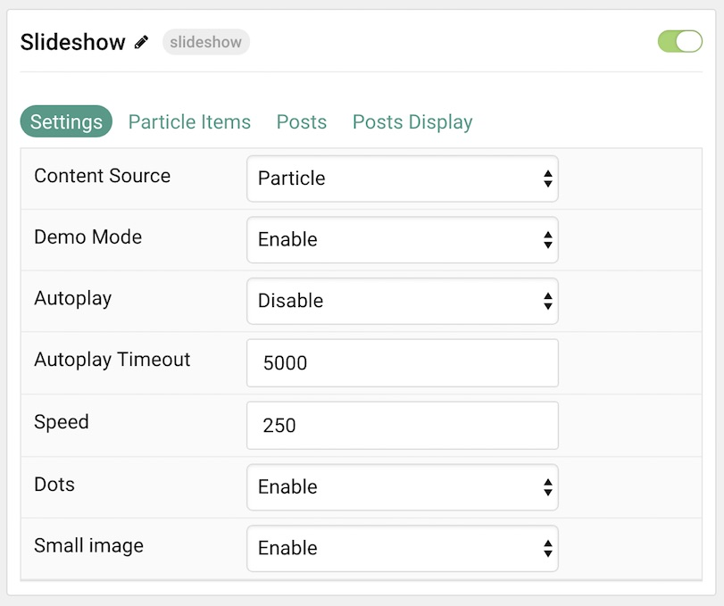
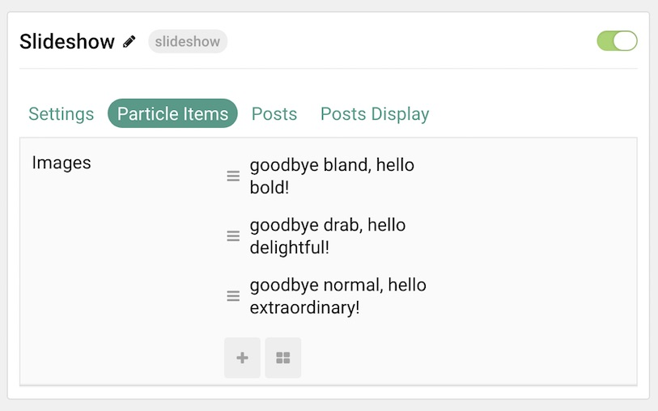
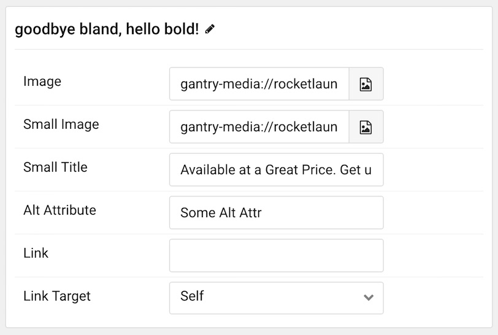
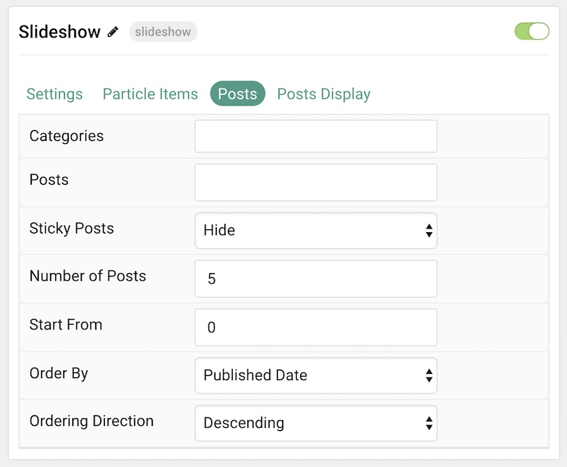
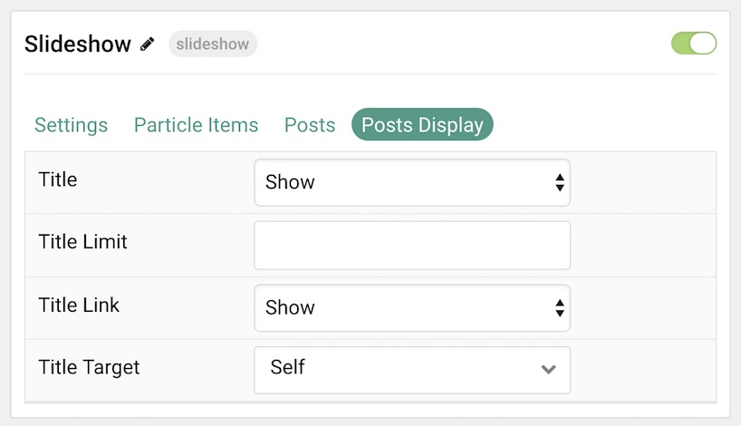

## Introduction

The **Slideshow** particle creates beautiful image slideshows that work perfectly at the top of your page.

Here are the topics covered in this guide:

* [Configuration](#configuration)
    - [Main Options](#settings)
    - [Item Options](#particle-item-options)
    - [Posts](#posts)
    - [Display](#display)

## Configuration

### Settings 

These options affect the main area of the particle, and not the individual items within. You can set the title of the particle, as well as give it an introductory paragraph here.

| Option           | Description                                                                                             |
| :-----           | :-----                                                                                                  |
| Particle Name    | This is the name of the particle used for back end management. It does not appear on the front end.     |
| Demo Mode        | **Enables** or **Disables** Demo Mode. If enabled the preset number will be synced with the set number. |
| Autoplay         | **Enable** or **Disable** autoplay for hte particle.                                                    |
| Autoplay Timeout | Set the time (in milliseconds) between slides in autoplay mode.                                         |
| Speed            | Set the transition speed (in milliseconds).                                                             |
| Dots             | **Enable** or **Disable** dots navigation.                                                              |
| Small Image      | **Enable** or **Disable** the use of a small image that sits secondary to the main image in each item.  |

### Particle Item Options

These items make up the individual featured items in the particle. Items in this section will only appear if **Particle** is selected as the **Content Source**.

| Option        | Description                                                                            |
| :-----        | :-----                                                                                 |
| Item Name     | This is the name of the item. This becomes the headline for the item on the front end. |
| Image         | Set an image for the item. This is the main image.                                     |
| Small Image   | Set a small image that appears alongside the item (if enabled).                        |
| Small Title   | Enter a title that appears with the small image.                                       |
| Alt Attribute | Enter an alt attribute for the slideshow image.                                        |
| Link          | Enter a link for the image to send users to.                                           |
| Link Target   | Enter a target window for the link.                                                    |

### Posts

| Option             | Description                                                                            |
| :-----             | :-----                                                                                 |
| Categories         | Select the categories of posts this particle will display.                             |
| Posts              | Select the number of posts you would like the particle to fetch.                       |
| Sticky Posts       | Choose how Sticky Posts should be displayed. Choose between **Hide** or **Show**.      |
| Number of Posts    | Enter the maximum number of posts to display.                                          |
| Start From         | Enter offset specifying the first post to return. The default is '0' (the first post). |
| Order By           | Choose the type of factor to order by.                                                 |
| Ordering Direction | Choose between **Ascending** and **Descending** as the post ordering method.           |

### Display

This section configures how articles are displayed.

| Option       | Description                                                     |
| :-----       | :-----                                                          |
| Title        | **Show** or **Hide** the post's title.                          |
| Title Limit  | Enter the maximum number of characters in the title to display. |
| Title Link   | **Show** or **Hide** the title link.                            |
| Title Target | Set a target window for the title link.                         |
