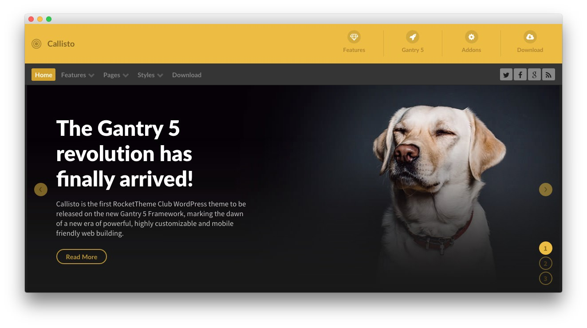

Introduction
-----

Callisto is the first RocketTheme WordPress Club theme to be released on the new Gantry 5 Framework, marking the dawn of a new era of powerful, highly customizable and mobile friendly web building, and complemented by a vibrant, engaging visual design.

New to Gantry 5?
-----
If you are new to Gantry 5, a good place to start would be our [dedicated Gantry documentation](http://docs.gantry.org).

Requirements
-----
* Apache 2.2+ or Microsoft IIS 7
* PHP 7.1+ 
* MySQL 5.1+
* WordPress 4.2.1+

>> NOTE: Gantry v5.1.0+ is required for Callisto to work correctly. For more details on the Gantry Framework, please visit its [Dedicated Website](http://gantry.org).

Key Features
-----

* Responsive Layout
* 10 Preset Styles
* Block Variations
* Custom Typography
* Unlimited Positions
* Custom Particles
* Dropdown Menu
* Icon Menu
* Social Icons
* Mobile Menu
* Coming Soon Page
* Offline Page
* Font Awesome Icons
* Content Animations

## Layout Manager

The Gantry 5 Layout manager benefits from a drag and drop interface, providing an easy mechanism for configuring positions and particles. Furthermore, there are now no restrictions to the number of positions you can have. It is truly unlimited.

## Style Settings

Callisto's pre-built presets are displayed in the Styles tab for you to preview, individually customize and apply. You'll also find an assortment of individual style options, such as text and background colors for the various sections, allowing for easy color changes.

## Responsive

A responsive layout adapts to the viewing device's width, such as mobile, tablet or desktop. Mobile modes have a unique menu to aid usability. Support classes can also be used to display or hide various types of content for each device.
