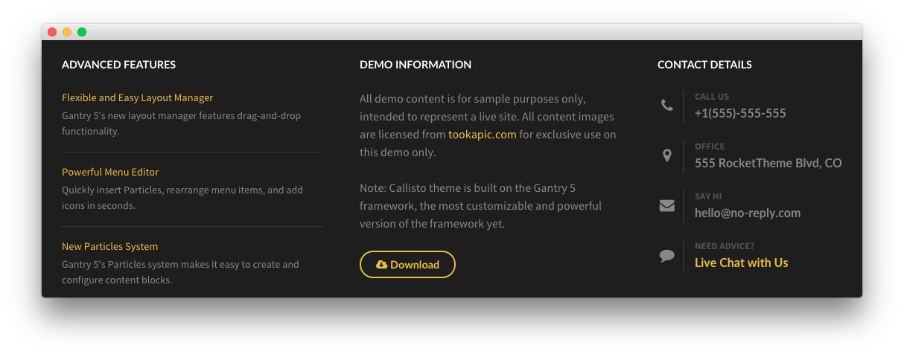

## Introduction

:   1. **Info List (Particle)** [15%, 5%, se]
    2. **Custom HTML (Particle)** [15%, 38%, se]
    3. **Contact (Particle)** [15%, 70%, se]

The **Footer** section is made up of three particles.

Settings used in our demo for each of these particles can be found below.

## Section Settings

| Field          | Setting |
| :-----         | :-----  |
| CSS Classes    | Blank   |
| Tag Attributes | Blank   |

### Info List (Particle)

#### Particle Settings

| Field                        | Setting                                                                             |
| :-----                       | :-----                                                                              |
| Particle Name                | `Advanced Features`                                                                 |
| CSS Classes                  | Blank                                                                               |
| Title                        | `Advanced Features`                                                                 |
| Info List Item 1 Title       | `Flexible and Easy Layout Manager`                                                  |
| Info List Item 1 Link        | `#`                                                                                 |
| Info List Item 1 Description | `Gantry 5's new layout manager features drag-and-drop functionality.`               |
| Info List Item 2 Title       | `Powerful Menu Editor`                                                              |
| Info List Item 2 Link        | `#`                                                                                 |
| Info List Item 2 Description | `Quickly insert Particles, rearrange menu items, and add icons in seconds.`         |
| Info List Item 3 Title       | `New Particles System`                                                              |
| Info List Item 3 Link        | `#`                                                                                 |
| Info List Item 3 Description | `Gantry 5's Particles system makes it easy to create and configure content blocks.` |

#### Block Settings

| Field          | Setting    |
| :-----         | :-----     |
| CSS ID         | Blank      |
| CSS Classes    | Blank      |
| Variations     | Blank      |
| Tag Attributes | Blank      |
| Block Size     | `33.3333%` |

### Custom HTML (Particle)

#### Particle Settings

| Field         | Setting            |
| :-----        | :-----             |
| Particle Name | `Demo Information` |

**Custom HTML**
~~~ .html
<h2 class="g-title">Demo Information</h2>

All demo content is for sample purposes only, intended to represent a live site. All content images are licensed from <a href="http://tookapic.com">tookapic.com</a> for exclusive use on this demo only.

Note: Callisto theme is built on the Gantry 5 framework, the most customizable and powerful version of the framework yet.

<a href="http://www.rockettheme.com/wordpress/themes/callisto" class="button button-3"><i class="fa fa-cloud-download"></i> Download</a>
~~~

#### Block Settings

| Field          | Setting    |
| :-----         | :-----     |
| CSS ID         | Blank      |
| CSS Classes    | Blank      |
| Variations     | Blank      |
| Tag Attributes | Blank      |
| Block Size     | `33.3333%` |

### Contact (Particle)

#### Particle Settings

| Field                | Setting                             |
| :-----               | :-----                              |
| Particle Name        | `Contact Details`                   |
| CSS Classes          | Blank                               |
| Title                | `Contact Details`                   |
| Contact Item 1 Title | `Call Us`                           |
| Contact Item 1 Icon  | `fa fa-phone fa-fw`                 |
| Contact Item 1 Value | `+1(555)-555-555`                   |
| Contact Item 2 Title | `Office`                            |
| Contact Item 2 Icon  | `fa fa-map-marker fa-fw`            |
| Contact Item 2 Value | `555 RocketTheme Blvd, CO`          |
| Contact Item 3 Title | `Say Hi`                            |
| Contact Item 3 Icon  | `fa fa-envelope fa-fw`              |
| Contact Item 3 Value | `hello@no-reply.com`                |
| Contact Item 4 Title | `Need Advice?`                      |
| Contact Item 4 Icon  | `fa fa-comment fa-fw`               |
| Contact Item 4 Value | `<a href="#">Live Chat with Us</a>` |

#### Block Settings

| Field          | Setting    |
| :-----         | :-----     |
| CSS ID         | Blank      |
| CSS Classes    | Blank      |
| Variations     | Blank      |
| Tag Attributes | Blank      |
| Block Size     | `33.3333%` |
