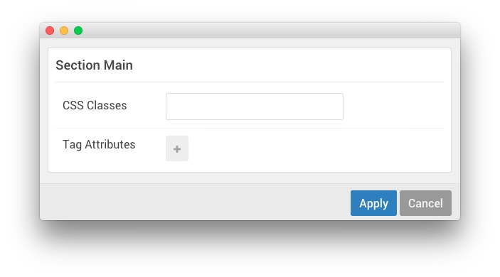

## Introduction

:   1. **Menu (Particle)** [20%, 5%, se]
    2. **Social** [20%, 67%, se]

The **Main** section is made up of two particles. The first is a **Content List** particle and the second in the section is a **Custom HTML** particle.

Settings used in our demo for each of these particles can be found below.

## Section Settings

| Field          | Setting |
| :-----         | :-----  |
| CSS Classes    | Blank   |
| Tag Attributes | Blank   |

### Content List (Particle)

#### Particle Settings

| Field         | Setting                  |
| :-----        | :-----                   |
| Particle Name | `Ultimate Customization` |
| CSS Classes   | Blank                    |
| Title         | Blank                    |
| Image         | Custom                   |
| Image Tag     | `Ultimate`               |
| Headline      | `Ultimate Customization` |
| Subtitle      | `Plug and Play Presets`  |
| Readmore Text | `Read More`              |
| Readmore Link | `#`                      |
| Grid Column   | 2 Columns                |
| Content Lists | Blank                    |

**Description**
~~~ .html
The Styles settings provides a user friendly interface for easily customizing the stylistic elements of the template, such as color pickers for link, font or background colors. You can choose from six predefined presets or create or customize your own.
~~~

#### Block Settings

| Field          | Setting          |
| :-----         | :-----           |
| CSS ID         | Blank            |
| CSS Classes    | `nopaddingall`   |
| Variations     | `Box 2, Rounded` |
| Tag Attributes | Blank            |
| Block Size     | `67%`            |

### Social (Particle)

#### Particle Settings

| Field         | Setting             |
| :-----        | :-----              |
| Particle Name | `Responsive Layout` |

#### Custom HTML
~~~ .html
<h2 class="g-title">Responsive Layout</h2>

Callisto is built with a Responsive Layout, which means it automatically adapts to the viewing device, so will expand and contract accordingly to the size and resolution of the screen, whether mobile, tablet or desktop. This ensures a consistent, and easy to maintain, appearance for your site.

~~~

#### Block Settings

| Field          | Setting          |
| :-----         | :-----           |
| CSS ID         | Blank            |
| CSS Classes    | Blank            |
| Variations     | `Box 3, Rounded` |
| Tag Attributes | Blank            |
| Block Size     | `33%`            |
