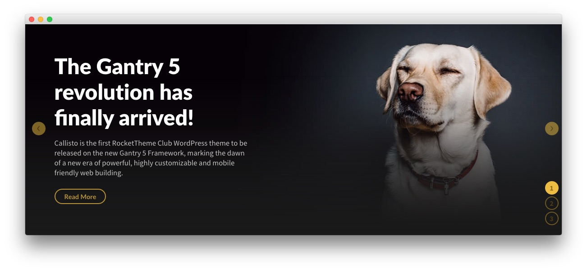
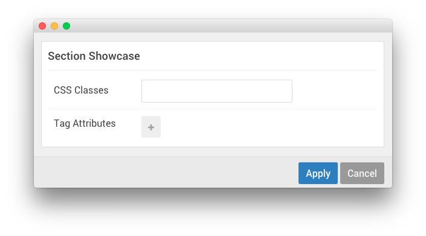
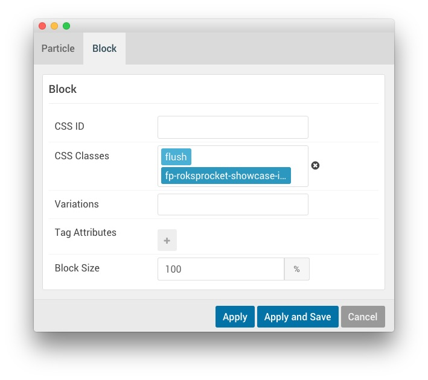
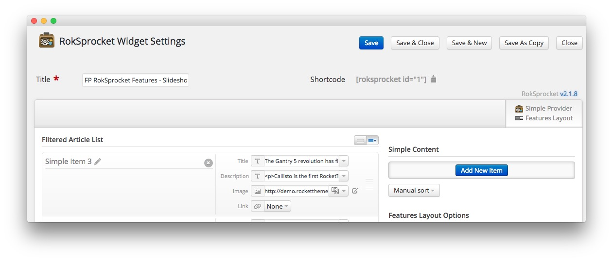
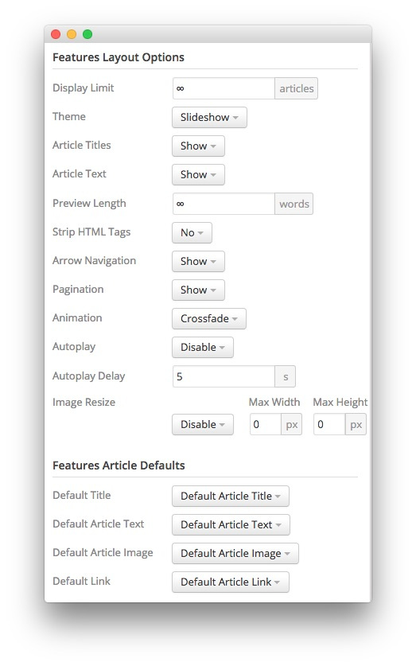

## Introduction

The **Showcase** section is made up of one **Widget Position**. This position, once placed and set up in the **Layout Manager** makes it possible to assign Widgets to it that appear on your site.

Settings used in our demo for each of these particles can be found below.

## Section Settings

| Field          | Setting |
| :-----         | :-----  |
| CSS Classes    | Blank   |
| Tag Attributes | Blank   |

## Widget Position (showcase)

### Particle Settings

| Field         | Setting                           |
| :-----        | :-----                            |
| Particle Name | `Position - RokSprocket Features` |
| Key           | `showcase`                        |
| Chrome        | `gantry`                          |

### Block Settings

| Field          | Setting                                  |
| :-----         | :-----                                   |
| CSS ID         | Blank                                    |
| CSS Classes    | `flush`, `fp-roksprocket-showcase-image` |
| Variations     | Blank                                    |
| Tag Attributes | Blank                                    |
| Block Size     | `100%`                                   |

## Assigned Widget(s)

The `showcase` widget position is host to a single **RokSprocket** widget.

We utilized the **Simple** Content Provider, linking each item in the RokSprocket widget to an article. You can find examples of the **Simple** items used in this widget in the **Filtered Article List** section below.

### Details

| Option           | Setting                               |
| :-----           | :-----                                |
| Title            | `FP RokSprocket Features - Slideshow` |
| Content Provider | Simple                                |
| Type             | Features                              |

### Filtered Article List

#### Item 1

| Option | Setting |
| :----- | :-----  |
| Image  | Custom  |
| Link   | None    |

**Title**

~~~ .html
The Gantry 5 revolution has finally arrived!
~~~

**Description**

~~~ .html

Callisto is the first RocketTheme Club template to be released on the new Gantry 5 Framework, marking the dawn of a new era of powerful, highly customizable and mobile friendly web building.
<a class="button button-3" href="#">Read More</a>
~~~

#### Item 2

| Option | Setting |
| :----- | :-----  |
| Image  | Custom  |
| Link   | None    |

**Title**

~~~
Built in Menu Support with Custom Editor
~~~

**Description**

~~~ .html

Gantry 5 benefits from its own built-in menu system, negating the need for auxiliary extensions, as well as featuring a drag and drop setup for dropdown configuration.
                    <a class="button button-3" href="#">Read More</a>
~~~

#### Item 3

| Option | Setting |
| :----- | :-----  |
| Image  | Custom  |
| Link   | None    |

**Title**

~~~ .html
Choose and Configure the Six Preset Styles
~~~

**Description**

~~~ .html

Callisto is distributed with six preset styles, with light and dark variations. Each can be customized in the Style Settings to individualize the template with ease and speed.
                    <a class="button button-3" href="#">Read More</a>
~~~

### Layout Options

| Option                | Setting               |
| :-----                | :-----                |
| Display Limit         | `∞`                   |
| Theme                 | Slideshow             |
| Article Titles        | Show                  |
| Article Text          | Show                  |
| Preview Length        | `∞`                   |
| Strip HTML Tags       | No                    |
| Arrow Navigation      | Show                  |
| Pagination            | Show                  |
| Animation             | Crossfade             |
| Autoplay              | Disable               |
| Autoplay Delay        | `5`                   |
| Image Resize          | Disable               |
| Default Title         | Default Article Title |
| Default Article Text  | Default Article Text  |
| Default Article Image | Default Article Image |
| Default Link          | Default Article Link  |

