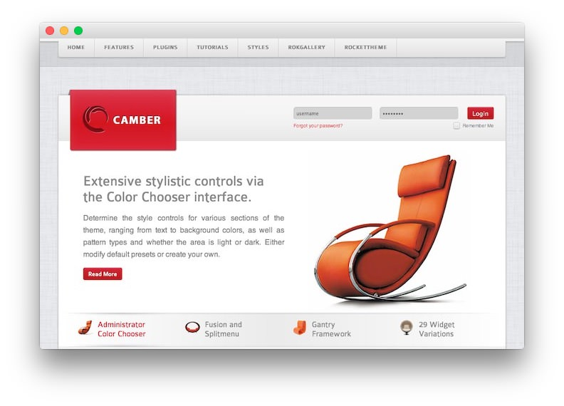

Introduction
------------

Camber is a beautifully designed theme, based around the Color Chooser parameters, which allow for you to easily choose from a selection of background, text and link colors, as well as the overlay type for each section of the design.

Requirements
------------

- Gantry 4 Framework
- FF, Safari, Chrome, Opera, IE8+
- PHP 5.4+
- WordPress 3.x

> > NOTE: An updated version of RokCommon is required for Camber to work properly. For more details on the Gantry Framework, please visit its [Dedicated Website](http://www.gantry.org/).

Key Features
------------

- 960 Fixed Layout
- 6 Preset Styles
- 78 Widget Positions
- 58 Widget Variations
- Fusion-Menu and Split-Menu
- Custom Typography
- iPhone/Android Theme
- iPhone Menu Option

### Split/Fusion Menu

There are two menu options, SplitMenu and Fusion Menu. The Splitmenu is a static menu system that displays select menu items in a main horizontal menu. The Fusion Menu is an advanced, CSS based menu system, which offers a wide range of per menu options.

### Compact Login

A uniquely styled feature of Camber, is the horizontal login in the header area. The styling is automatically applied, without the need for an additional widget suffix, which transforms the vertical login into a singular-lined login, perfect for displaying in space-conscious zones.
