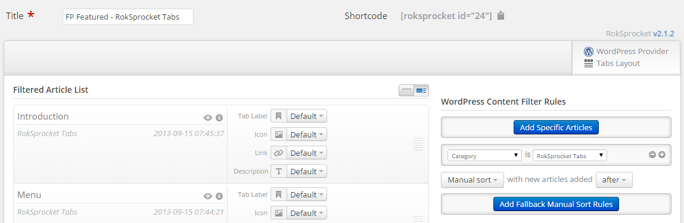
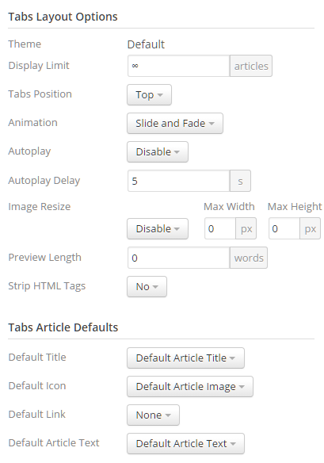

Featured Posts Section
-----

![][demo]

This area of the front page is the mainbody. It allows you to display featured articles on the front page. There are a couple things that have to be in order in order to see these articles populated in the MainBody section of the page.

![][mainbody]

First, you will need to have the **Display Mainbody** option set to **On** in your template settings. You can find this option by navigating to **Admin -> Chapelco Theme -> Advanced -> Display Mainbody**. You will also want to make sure that the posts you want to display are set in the published status.

By default, WordPress displays the most recent articles in this area of the page. You can assign specific categories to the blog view by navigating to **Admin -> Chapelco Theme -> Content -> Blog View -> Blog Category** and entering (comma separated) category IDs. If the field is left blank, the most recent posts will appear. 

Below, we have listed the settings of the post titled **Top Template of the Year**.

| Option         | Settings                   |
| :------------- | :-----------------         |
| Title          | `Top Template of the Year` |
| Status         | Published                  |
| Tags           | Blank                      |
| Featured Image | Blank                      |

Most of the magic takes place in the article content:

~~~ .html

    

        <h2 class="title">
            Top Template of the Year             
        </h2>
    

    Powered by <strong>Gantry</strong>

[roksprocket id="24"]
~~~ 

The last line of the page's content injects a RokSprocket module. In this case, it's a **Tabs** module using the **WordPress** provider.

## RokSprocket Tabs

You will need to do two things to prepare this widget so that it looks similar to the one in the demo.

First, you will need to create the RokSprocket Widget. You can do this by navigating to **Administration -> RokSprocket Admin** and creating a new **Tabs** widget..

**WordPress Content Provider**

We used the **WordPress** Content Provider which pulls article information from WordPress. This requires a set of articles to replicate exactly, and we recommend downloading a RocketLauncher version of Chapelco to get a good look at how these articles are set up if you want to replicate them exactly. Otherwise, any articles you place in the filtered category (or categories) will load.

Here is a look at the **Tabs Layout Options** for this widget.

| Option          | Setting        |
| :-------------- | :------------  |
| Theme           | Default        |
| Display Limit   | ∞              |
| Tabs Position   | Top            |
| Animation       | Slide and Fade |
| Autoplay        | Disable        |
| Autoplay Delay  | 5              |
| Image Resize    | Disable        |
| Preview Length  | 0              |
| Strip HTML Tags | No             |

You can set the RokSprocket filters to include any category, specific articles, or otherwise you would like to have featured in this widget.

Leaving everything else at its default setting, select **Save**.

[demo]: assets/demo_6.jpeg
[mainbody]: assets/mainbody.jpg