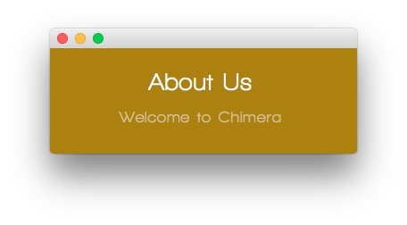
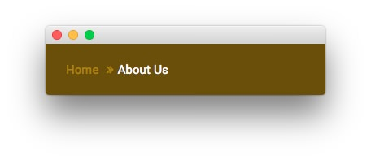
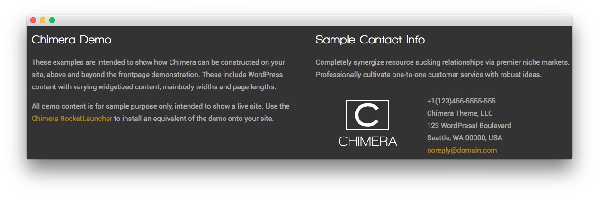

Introduction
-----

The **About Us** example page demonstrates how you can create a beautiful page with the Chimera template. Here is some information to help you replicate this page as it appears in the demo.

Theme Override Options
-----

The **About Us** page is a regular **Page**. To recreate the layout the way it appears in our demo, enter `menu-about-us` in the **Page Suffix** field in the **Gizmos** page inside the **Chimera** theme settings. This suffix is tied to a class in the demo.less file that sets the page up so it appears the way it does in the demo.

In order for this to work, you should have the **Page Suffix** option set to **On** in **Admin > Chimera > Gizmos**. You will likely need to create a theme override specifically for the page before assigning that suffix to it. For more information on creating theme overrides, visit our [Gantry Documentation][gantrydocs].

You will also want to assign the override to the **About Us** page via the **Assignments** tab in the **Theme Settings**.

Mainbody
-----

The page's content body is set in the **About Us** article. You will find the content used in the article below.

~~~ .html
<h3>Chimera, the Powerful Theme</h3>

Efficiently unleash cross-media information without cross-media value. Quickly maximize timely deliverables for real-time schemas. Dramatically maintain clicks-and-mortar solutions without functional solutions.

Completely synergize resource sucking relationships via premier niche markets. Professionally cultivate one-to-one customer service with robust ideas. Dynamically innovate resource-leveling customer service for state of the art customer service.

<a href="http://www.rockettheme.com/wordpress-themes/chimera" class="readon">Learn More</a>

~~~

Widgets
-----

Below is a brief rundown of the widgets used to make up the demo page. Widgets in the [**Top**][top], [**Header**][header], and [**Copyright**][copyright] positions are outlined in the main demo replication area of this guide.

:   1. **Showcase - Text** [10%, 45%, se]
    2. **Breadcrumbs** [15%, 12%, se]
    3. **Main Top - Text** [18%, 12%, se]
    4. **MainBody Content** [34%, 12%, se]
    5. **Main Bottom - Text** [48%, 12%, se]
    6. **Extension - Text** [68%, 30%, se]
    7. **Footer - Text** [77%, 13%, se]
    8. **Footer - Text** [77%, 52%, se]

1. [Showcase - Text](aboutus.md#showcase-section)
2. [Breadcrumbs](aboutus.md#breadcrumbs-section)
2. [Main Top - Text](aboutus.md#main-top-section)
3. [MainBody Content](aboutus.md#mainbody)
4. [Main Bottom - Text](aboutus.md#main-bottom-section)
5. [Extension - Text](aboutus.md#extension-section)
6. [Footer - Text](aboutus.md#footer-section)
7. [Footer - Text](aboutus.md#footer-section)

Showcase Section
-----

Here is the widget breakdown for the Showcase section:

#### Text

This section of the page is a standard text widget. You will need to enter the following in the main text field.

~~~ .html
&nbsp;
~~~

Here is a breakdown of options changes you will want to make to match the demo.

* Set the **Title** to `About Us[span class="rt-title-tag"]Welcome to Chimera[/span]`.
* Switch the **Widget Variations** option to **RT-Center, No Margin All**.
* Enter `rt-title-large rt-nomodulecontent rt-top-large-padding` in the **Custom Variations** field.
* Leaving everything else at its default setting, select **Save**.

Breadcrumbs Section
-----

#### Gantry Breadcrumbs

The **Gantry Breadcrumbs** widget gives you the ability to present page-aware breadcrumbs on the page. All you need to do to add them is to drag the **Gantry Breadcrumbs** widget from the **Available Widgets** area to the **Breadcrumbs** widget position.

Main Top Section
-----

Here is the widget breakdown for the Main Top section:

#### Text

This section of the page is a standard text widget. You will need to enter the following in the main text field.

~~~ .html

    

        

            
        

    

    

        

            <h3>Introduction</h3>
            
Globally incubate standards compliant channels before scalable benefits. Quickly disseminate superior deliverables whereas web-enabled applications. Quickly drive clicks-and-mortar catalysts for change before vertical architectures.

            

                <h3>More About Us</h3>
                
Proactively envisioned multimedia based expertise and cross-media growth strategies. Seamlessly visualize quality intellectual capital without superior collaboration and idea-sharing. Holistically pontificate installed base portals after maintainable products.

            

        

    

~~~

Here is a breakdown of options changes you will want to make to match the demo.

* Set the **Widget Variations** to **Box 2, No Margin All**.
* Enter `rt-title-center rt-square` in the **Custom Variations** field.
* Leaving everything else at its default setting, select **Save**.

Main Bottom Section
-----

Here is a breakdown for the **Main Bottom** section:

#### Text

This section of the page is a standard text widget. You will need to enter the following in the main text field.

~~~ .html

    

        

            

                
                <h4>Our Mission</h4>
                
Objectively innovate empowered manufactured products whereas parallel platforms. Holisticly predominate extensible testing procedures for reliable supply chains.

            

        

        

            

                
                <h4>Our Values</h4>
                
Proactively envisioned multimedia based expertise and cross-media growth strategies. Seamlessly visualize quality intellectual capital without superior collaboration.

            

        

        

            

                
                <h4>Our Solution</h4>
                
Engage worldwide methodologies with web-enabled technology. Interactively coordinate proactive e-commerce via process-centric outside the box thinking.

            

        

    

~~~

Leaving everything else at its default setting, select **Save**.

Extension Section
-----

Here is a breakdown for the **Extension** section:

#### Text

This section of the page is a standard text widget. You will need to enter the following in the main text field.

~~~ .html

Utilized with Versatile and Flexible Features Powered by the Gantry Framework.

<a href="http://www.rockettheme.com/wordpress-themes/chimera" class="readon">Download Chimera</a>

~~~

Here is a breakdown of options changes you will want to make to match the demo.

* Set the **Title** to `We Always Try to Create a Difference`.
* Set the **Widget Variations** option to **RT-Center**.
* Leaving everything else at its default setting, select **Save**.

Footer Section
-----

:   1. **Text 1** [20%, 5%, se]
    2. **Text 2** [20%, 52%, se]

#### Text 1

This section of the page is a standard text widget. You will need to enter the following in the main text field.

~~~ .html

These examples are intended to show how Chimera can be constructed on your site, above and beyond the frontpage demonstration. These include WordPress content with varying widgetized content, mainbody widths and page lengths.

All demo content is for sample purpose only, intended to show a live site. Use the <a href="http://www.rockettheme.com/wordpress/themes/chimera">Chimera RocketLauncher</a> to install an equivalent of the demo onto your site.

~~~

Here is a breakdown of options changes you will want to make to match the demo.

* Set the **Title** to `Chimera Demo`.
* Enter `rt-phone-center` in the **Custom Variations** field.
* Leaving everything else at its default setting, select **Save**.

#### Text 2

This section of the page is a standard text widget. You will need to enter the following in the main text field.

~~~ .html

Completely synergize resource sucking relationships via premier niche markets. Professionally cultivate one-to-one customer service with robust ideas.

    

        

            
        
  
    

    

        

            +1(123)456-5555-555 
            Chimera Theme, LLC 
            123 WordPress Boulevard 
            Seattle, WA 00000, USA 
            <a href="#">noreply@domain.com</a>
        

    

~~~

Here is a breakdown of options changes you will want to make to match the demo.

* Set the **Title** to `Sample Contact Info`.
* Enter `rt-phone-center` in the **Custom Variations** field.
* Leaving everything else at its default setting, select **Save**.

[aboutuspage]: assets/page_aboutus.jpeg
[aboutuspage2]: assets/page_aboutus_1.jpeg
[aboutuspage3]: assets/page_aboutus_2.jpeg
[aboutuspage4]: assets/page_aboutus_3.jpeg
[aboutuspage5]: assets/page_aboutus_4.jpeg
[aboutuspage6]: assets/page_aboutus_5.jpeg
[aboutuspage7]: assets/page_aboutus_6.jpeg
[aboutuspage8]: assets/page_aboutus_7.jpeg
[aboutuspage9]: assets/page_aboutus_8.jpeg
[aboutuspage10]: assets/page_aboutus_9.jpeg
[aboutuspage11]: assets/page_footer_11.jpg
[aboutusmenu]: assets/page_aboutus_menu.jpeg
[gantrydocs]: http://docs.gantry.org/gantry4/configure
[header]: demo_header.md
[top]: demo_top.md
[copyright]: demo_copyright.md
