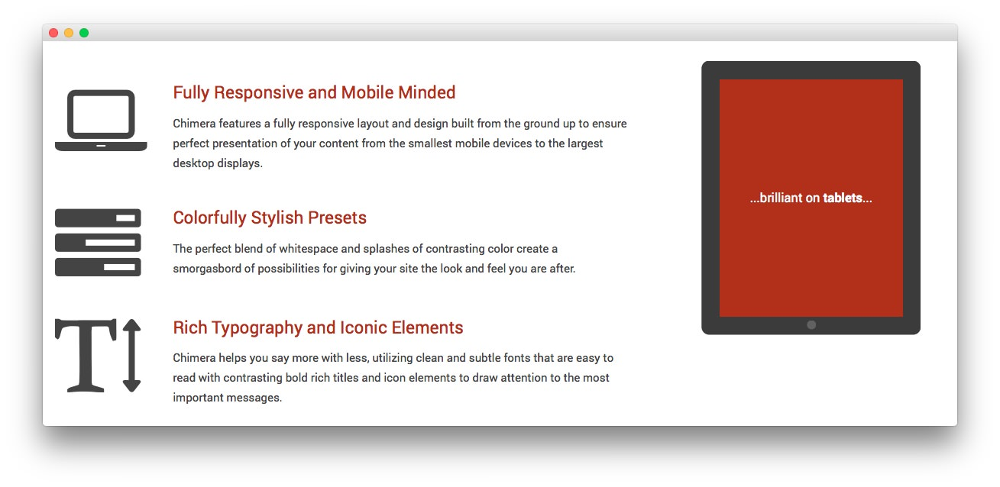

Utility Section
-----

:	1. **Text 1** [13%, 7%, se]
	2. **Text 2** [13%, 70%, se]

Here is the widget breakdown for the Utility section:

* Text
* Gantry Divider
* Text

#### Text 1

This section of the page is a standard text widget. You will need to enter the following in the main text field.

~~~ .html

  <i class="fa fa-laptop"></i>

<h3><a href="http://demo.rockettheme.com/live/wordpress/chimera/features-overview/">Fully Responsive and Mobile Minded</a></h3>

Chimera features a fully responsive layout and design built from the ground up to ensure perfect presentation of your content from the smallest mobile devices to the largest desktop displays.

 

  <i class="fa fa-tasks"></i>

<h3><a href="http://demo.rockettheme.com/live/wordpress/chimera/features-overview/">Colorfully Stylish Presets</a></h3>

The perfect blend of whitespace and splashes of contrasting color create a smorgasbord of possibilities for giving your site the look and feel you are after.

 

  <i class="fa fa-text-height"></i>

<h3><a href="http://demo.rockettheme.com/live/wordpress/chimera/typography/">Rich Typography and Iconic Elements</a></h3>

Chimera helps you say more with less, utilizing clean and subtle fonts that are easy to read with contrasting bold rich titles and icon elements to draw attention to the most important messages.

~~~

Here is a breakdown of options changes you will want to make to match the demo.

* Enter `fp-utility` in the **Custom Variations** field.
* Leaving everything else at its default setting, select **Save**.

#### Gantry Divider

This widget tells WordPress to start a new widget column beginning with the widget placed directly below the divider in the section.

#### Text 2

This section of the page is a standard text widget. You will need to enter the following in the main text field.

~~~ .html

  

    

    

    

    

      

Chimera's design is great on <strong>desktops</strong>...

      

...brilliant on <strong>tablets</strong>...

      

and perfect for <strong>mobile!</strong>

    

  

~~~

Here is a breakdown of options changes you will want to make to match the demo.

* Enter `fp-utility-b` in the **Custom Variations** field.
* Leaving everything else at its default setting, select **Save**.
