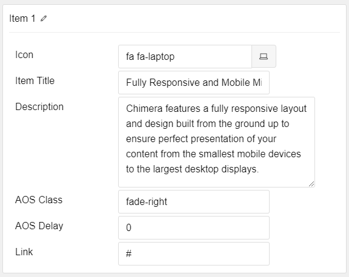

## Introduction

The **Icon List** particle provides a method of quickly adding animated icon-driven content lists to your website.

Here are the topics covered in this guide:

* [Configuration](#configuration)
    - [Main Options](#main-options)
    - [Item Options](#item-options)

## Configuration

### Main Options 

The main options area of this particle's settings panel houses the items list. There are no settings available at this level.

### Item Options

These items make up the individual featured items in the particle.

| Option      | Description                                                                                   |
| :-----      | :-----                                                                                        |
| Icon        | Select the icon you would like to have appear with the title area in the item.                |
| Item Title  | Enter a text title for the item that appears on the front end.                                |
| Description | Enter a text description for the item. This appears as the primary paragraph in the particle. |
| AOS Class   | Select the type of animation to appear on scroll.                                             |
| AOS Delay   | Enter a delay time (in milliseconds) for the animation to trigger.                            |
| Link        | Enter the url you want that link to go to.                                                    |
