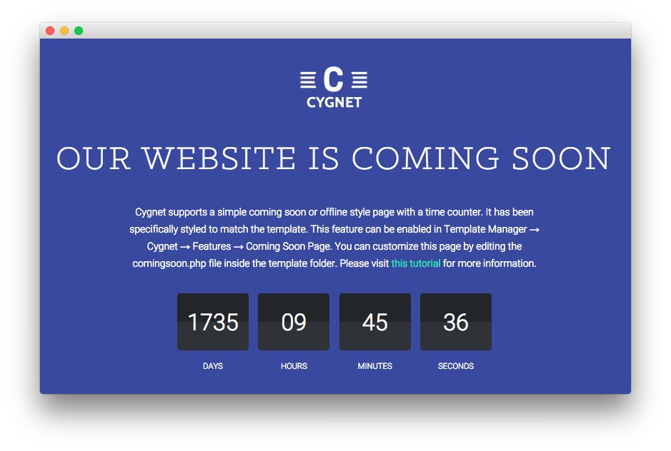

Introduction
-----

Cygnet introduces a **Coming Soon** page which allows you to display a stylish page indicating that your site is either being worked on or under construction. This page includes a countdown timer, your logo, and an area for text you can use to share any information you would like to about the pending release.

You can also have users subscribe to a newsletter should you wish to email them and let them know when the site is up, as well as keep in touch to share regular updates and information.

How to Enable/Disable the Page
-----

The **Coming Soon** page can be enabled or disabled from the **Gizmos** tab in **Theme Settings**. You can opt to create an override for this page, or enable it on your primary theme, accordingly. You can reach this option by navigating to **Administration -> Cygnet Theme -> Gizmos** and turning **Coming Soon Page** on or off.

How to Make Changes
-----

Making changes to the Coming Soon page will require you to access a file and make manual changes yourself. It is not as difficult as it sounds. All of the changes you might want to make to this page can be done by visiting `/themes/rt_cygnet_wp/comingsoon.php` and altering its code. Some of the more common changes are listed below.

### Countdown Timer

You can set the countdown timer by navigating to **Admin -> Cygnet Theme -> Gizmos** and setting the date fields in the **Coming Soon Page** area of the page. The date you set here will be the date the countdown will expire.

### Text

There is a block of text under the countdown timer in our default page. This block of text is located on **line 137**:

~~~ .php

    <?php _re( 'Cygnet supports a simple coming soon or offline style page with a time counter. It has been specifically styled to match the theme. This feature can be enabled in Admin Dashboard &rarr; Cygnet Theme &rarr; Gizmos &rarr; Coming Soon Page. Please visit <a href="http://www.rockettheme.com/">Cygnet tutorials</a> for more information.' ); ?>

~~~

Just replace the text between the `
` tags with the information you wish to have displayed here. You can remove this line to have no text appear in this area at all.

### Newsletter Subscription

The subscription field and button are a standard form found between **lines 160 and 165**.

~~~ .php
<form class="rt-comingsoon-form" action="http://feedburner.google.com/fb/a/mailverify" method="post" target="popupwindow" onsubmit="window.open('http://feedburner.google.com/fb/a/mailverify?uri=<?php echo $gantry->get('feedburner-uri'); ?>', 'popupwindow', 'scrollbars=yes,width=550,height=520');return true">
    <input type="text" placeholder="<?php _e( 'Email Address', 'rt_cygnet_wp_lang' ); ?>" class="inputbox" name="email">
    <input type="hidden" value="<?php echo $gantry->get('feedburner-uri'); ?>" name="uri"/>
    <input type="hidden" name="loc" value="en_US"/>
    <input type="submit" name="Submit" class="readon" value="<?php _e( 'Subscribe', 'rt_cygnet_wp_lang' ); ?>" />
</form>
~~~
