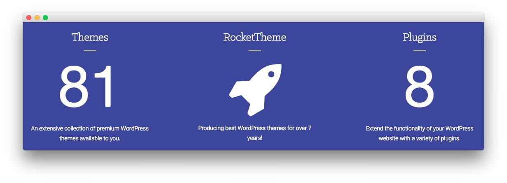

Bottom Section
-----

:   1. **RokSprocket (Lists)** [10%, 7%, se]
    2. **RokSprocket (Features)** [10%, 36%, se]
    3. **Text** [10%, 68%, se]

Here is the widget breakdown for the Bottom section:

* [RokSprocket (Lists)](#roksprocket-(lists))
* [Gantry Divider](#gantry-divider)
* [RokSprocket (Features)](#roksprocket-(features))
* [Gantry Divider](#gantry-divider)
* [Text](#text)

#### RokSprocket (Lists)

The widget located in this section of the page is a **RokSprocket Lists** widget created in a very similar way to the previous RokSprocket widgets featured on the front page of the demo.

First, you will need to create the RokSprocket widget. You can do this by navigating to **Administration -> RokSprocket Admin** and creating a new **Lists** widget.

You can find out more about RokSprocket and how to set up and modify widgets by visiting our [RokSprocket documentation](../../plugins/roksprocket).

##### Simple Provider

We used the **Simple Provider** to enable us to create custom RokSprocket content without having to create separate posts or pages to do so. Here are the details of one of the **Simple Items** in the **Featured Article List**.

| Option | Setting                                      |
| :----- | :------------------------------------------- |
| Image  | None                                         |
| Link   | Custom                                       |

**Title**

~~~ .html
The RocketLauncher package installs a demo copyequivalent onto your site
~~~

**Description**

~~~ .html
A default WordPress package with custom sample data and images from the demo. Content images are replaced with sample tiled substitutes due to copyright.
~~~

Here is a look at the **Lists Layout Options** for this widget.

| Option              | Setting |
| :------------------ | :------ |
| Theme               | Default |
| Display Limit       | `6`     |
| Collapsible Preview | Enable  |
| Preview Length      | `∞`     |
| Strip HTML Tags     | No      |
| Previews Per Page   | `5`     |
| Arrow Navigation    | Show    |
| Pagination          | Show    |
| Autoplay            | 5       |
| Image Resize        | Disable |

You can set the RokSprocket filters to include any category, specific posts, or otherwise you would like to have featured in this widget.

Once you have created this widget, you can add it via the Widgets menu by clicking **RokSprocket** and dragging it to the appropriate section. When you have done this, you will need to return to the Widgets settings and fill them out as noted below:

| Option            | Setting                                          |
| :---------------- | :----------------------------------------------- |
| Title             | `Breaking News`                                  |
| Choose Widget     | (Select the RokSprocket Widget You Just Created) |
| Custom Variations | `fp-roksprocket-lists-bottom`                    |

Leaving everything else at its default setting, select **Save**.

#### Gantry Divider

This widget tells WordPress to start a new widget column beginning with the widget placed directly below the divider in the section.

#### RokSprocket (Features)

This area of the demo is a RokSprocket widget. You will need to do two things to prepare this widget so that it looks similar to the one in the demo.

First, you will need to create the RokSprocket Widget. You can do this by navigating to **Administration -> RokSprocket Admin** and creating a new **Features** widget.

You can find out more about RokSprocket and how to set up and modify widgets by visiting our [RokSprocket documentation](../../plugins/roksprocket).

##### Simple Provider

We used the **Simple Provider** to enable us to create custom RokSprocket content without having to create separate posts or pages to do so. Here are the details of one of the **Simple Items** in the **Featured Article List**.

| Option | Setting                                      |
| :----- | :------------------------------------------- |
| Image  | None                                         |
| Link   | Custom                                       |

**Title**

~~~ .html
RokSprocket features a diverse collection of differentdistinct themes and layouts
~~~

**Description**

~~~ .html

Powerful Plugin

RokSprocket is a versatile and highly configurable content plugin that has a rich user interface, and many types of layouts to suit any content purpose.

~~~

Here is a look at the **Features Layout Options** for this widget.

| Option           | Setting          |
| :--------------- | :-------------   |
| Display Limit    | ∞                |
| Theme            | Showcase Style 2 |
| Article Titles   | Show             |
| Article Text     | Show             |
| Preview Length   | ∞                |
| Strip HTML Tags  | No               |
| Arrow Navigation | Hide             |
| Pagination       | Show             |
| Animation        | Crossfade        |
| Autoplay         | Disable          |
| Autoplay Delay   | 5                |
| Image Resize     | Disable          |

>> The **Showcase Style 2** theme is unique to Cygnet and was created to give the RokSprocket mode a certain set of attributes that enables it to look the way it does in this theme. You can find more information about overriding themes [here](../../plugins/roksprocket/layout_modes.md#custom-layout-theme-overrides).

You can set the RokSprocket filters to include any category, specific posts, or otherwise you would like to have featured in this widget.

Once you have created this widget, you can add it via the Widgets menu by clicking **RokSprocket** and dragging it to the appropriate section. When you have done this, you will need to return to the Widgets settings and fill them out as noted below:

| Option            | Setting                                          |
| :---------------- | :----------------------------------------------- |
| Choose Widget     | (Select the RokSprocket Widget You Just Created) |
| Widget Variations | Box 1                                            |
| Custom Variations | `fp-roksprocket-showcase2-bottom`                |

Leaving everything else at its default setting, select **Save**.

#### Text

This section of the page is a standard text widget. You will need to enter the following in the main text field.

~~~ .html

    

        

            

                
                    <a href="http://(your site url)/wp-content/rockettheme/rt_cygnet_wp/home/fp-bottom/img-01.jpg" data-rokbox data-rokbox-caption="Arifin Finly - Developer" data-rokbox-album="Cygnet Gallery">
                        <i class="fa fa-search"></i>    
                    </a>            
                
            

        

        

            

                
                    <a href="http://(your site url)/wp-content/rockettheme/rt_cygnet_wp/home/fp-bottom/img-02.jpg" data-rokbox data-rokbox-caption="Kevin DuCommun - Lead Developer" data-rokbox-album="Cygnet Gallery">
                        <i class="fa fa-search"></i>    
                    </a>            
                
            

        

    

    

        

            

                
                    <a href="http://(your site url)/wp-content/rockettheme/rt_cygnet_wp/home/fp-bottom/img-03.jpg" data-rokbox data-rokbox-caption="James Spencer - Developer / Support" data-rokbox-album="Cygnet Gallery">
                        <i class="fa fa-search"></i>    
                    </a>            
                
            

        

        

            

                
                    <a href="http://(your site url)/wp-content/rockettheme/rt_cygnet_wp/home/fp-bottom/img-04.jpg" data-rokbox data-rokbox-caption="Karol Orzel - Developer" data-rokbox-album="Cygnet Gallery">
                        <i class="fa fa-search"></i>    
                    </a>            
                
            

        

    

    

        

            

                
                    <a href="http://(your site url)/wp-content/rockettheme/rt_cygnet_wp/home/fp-bottom/img-05.jpg" data-rokbox data-rokbox-caption="Djamil Legato - Lead Developer" data-rokbox-album="Cygnet Gallery">
                        <i class="fa fa-search"></i>    
                    </a>            
                
            

        

        

            

                
                    <a href="http://(your site url)/wp-content/rockettheme/rt_cygnet_wp/home/fp-bottom/img-06.jpg" data-rokbox data-rokbox-caption="Jakub Baran - Developer" data-rokbox-album="Cygnet Gallery">
                        <i class="fa fa-search"></i>    
                    </a>            
                
            

        

    

    

        

            

                
                    <a href="http://(your site url)/wp-content/rockettheme/rt_cygnet_wp/home/fp-bottom/img-07.jpg" data-rokbox data-rokbox-caption="Sam Mahoney - Developer" data-rokbox-album="Cygnet Gallery">
                        <i class="fa fa-search"></i>    
                    </a>            
                
            

        

        

            

                
                    <a href="http://(your site url)/wp-content/rockettheme/rt_cygnet_wp/home/fp-bottom/img-08.jpg" data-rokbox data-rokbox-caption="Ryan Pierson - WordSmith" data-rokbox-album="Cygnet Gallery">
                        <i class="fa fa-search"></i>    
                    </a>            
                
            

        

    

    

   

    

        

            

                
                    <a href="http://(your site url)/wp-content/rockettheme/rt_cygnet_wp/home/fp-bottom/img-01.jpg" data-rokbox data-rokbox-caption="Some Caption Here" data-rokbox-album="Cygnet Gallery">
                        <i class="fa fa-search"></i>    
                    </a>            
                
            

        

        

            

                
                    <a href="http://(your site url)/wp-content/rockettheme/rt_cygnet_wp/home/fp-bottom/img-02.jpg" data-rokbox data-rokbox-caption="Some Caption Here" data-rokbox-album="Cygnet Gallery">
                        <i class="fa fa-search"></i>    
                    </a>            
                
            

        

        

            

                
                    <a href="http://(your site url)/wp-content/rockettheme/rt_cygnet_wp/home/fp-bottom/img-03.jpg" data-rokbox data-rokbox-caption="Some Caption Here" data-rokbox-album="Cygnet Gallery">
                        <i class="fa fa-search"></i>    
                    </a>            
                
            

        

        

            

                
                    <a href="http://(your site url)/wp-content/rockettheme/rt_cygnet_wp/home/fp-bottom/img-04.jpg" data-rokbox data-rokbox-caption="Some Caption Here" data-rokbox-album="Cygnet Gallery">
                        <i class="fa fa-search"></i>    
                    </a>            
                
            

        
      
    

    

        

            

                
                    <a href="http://(your site url)/wp-content/rockettheme/rt_cygnet_wp/home/fp-bottom/img-05.jpg" data-rokbox data-rokbox-caption="Some Caption Here" data-rokbox-album="Cygnet Gallery">
                        <i class="fa fa-search"></i>    
                    </a>            
                
            

        

        

            

                
                    <a href="http://(your site url)/wp-content/rockettheme/rt_cygnet_wp/home/fp-bottom/img-06.jpg" data-rokbox data-rokbox-caption="Some Caption Here" data-rokbox-album="Cygnet Gallery">
                        <i class="fa fa-search"></i>    
                    </a>            
                
            

        

        

            

                
                    <a href="http://(your site url)/wp-content/rockettheme/rt_cygnet_wp/home/fp-bottom/img-07.jpg" data-rokbox data-rokbox-caption="Some Caption Here" data-rokbox-album="Cygnet Gallery">
                        <i class="fa fa-search"></i>    
                    </a>            
                
            

        

        

            

                
                    <a href="http://(your site url)/wp-content/rockettheme/rt_cygnet_wp/home/fp-bottom/img-08.jpg" data-rokbox data-rokbox-caption="Some Caption Here" data-rokbox-album="Cygnet Gallery">
                        <i class="fa fa-search"></i>    
                    </a>            
                
            

        
      
    
      

All demo content is for sample purposes only. All content images are freely available from tookapic.com. Use the <a href="http://www.rockettheme.com/wordpress/themes/cygnet">RocketLauncher</a> to install a demo equivalent onto your site.

~~~

Here is a breakdown of options changes you will want to make to match the demo.

| Option            | Setting       |
| :---------------- | :---------    |
| Custom Variations | `fp-bottom-c` |

Leaving everything else at its default setting, select **Save**.
