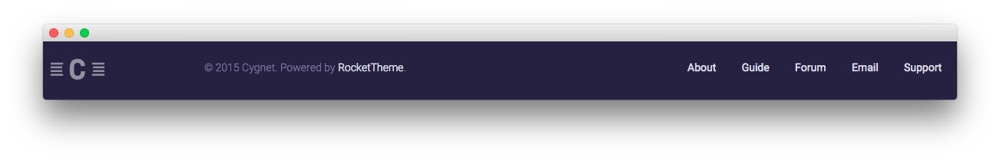

Copyright Section
-----

:   1. **Gantry Branding** [35%, 5%, se]
    2. **Gantry Copyright** [35%, 20%, se]
    3. **Gantry To Top** [35%, 68%, se]

Here is the widget breakdown for the Footer section:

* [Gantry Branding](#gantry-branding)
* [Gantry Divider](#gantry-divider)
* [Gantry Copyright](#gantry-copyright)
* [Gantry Divider](#gantry-divider)
* [Gantry To Top](#gantry-to-top)

#### Gantry Branding

The Gantry Branding widget does little more than display our logo at the bottom of the page. Simply click and drag the **Gantry Branding** widget into the widget section for this to appear.

#### Gantry Divider

This widget tells WordPress to start a new widget column beginning with the widget placed directly below the divider in the section.

#### Gantry Copyright

The Gantry Copyright widget places a tiny Copyright notification at the bottom of the page. The only thing you need to change in this widget to match the demo is the text field, which includes: `&copy; 2015 Cygnet. Powered by <a href="http://www.rockettheme.com/">RocketTheme</a>.`.

#### Custom Menu

The **Custom Menu** widget allows us to add an extra menu somewhere on the page. This menu was created separately from the main menu linked in the header, and can be configured by going to **Administration -> Appearance -> Menus**.

Here is a breakdown of what you will need to change in the widget options to match the demo.

| Option            | Setting                                                 |
| :---------------- | :------------------------------------------------------ |
| Select Menu       | (Choose the menu you wish to have appear in the widget) |
| Custom Variations | `rt-horizmenu rt-floatright`                            |

Leaving all other options at their default settings, click **Save**.

