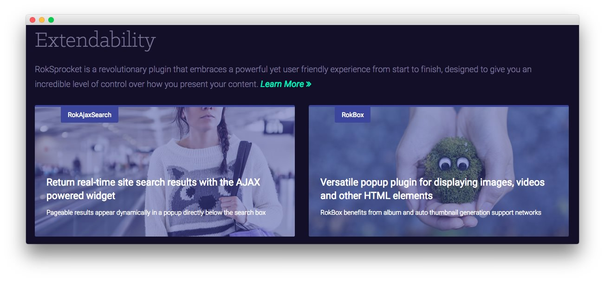

Expanded Bottom Section
-----

Here is the widget breakdown for the Expanded Bottom section:

#### Text

This section of the page is a standard text widget. You will need to enter the following in the main text field.

~~~ .html

RokSprocket is a revolutionary plugin that embraces a powerful yet user friendly experience from start to finish, designed to give you an incredible level of control over how you present your content. <a class="readon3" href="#">Learn More</a>

    

        

            

                

                    

                        
                    

                    

                        
RokAjaxSearch

                        

                            <h2 class="title">Return real-time site search results with the AJAX powered widget</h2>
                            
Pageable results appear dynamically in a popup directly below the search box
                     
                        

                    
          
                
              
            

        
  
        

            

                

                    

                        
                    

                    

                        
RokBox

                        

                            <h2 class="title">Versatile popup plugin for displaying images, videos and other HTML elements</h2>
                            
RokBox benefits from album and auto thumbnail generation support networks
                        
                        

                    
          
                

            

        
          
    

~~~

Here is a breakdown of options changes you will want to make to match the demo.

| Option            | Setting                          |
| :---------------- | :---------                       |
| Title             | `Extendability`                  |
| Custom Variations | `fp-expandedbottom rt-big-title` |

Leaving everything else at its default setting, select **Save**.
