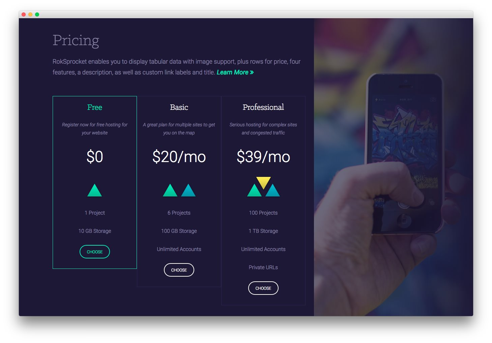

Expanded Top Section
-----

:   1. **Text 1** [10%, 9%, se]
    2. **RokSprocket (Tables)** [30%, 9%, se]
    3. **Text 2** [10%, 65%, se]

Here is the widget breakdown for the Expanded Top section:

* Text
* RokSprocket (Tables)
* Gantry Divider
* Text

#### Text 1

This section of the page is a standard text widget. You will need to enter the following in the main text field.

~~~ .html

RokSprocket enables you to display tabular data with image support, plus rows for price, four features, a description, as well as custom link labels and title.<a class="readon3" href="#"> Learn More</a>

~~~

Here is a breakdown of options changes you will want to make to match the demo.

| Option            | Setting                         |
| :---------------- | :---------                      |
| Title             | `Pricing`                       |
| Custom Variations | `fp-expandedtop-a rt-big-title` |

Leaving everything else at its default setting, select **Save**.

#### RokSprocket (Tables)

You will need to do two things to prepare this widget so that it looks similar to the one in the demo.

First, you will need to create the RokSprocket Widget. You can do this by navigating to **Administration -> RokSprocket Admin** and creating a new **Tables** widget.

You can find out more about RokSprocket and how to set up and modify widgets by visiting our [RokSprocket documentation](../../plugins/roksprocket/).

### Simple Item Example

| Option      | Setting                                          |
| :---------- | :--------------------------------                |
| Title       | `Free`                                           |
| Description | `Register now for free hosting for your website` |
| Image       | Custom                                           |
| Class Label | `rt-cell-active`                                 |
| Price       | `$0`                                             |
| Feature 1   | `1 Project`                                      |
| Feature 2   | `10 GB Storage`                                  |
| Link        | `#`                                              |
| Link Text   | `Choose`                                         |

Here is a look at the **Tables Layout Options** for this widget.

| Option            | Setting     |
| :----------       | :---------- |
| Theme             | Product     |
| Display Limit     | `∞`         |
| Preview Length    | `∞`         |
| Strip HTML Tags   | No          |
| Previews Per Page | `3`         |
| Items Per Row     | `3`         |
| Arrow Navigation  | Hide        |
| Pagination        | Show        |
| Animation         | Randomize   |
| Autoplay          | Disable     |
| Autoplay Delay    | 5           |
| Image Resize      | Disable     |

You can set the RokSprocket filters to include any category, specific posts, or otherwise you would like to have featured in this widget.

Once you have created this widget, you can add it via the Widgets menu by clicking **RokSprocket** and dragging it to the appropriate section. When you have done this, you will need to open the Widget's settings and fill them out as noted below:

| Option            | Setting                                          |
| :-----            | :-----                                           |
| Choose Widget     | (Select the RokSprocket Widget You Just Created) |
| Custom Variations | `fp-roksprocket-tables`                          |

Leaving everything else at its default setting, select **Save**.

#### Gantry Divider

This widget tells WordPress to start a new widget column beginning with the widget placed directly below the divider in the section.

#### Text 2

This section of the page is a standard text widget. You will need to enter the following in the main text field.

~~~ .html

~~~

Here is a breakdown of options changes you will want to make to match the demo.

| Option            | Setting                         |
| :---------------- | :---------                      |
| Custom Variations | `fp-expandedtop-b hidden-phone` |

Leaving everything else at its default setting, select **Save**.