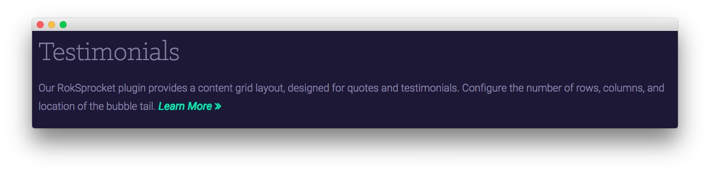

Extension Section
-----

Here is the widget breakdown for the Extension section:

#### Text

This section of the page is a standard text widget. You will need to enter the following in the main text field.

~~~ .html

Our RokSprocket plugin provides a content grid layout, designed for quotes and testimonials. Configure the number of rows, columns, and location of the bubble tail. <a href="#" class="readon3">Learn More</a>

~~~

Here is a breakdown of options changes you will want to make to match the demo.

| Option            | Setting                     |
| :---------------- | :---------                  |
| Title             | `Testimonials`              |
| Custom Variations | `fp-extension rt-big-title` |

Leaving everything else at its default setting, select **Save**.
