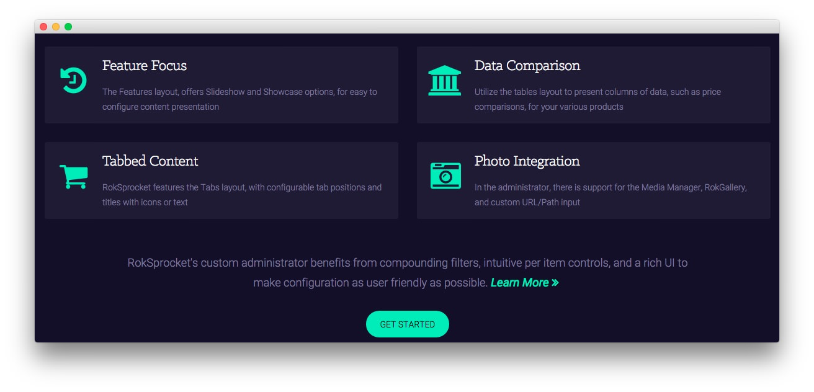

Feature Section
-----

Here is the widget breakdown for the Feature section:

#### Text

This section of the page is a standard text widget. You will need to enter the following in the main text field.

~~~ .html

    

        

            

                

                    

                        <i class="fa fa-fw fa-history"></i>
                    

                    

                        <h3>Feature Focus</h3>  
                        
The Features layout, offers Slideshow and Showcase options, for easy to configure content presentation

                    

                    

                

                

                    

                        <i class="fa fa-fw fa-shopping-cart"></i>
                    

                    

                        <h3>Tabbed Content</h3> 
                        
RokSprocket features the Tabs layout, with configurable tab positions and titles with icons or text

                    

                    

                
              
            

        
  
        

            

                

                    

                        <i class="fa fa-fw fa-institution"></i>
                    

                    

                        <h3>Data Comparison</h3>    
                        
Utilize the tables layout to present columns of data, such as price comparisons, for your various products

                    

                    

                

                

                    

                        <i class="fa fa-fw fa-camera-retro"></i>
                    

                    

                        <h3>Photo Integration</h3>  
                        
In the administrator, there is support for the Media Manager, RokGallery, and custom URL/Path input

                    

                    

                
              
            

        
                                      
    

    
RokSprocket's custom administrator benefits from compounding filters, intuitive per item controls, and a rich UI to make configuration as user friendly as possible. <a href="http://demo.rockettheme.com/live/wordpress/cygnet/features-overview/" class="readon3">Learn More</a>

    <a class="readon" href="http://demo.rockettheme.com/live/wordpress/cygnet/features-overview/">Get Started</a>

~~~

Here is a breakdown of options changes you will want to make to match the demo.

| Option            | Setting                    |
| :---------------- | :---------                 |
| Custom Variations | `fp-feature wow slideInUp` |

Leaving everything else at its default setting, select **Save**.
