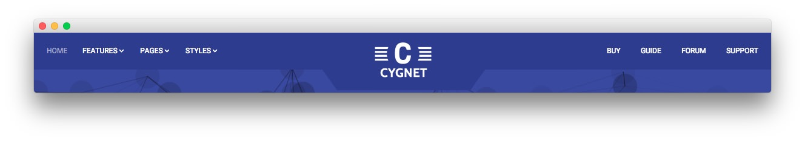

Header Section
-----

:   1. **Gantry Menu** [30%, 5%, se]
    2. **Gantry Logo** [30%, 45%, se]
    3. **Custom Menu** [30%, 73%, se]

Here is the widget breakdown for the Header section:

* [Gantry Menu](#gantry-menu)
* [Gantry Divider](#gantry-divider)
* [Gantry Logo](#gantry-logo)
* [Gantry Divider](#gantry-divider)
* [Custom Menu](#custom-menu)

#### Gantry Menu

The Gantry Menu widget should be set to match your site's main menu as it serves as the primary menu widget for the entire site. You can customize this menu by navigating to **Administration -> Appearance -> Menus** and creating or modifying your selected menu there.

Here is a breakdown of the widget options for this menu widget. Any options not present in this breakdown are left at default and should not be adjusted.

| Option            | Setting      |  
| :---------------- | :----------- |  
| Menu              | Main Menu    |  
| Menu Theme        | Dropdown     |  
| SplitMenu Style   | Sidebar Menu |  
| Limit Levels      | No           |  
| Start Level       | 0            |  
| End Level         | 0            |  
| Show All Children | Yes          |  
| Show Empty Menu   | No           |  
| Maximum Depth     | 10           |  
| Custom Chrome     | Menu         |  

#### Gantry Divider

This widget tells WordPress to start a new widget column beginning with the widget placed directly below the divider in the section.

#### Gantry Logo

The first thing you will need to do is click and drag the **Gantry Logo** widget from the **Available Widgets** area of the Widgets menu to the appropriate section. Once this is done, the logo should appear in as it does in the demo. You can further customize this logo by following the instructions in our [FAQ](faq.md).

#### Custom Menu

The **Custom Menu** widget allows us to add an extra menu somewhere on the page. This menu was created separately from the main menu linked in the header, and can be configured by going to **Administration -> Appearance -> Menus**.

Here is a breakdown of what you will need to change in the widget options to match the demo.

| Option            | Setting                                                 |
| :-----            | :-----                                                  |
| Select Menu       | (Choose the menu you wish to have appear in the widget) |
| Custom Variations | `rt-horizmenu rt-header-menu hidden-phone`              |

Leaving all other options at their default settings, click **Save**.
