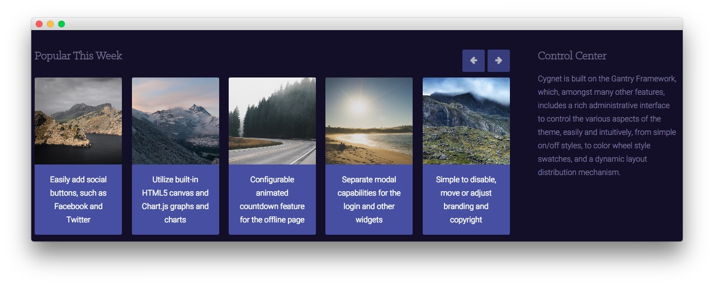

Main Bottom Section
-----

:   1. **RokSprocket (Strips)** [20%, 6%, se]
    2. **Text** [20%, 75%, se]

Here is the widget breakdown for the Main Bottom section:

* [RokSprocket (Strips)](#roksprocket-(strips)-(desktop-only))
* [RokSprocket (Strips)](#roksprocket-(strips)-(devices-other-than-desktop))
* [Gantry Divider](#gantry-divider)
* [Text](#text)

## RokSprocket (Strips) (Desktop Only)

There are actually two RokSprocket (Strips) widgets in this space. The first is visible only to the desktop and the second to every other type of device. Here is a breakdown of the Desktop one:

This area of the demo is a RokSprocket widget. You will need to do two things to prepare this widget so that it looks similar to the one in the demo.

First, you will need to create the RokSprocket Widget. You can do this by navigating to **Administration -> RokSprocket Admin** and creating a new **Strips** widget.

You can find out more about RokSprocket and how to set up and modify widgets by visiting our [RokSprocket documentation](../../plugins/roksprocket).

##### Simple Provider

We used the **Simple Provider** to enable us to create custom headline text without having to create separate posts or pages to do so. Here are the details of one of the items in the **Featured Article List**.

| Option      | Setting                                                 |
| :-----      | :-----                                                  |
| Title       | None                                                    |
| Image       | Custom                                                  |
| Link        | Custom                                                  |
| Description | Easily add social buttons, such as Facebook and Twitter |

Here is a look at the **Strips Layout Options** for this widget.

| Option            | Setting      |
| :-----            | :-----       |
| Theme             | Default      |
| Display Limit     | ∞            |
| Preview Length    | ∞            |
| Strip HTML Tags   | No           |
| Previews Per Page | 5            |
| Items Per Row     | 5            |
| Arrow Navigation  | Show         |
| Pagination        | Hide         |
| Animation         | Fade Delayed |
| Autoplay          | Disable      |
| Autoplay Delay    | 5            |
| Image Resize      | Disable      |

You can set the RokSprocket filters to include any category, specific posts, or otherwise you would like to have featured in this widget.

Once you have created this widget, you can add it via the Widgets menu by clicking **RokSprocket** and dragging it to the appropriate section. When you have done this, you will need to return to the Widgets settings and fill them out as noted below:

| Option            | Setting                                          |
| :-----            | :-----                                           |
| Title             | `Popular This Week`                              |
| Choose Widget     | (Select the RokSprocket Widget You Just Created) |
| Custom Variations | `fp-roksprocket-strips visible-desktop`          |

Leaving everything else at its default setting, select **Save**.

## RokSprocket (Strips) (Devices Other than Desktop)

There are actually two RokSprocket (Strips) widgets in this space. The first is visible only to the desktop and the second to every other type of device. Here is a breakdown of the Desktop one:

This area of the demo is a RokSprocket widget. You will need to do two things to prepare this widget so that it looks similar to the one in the demo.

First, you will need to create the RokSprocket Widget. You can do this by navigating to **Administration -> RokSprocket Admin** and creating a new **Strips** widget.

You can find out more about RokSprocket and how to set up and modify widgets by visiting our [RokSprocket documentation](../../plugins/roksprocket).

##### Simple Provider

We used the **Simple Provider** to enable us to create custom headline text without having to create separate posts or pages to do so. Here are the details of one of the items in the **Featured Article List**.

| Option      | Setting                                                   |
| :-----      | :-----                                                    |
| Title       | None                                                      |
| Image       | Custom                                                    |
| Link        | Custom                                                    |
| Description | `Easily add social buttons, such as Facebook and Twitter` |

Here is a look at the **Strips Layout Options** for this widget.

| Option            | Setting      |
| :-----            | :-----       |
| Theme             | Default      |
| Display Limit     | ∞            |
| Preview Length    | ∞            |
| Strip HTML Tags   | No           |
| Previews Per Page | `2`          |
| Items Per Row     | 2            |
| Arrow Navigation  | Show         |
| Pagination        | Hide         |
| Animation         | Fade Delayed |
| Autoplay          | Disable      |
| Autoplay Delay    | 5            |
| Image Resize      | Disable      |

You can set the RokSprocket filters to include any category, specific posts, or otherwise you would like to have featured in this widget.

Once you have created this widget, you can add it via the Widgets menu by clicking **RokSprocket** and dragging it to the appropriate section. When you have done this, you will need to return to the Widgets settings and fill them out as noted below:

| Option            | Setting                                          |
| :-----            | :-----                                           |
| Title             | `Popular This Week`                              |
| Choose Widget     | (Select the RokSprocket Widget You Just Created) |
| Custom Variations | `fp-roksprocket-strips hidden-desktop`           |

Leaving everything else at its default setting, select **Save**.

#### Gantry Divider

This widget tells WordPress to start a new widget column beginning with the widget placed directly below the divider in the section.

#### Text

This section of the page is a standard text widget. You will need to enter the following in the main text field.

~~~ .html
Cygnet is built on the Gantry Framework, which, amongst many other features, includes a rich administrative interface to control the various aspects of the theme, easily and intuitively, from simple on/off styles, to color wheel style swatches, and a dynamic layout distribution mechanism.
~~~

Here is a breakdown of options changes you will want to make to match the demo.

| Option            | Setting          |
| :---------------- | :---------       |
| Title             | `Control Center` |
| Custom Variations | `fp-mainbottom`  |

Leaving everything else at its default setting, select **Save**.
