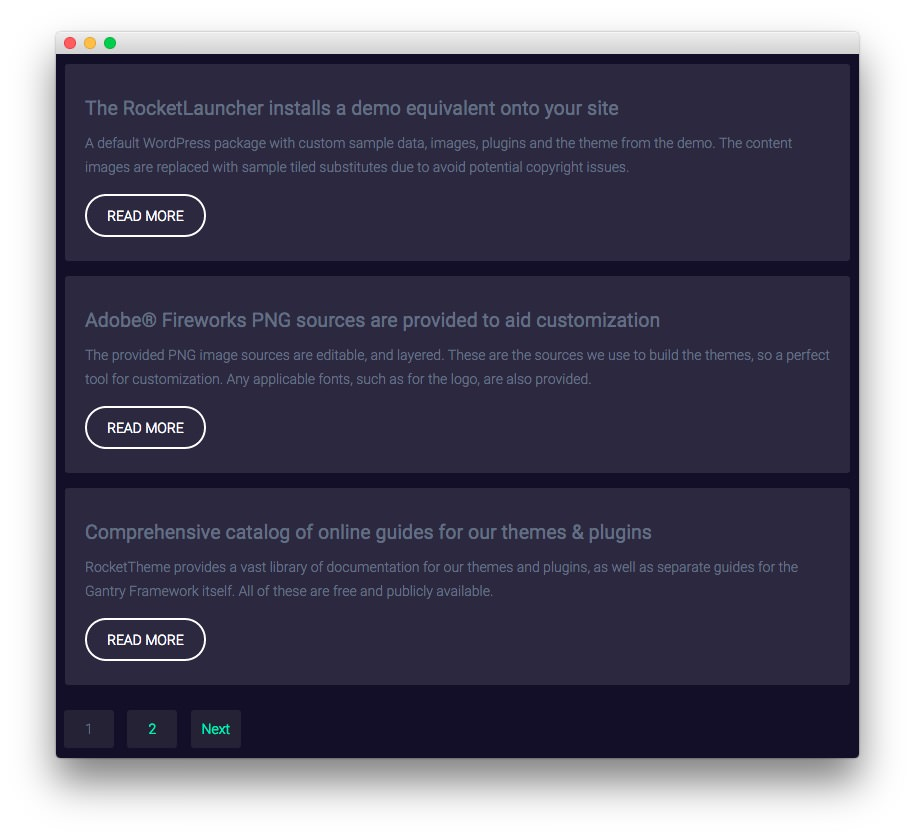
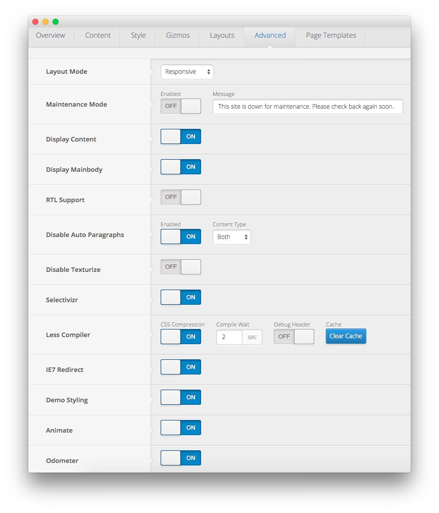

Mainbody Section
-----

This area of the front page is the mainbody. It allows you to display featured articles on the front page. There are a couple things that have to be in order in order to see these articles populated in the MainBody section of the page.

First, you will need to have the **Display Mainbody** and **Display Content** options set to **On** in your template settings. You can find these options by navigating to **Admin -> Clarion Theme -> Advanced -> Display Mainbody**. You will also want to make sure that the posts you want to display are set in the published status.

By default, WordPress displays the most recent articles in this area of the page. You can assign specific categories to the blog view by navigating to **Admin -> Clarion Theme -> Content -> Blog View -> Blog Category** and entering (comma separated) category IDs. If the field is left blank, the most recent posts will appear.

Below, we have listed the settings of the post titled **The RocketLauncher installs a demo equivalent onto your site**.

| Option         | Settings             |
| :----------    | :----------          |
| Title          | `The RocketLauncher installs a demo equivalent onto your site` |
| Status         | Published            |
| Tags           | Blank                |
| Featured Image | Blank                |

Most of the magic takes place in the article content:

~~~ .html

A default WordPress package with custom sample data, images, plugins and the theme from the demo. The content images are replaced with sample tiled substitutes due to avoid potential copyright issues.

<a class="readon2" href="http://demo.rockettheme.com/live/wordpress/cygnet/features-overview/">Read More</a>
~~~
