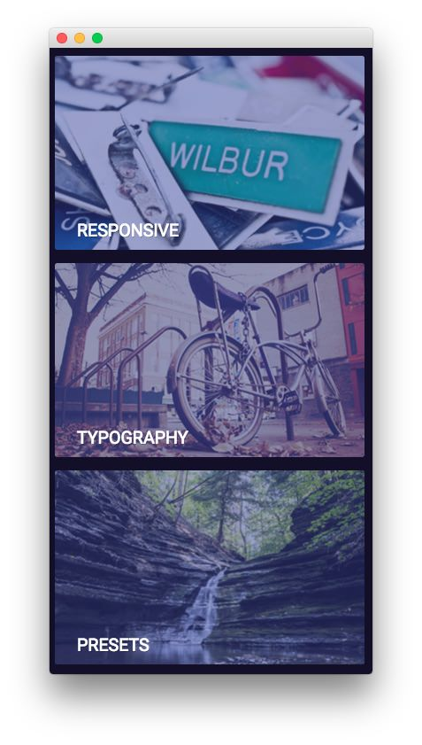

Sidebar Section
-----

Here is the widget breakdown for the Sidebar section:

#### Text

This section of the page is a standard text widget. You will need to enter the following in the main text field.

~~~ .html

    
    

        <h2 class="rt-uppercase"><a class="fp-demo-url" href="http://demo.rockettheme.com/live/wordpress/cygnet/features-overview/">Responsive</a></h2>
        
<a class="fp-demo-url" href="http://demo.rockettheme.com/live/wordpress/cygnet/features-overview/">Adapts to any devices</a>

    
          

    
    

        <h2 class="rt-uppercase"><a class="fp-demo-url" href="http://demo.rockettheme.com/live/wordpress/cygnet/typography/">Typography</a></h2>
        
<a class="fp-demo-url" href="http://demo.rockettheme.com/live/wordpress/cygnet/typography/">Individualize your content</a>

    
          

    
    

        <h2 class="rt-uppercase"><a class="fp-demo-url" href="http://demo.rockettheme.com/live/wordpress/cygnet/features-overview/">Presets</a></h2>
        
<a class="fp-demo-url" href="http://demo.rockettheme.com/live/wordpress/cygnet/features-overview/">Six elegant styles</a>

    
          

~~~

Here is a breakdown of options changes you will want to make to match the demo.

| Option            | Setting                 |
| :---------------- | :---------              |
| Custom Variations | `fp-sidebar wow fadeIn` |

Leaving everything else at its default setting, select **Save**.
