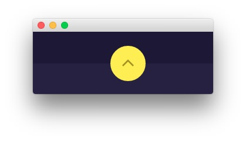

To Top Section
-----

Here is the widget breakdown for the To Top section:

#### Gantry To Top

The Gantry To Top widget is a simple indicator which allows users to jump to the top of a page with a single click. Just click and drag this widget into the section to activate it.

This particular widget has the following setting:

| Option      | Setting                          |
| :-----      | :-----                           |
| To Top Text | `<i class="fa fa-angle-up"></i>` |
