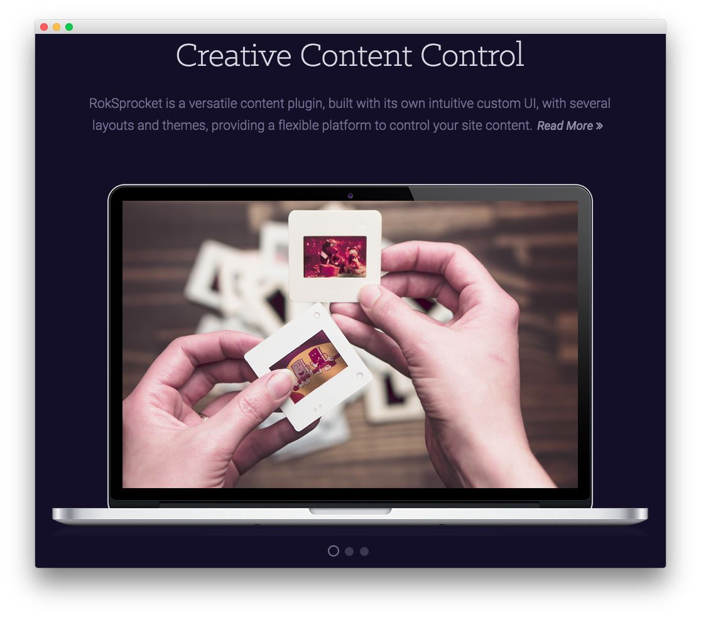

Utility Section
-----

Here is the widget breakdown for the Utility section:

#### RokSprocket (Features)

This area of the demo is a RokSprocket widget. You will need to do two things to prepare this widget so that it looks similar to the one in the demo.

First, you will need to create the RokSprocket Widget. You can do this by navigating to **Administration -> RokSprocket Admin** and creating a new **Features** widget.

You can find out more about RokSprocket and how to set up and modify widgets by visiting our [RokSprocket documentation](../../plugins/roksprocket).

##### Simple Provider

We used the **Simple Provider** to enable us to create custom RokSprocket content without having to create separate posts or pages to do so. Here are the details of one of the **Simple Items** in the **Featured Article List**.

| Option | Setting                    |
| :----- | :-----                     |
| Title  | `Creative Content Control` |
| Image  | Custom                     |
| Link   | Custom                     |

**Description**

~~~ .html
RokSprocket is a versatile content plugin, built with its own intuitive custom UI, with several layouts and themes, providing a flexible platform to control your site content.
~~~

Here is a look at the **Features Layout Options** for this widget.

| Option           | Setting   |
| :-----           | :-----    |
| Display Limit    | ∞         |
| Theme            | Showcase  |
| Article Titles   | Show      |
| Article Text     | Show      |
| Preview Length   | ∞         |
| Strip HTML Tags  | No        |
| Arrow Navigation | Hide      |
| Pagination       | Show      |
| Animation        | Crossfade |
| Autoplay         | Disable   |
| Autoplay Delay   | 5         |
| Image Resize     | Disable   |

>> The **Full Slideshow** theme is unique to Cygnet and was created to give the RokSprocket mode a certain set of attributes that enables it to look the way it does in this theme. You can find more information about overriding themes [here](../../plugins/roksprocket/layout_modes.md#custom-layout-theme-overrides).

You can set the RokSprocket filters to include any category, specific posts, or otherwise you would like to have featured in this widget.

Once you have created this widget, you can add it via the Widgets menu by clicking **RokSprocket** and dragging it to the appropriate section. When you have done this, you will need to return to the Widgets settings and fill them out as noted below:

| Option            | Setting                                          |
| :-----            | :-----                                           |
| Choose Widget     | (Select the RokSprocket Widget You Just Created) |
| Custom Variations | `fp-roksprocket-showcase`                        |

Leaving everything else at its default setting, select **Save**.

