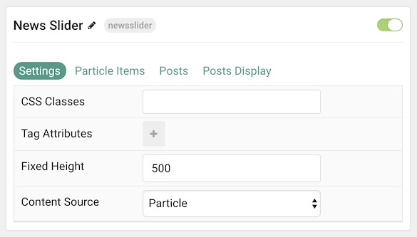
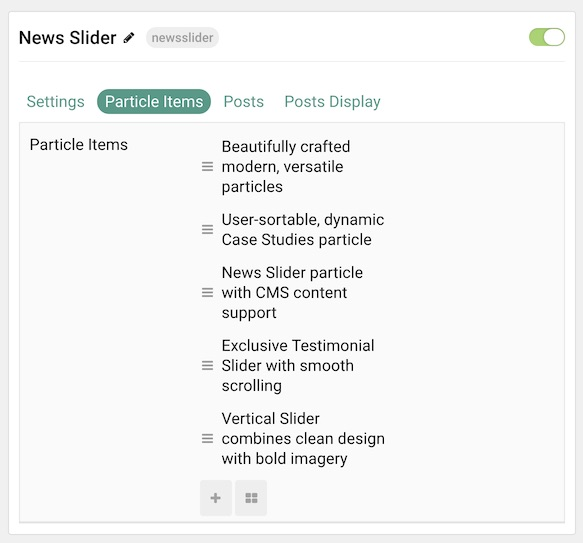
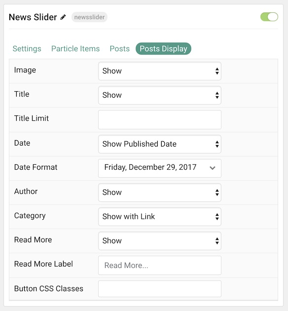

## Introduction

The **News Slider** particle displays bold images with supporting text in a way that showcases your content. This particle enables you to populate content either manually or directly from the CMS.

Here are the topics covered in this guide:

* [Configuration](#configuration)
    - [Main Options](#settings)
    - [Item Options](#particle-item-options)
    - [Articles](#articles)
    - [Display](#display)

## Configuration

### Settings 

These options affect the main area of the particle, and not the individual items within. You can set the title of the particle, as well as give it an introductory paragraph here.

| Option         | Description                                                                                         |
| :-----         | :-----                                                                                              |
| Particle Name  | This is the name of the particle used for back end management. It does not appear on the front end. |
| CSS Classes    | Enter any CSS class(es) you wish to have apply to the particle.                                     |
| Tag Attributes | Add extra tag attributes here.                                                                      |
| Fixed Height   | Set a height (in pixels) for the particle.                                                          |
| Content Source | Choose between **Particle** and **WordPress** as the Content Source.                                   |

### Particle Item Options

These items make up the individual featured items in the particle. Items in this section will only appear if **Particle** is selected as the **Content Source**.

| Option        | Description                                                      |
| :-----        | :-----                                                           |
| Item Name     | This is the name of the item. This only appears in the back end. |
| Avatar        | Set an avatar image for the item.                                |
| Image         | Set an image for the item.                                       |
| Author        | Enter an author name for the item here.                          |
| Date          | Enter a date that displays with the item here.                   |
| Date Format   | Set the format by which the date is displayed in the item.       |
| Link          | Enter a URL you would like the item to link to.                  |
| Category Name | Enter a name to display as a category for the item.              |
| Category Link | Enter a URL you would like the category name to link to.         |

### Articles

| Option             | Description                                                                                                     |
| :-----             | :-----                                                                                                          |
| Categories         | Select the categories of articles this particle will display.                                                   |
| Articles           | Select the number of articles you would like the particle to fetch.                                             |
| Featured Articles  | Choose how Featured Articles should be filtered. Choose between **Include**, **Exclude**, or **Only Featured**. |
| Number of Articles | Enter the maximum number of articles to display.                                                                |
| Start From         | Enter offset specifying the first article to return. The default is '0' (the first article).                    |
| Order By           | Choose the type of factor to order by.                                                                          |
| Ordering Direction | Choose between **Ascending** and **Descending** as the article ordering method.                                 |

### Display

This section configures how articles are displayed.

| Option             | Description                                                                  |
| :-----             | :-----                                                                       |
| Image              | Display the image assigned to the article's **Intro**, **Full** or **None**. |
| Title              | **Show** or **Hide** the article's title.                                    |
| Title Limit        | Enter the maximum number of characters in the title to display.              |
| Date               | Enter a date for the item.                                                   |
| Date Format        | Select the format you want the date to be displayed in.                      |
| Author             | Choose to **Show** or **Hide** author names.                                 |
| Category           | Choose to **Show** or **Hide** a category names.                             |
| Read More          | Choose to **Show** or **Hide** a readmore link for each item.                |
| Read More Label    | Enter a text label to appear in the read more button.                        |
| Button CSS Classes | Add any CSS class(es) you wish to have apply to the readmore button.         |