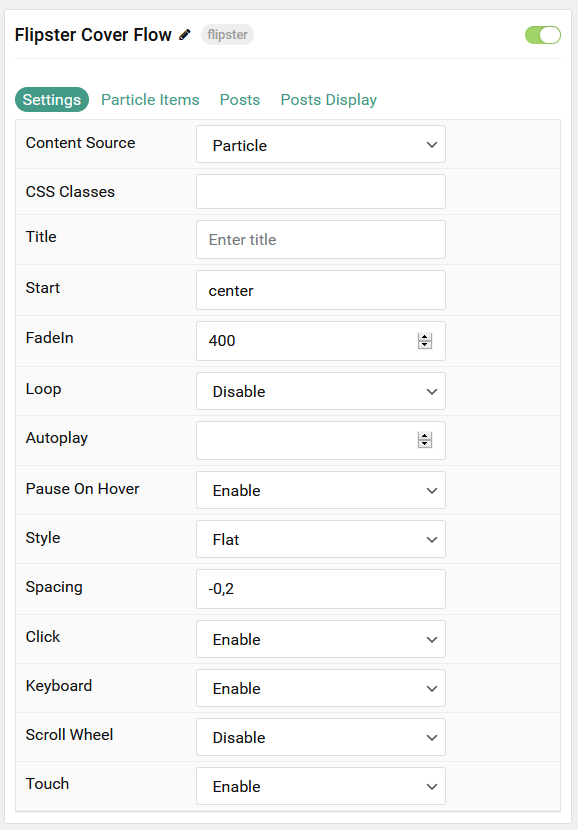
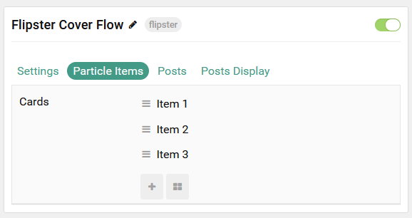
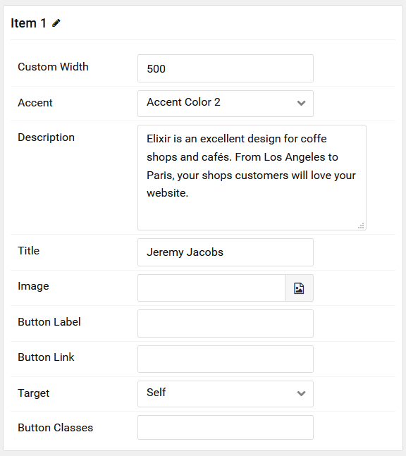
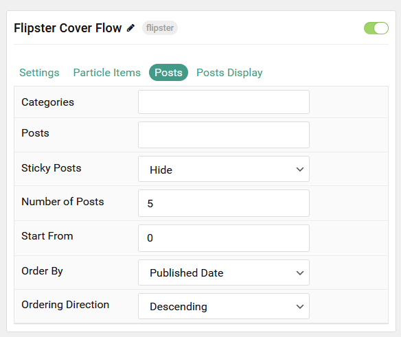
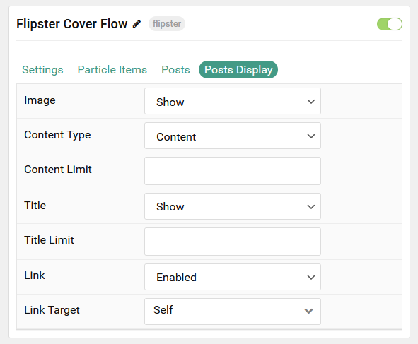

## Introduction

The **Flipster Cover Flow** particle is an excellent choice for displaying testimonial content, as well as important information for your visitors.

Here are the topics covered in this guide:

- [Introduction](#introduction)
- [Configuration](#configuration)
  - [Settings](#settings)
  - [Particle Item Options](#particle-item-options)
  - [Posts](#posts)
  - [Display](#display)

## Configuration

### Settings

These options affect the main area of the particle, and not the individual items within.

| Option         | Description                                                                                         |
| :------------- | :-------------------------------------------------------------------------------------------------- |
| Particle Name  | This is the name of the particle used for back end management. It does not appear on the front end. |
| Content Source | Choose whether to have content load from particle items or the CMS.                                 |
| CSS Classes    | Enter any CSS class(es) you wish to have apply to the particle.                                     |
| Title          | Set a title for the particle.                                                                       |
| Start          | Choose where to start the praticle off when the page loads.                                         |
| FadeIn         | Speed of the animation (in milliseconds) for items to fade in on page load.                         |
| Loop           | **Enable** or **Disable** the loop around when the items reach the end of the list.                 |
| Autoplay       | Enter the number of milliseconds between item switches on autoplay. `0` disables autoplay.          |
| Pause On Hover | **Enable** or **Disable** Pause on Hover.                                                           |
| Style          | Set the style. Options include: **Cover Flow**, **Carousel**, **Flat**, and **Wheel**.              |
| Spacing        | Space between items relative to the item's width.                                                   |
| Click          | Clicking an item switches to that item.                                                             |
| Keyboard       | **Enable** or **Disable** arrow right/left navigation.                                              |
| Scroll Wheel   | **Enable** or **Disable** Scroll Wheel navigation.                                                  |
| Touch          | **Enable** or **Disable** touch navigation.                                                         |

### Particle Item Options

These items make up the individual featured items in the particle.

| Option         | Description                                                           |
| :------------- | :-------------------------------------------------------------------- |
| Item Name      | This is the name of the item. This name only appears on the back end. |
| Accent         | Select the accent color to feature as the background of the item.     |
| Description    | Enter a text description for the item.                                |
| Title          | Enter a title for the item.                                           |
| Image          | Set an image to appear in the item.                                   |
| Button Label   | Enter a label to appear as the button for the item.                   |
| Button Link    | Enter a URL you would like the item to link to.                       |
| Target         | Select a target window for the URL to open through.                   |
| Button Classes | Enter any CSS class(es) to apply to the item.                         |

### Posts

| Option             | Description                                                                            |
| :----------------- | :------------------------------------------------------------------------------------- |
| Categories         | Select the categories of posts this particle will display.                             |
| Posts              | Select the number of posts you would like the particle to fetch.                       |
| Sticky Posts       | Choose to **Show** or **Hide** sticky posts.                                           |
| Number of Posts    | Enter the maximum number of posts to display.                                          |
| Start From         | Enter offset specifying the first post to return. The default is '0' (the first post). |
| Order By           | Choose the type of factor to order by.                                                 |
| Ordering Direction | Choose between **Ascending** and **Descending** as the post ordering method.           |

### Display

This section configures how posts are displayed.

| Option        | Description                                                                                                                                              |
| :------------ | :------------------------------------------------------------------------------------------------------------------------------------------------------- |
| Image         | Choose to **Show** or **Hide** the image.                                                                                                                |
| Content Type  | Choose between showing the **Content** or **Exerpt** text to display. You can also **Hide** text completely.                                             |
| Content Limit | Set a limit (in characters) of the post's text to appear.                                                                                                |
| Title         | Choose whether or not the title of an post should be shown.                                                                                              |
| Title Limit   | Set a character limit for titles.                                                                                                                        |
| Link          | Enter the url you want that link to go to.                                                                                                               |
| Link Target   | Set the target for the button. You can choose between **Self** which opens the link in the current tab or **New Window** which opens links in a new tab. |
