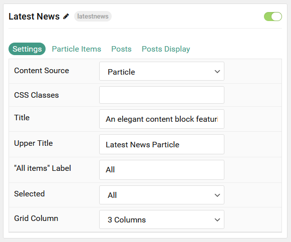
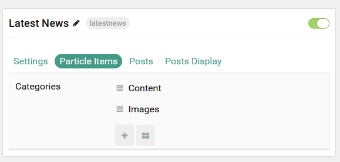
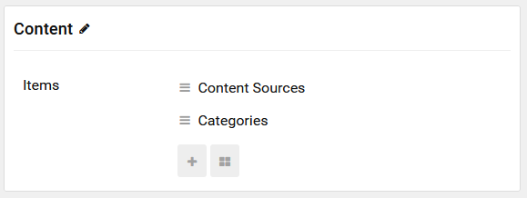
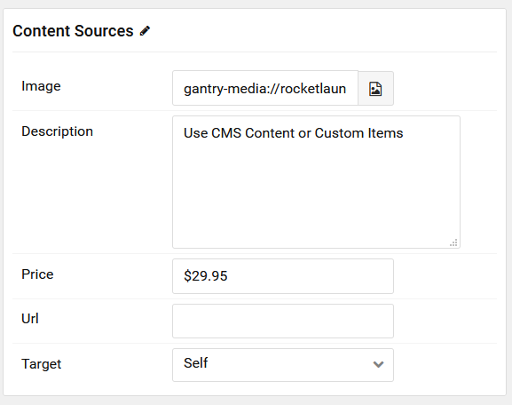
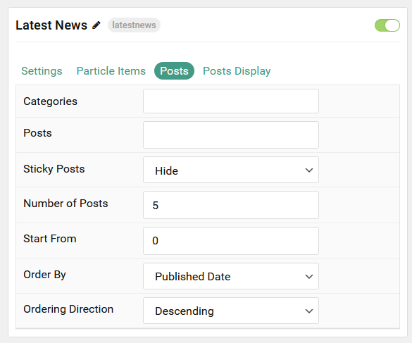
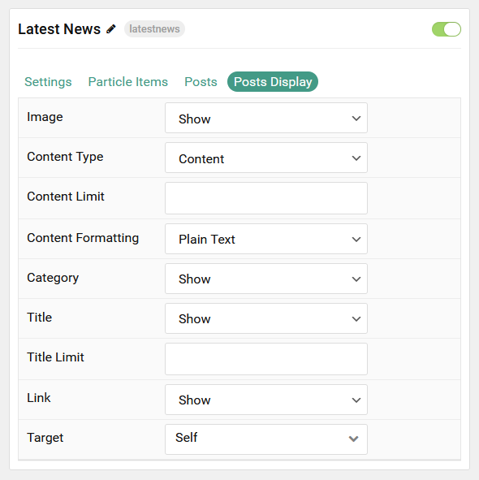

## Introduction

The **Latest News** particle displays your latest posts or featured content, along with images and text. You can vary the way these items appear, making them more appealing to the eye and magazine-like.

Here are the topics covered in this guide:

- [Introduction](#introduction)
- [Configuration](#configuration)
  - [Settings](#settings)
  - [Particle Item Options](#particle-item-options)
  - [Posts](#posts)
  - [Display](#display)

## Configuration

### Settings

These options affect the main area of the particle, and not the individual items within.

| Option         | Description                                                                                         |
| :------------- | :-------------------------------------------------------------------------------------------------- |
| Particle Name  | This is the name of the particle used for back end management. It does not appear on the front end. |
| Content Source | Choose whether to have content load from particle items or the CMS.                                 |
| CSS Classes    | Enter any CSS class(es) you wish to have apply to the particle.                                     |
| Title          | Set a title for the particle.                                                                       |
| Upper Title    | Enter a title to appear above the main title.                                                       |
| Grid Column    | Set the number of columns items appear in.                                                          |
| Date Format    | Select the date format to be displayed.                                                             |

### Particle Item Options

These items make up the individual featured items in the particle.

| Option      | Description                                                                      |
| :---------- | :------------------------------------------------------------------------------- |
| Item Name   | This is the name of the item. This appears as the item's title on the front end. |
| Image       | Set an image to appear in the item.                                              |
| Description | Enter a text description for the item.                                           |
| Price       | Enter a price for the item being described.                                      |
| URL         | Enter a URL you would like the item to link to.                                  |
| Target      | Select a target window for the URL to open through.                              |

### Posts

| Option             | Description                                                                            |
| :----------------- | :------------------------------------------------------------------------------------- |
| Categories         | Select the categories of posts this particle will display.                             |
| Posts              | Select the number of posts you would like the particle to fetch.                       |
| Sticky Posts       | Choose to **Show** or **Hide** sticky posts.                                           |
| Number of Posts    | Enter the maximum number of posts to display.                                          |
| Start From         | Enter offset specifying the first post to return. The default is '0' (the first post). |
| Order By           | Choose the type of factor to order by.                                                 |
| Ordering Direction | Choose between **Ascending** and **Descending** as the post ordering method.           |

### Display

This section configures how posts are displayed.

| Option             | Description                                                                                                                                              |
| :----------------- | :------------------------------------------------------------------------------------------------------------------------------------------------------- |
| Image              | Choose to **Show** or **Hide** the image.                                                                                                                |
| Content Type       | Choose between showing the **Content** or **Exerpt** text to display. You can also **Hide** text completely.                                             |
| Content Limit      | Set a limit (in characters) of the post's text to appear.                                                                                                |
| Content Formatting | Select between **Plain Text** and **HTML** text formatting.                                                                                              |
| Category           | Choose to **Show** or **Hide** the post's category.                                                                                                      |
| Title              | Choose whether or not the title of an post should be shown.                                                                                              |
| Title Limit        | Set a character limit for titles.                                                                                                                        |
| Link               | Enter the url you want that link to go to.                                                                                                               |
| Link Target        | Set the target for the button. You can choose between **Self** which opens the link in the current tab or **New Window** which opens links in a new tab. |