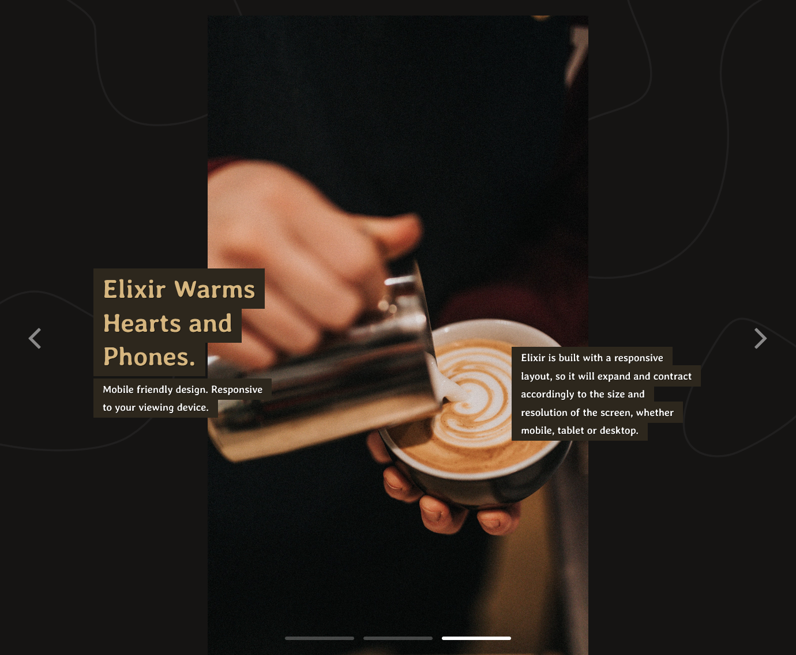
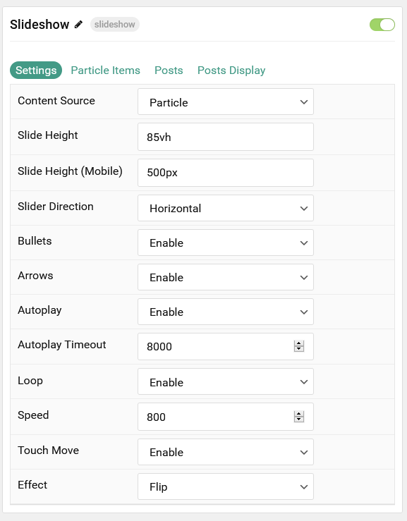
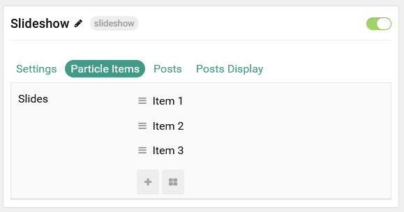
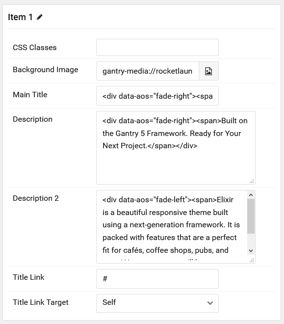
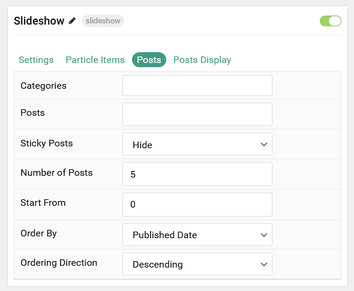

## Introduction

The **Slideshow** particle creates beautiful image slideshows that work perfectly at the top of your page.

Here are the topics covered in this guide:

- [Introduction](#introduction)
- [Configuration](#configuration)
  - [Settings](#settings)
  - [Particle Item Options](#particle-item-options)
  - [Posts](#posts)
  - [Display](#display)

## Configuration

### Settings

These options affect the main area of the particle, and not the individual items within. You can set the title of the particle, as well as give it an introductory paragraph here.

| Option                | Description                                                                                         |
| :-------------------- | :-------------------------------------------------------------------------------------------------- |
| Particle Name         | This is the name of the particle used for back end management. It does not appear on the front end. |
| Content Source        | Choose between **Particle** and **WordPress** as the content source for the particle.               |
| Slide Height          | Set the minimal height of each slide.                                                               |
| Slide Height (Mobile) | Set the minimal height of each slide on mobile devices.                                             |
| Slider Direction      | Choose between a **Vertical** and **Horizontal** slider animation.                                  |
| Center Active Slide   | If **enabled**, the active slide will be centered.                                                  |
| Bullets               | **Enable** or **Disable** bullet navigation.                                                        |
| Arrows                | **Enable** or **Disable** arrows navigation.                                                        |
| Autoplay              | **Enable** or **Disable** autoplay for the particle.                                                |
| Autoplay Timeout      | Set the time (in milliseconds) between slides in autoplay mode.                                     |
| Loop                  | **Enable** or **Disable** looping slides.                                                           |
| Speed                 | Set the transition speed (in milliseconds).                                                         |
| Touch Move            | **Enable** or **Disable** touch movements.                                                          |
| Effect                | Choose a slideshow effect. Options include: **Slide** or **Fade**.                                  |

### Particle Item Options

These items make up the individual featured items in the particle. Items in this section will only appear if **Particle** is selected as the **Content Source**.

| Option            | Description                                                                                 |
| :---------------- | :------------------------------------------------------------------------------------------ |
| Item Name         | This is the name of the item. It is used only for backend organization and does not appear. |
| CSS Classes       | Enter any CSS class(es) you wish to have apply to the item.                                 |
| Background Image  | Select a background image to appear in the particle.                                        |
| Main Title        | Enter a larger main title to appear on the front end.                                       |
| Description       | Enter a text description to appear in the first description area of the particle.           |
| Description 2     | Enter a text description to appear in the second description area of the particle.          |
| Title Link        | Enter a URL the button will send users to.                                                  |
| Title Link Target | Enter a target window for the link.                                                         |

### Posts

| Option             | Description                                                                            |
| :----------------- | :------------------------------------------------------------------------------------- |
| Categories         | Select the categories of posts this particle will display.                             |
| Posts              | Select the number of posts you would like the particle to fetch.                       |
| Sticky Posts       | Choose to **Show** or **Hide** sticky posts.                                           |
| Number of Posts    | Enter the maximum number of posts to display.                                          |
| Start From         | Enter offset specifying the first post to return. The default is '0' (the first post). |
| Order By           | Choose the type of factor to order by.                                                 |
| Ordering Direction | Choose between **Ascending** and **Descending** as the post ordering method.           |

### Display

This section configures how posts are displayed.

| Option        | Description                                                                                                                                              |
| :------------ | :------------------------------------------------------------------------------------------------------------------------------------------------------- |
| Image         | Choose to **Show** or **Hide** the image.                                                                                                                |
| Content Type  | Choose between showing the **Content** or **Exerpt** text to display. You can also **Hide** text completely.                                             |
| Content Limit | Set a limit (in characters) of the post's text to appear.                                                                                                |
| Title         | Choose whether or not the title of an post should be shown.                                                                                              |
| Title Limit   | Set a character limit for titles.                                                                                                                        |
| Link          | Enter the url you want that link to go to.                                                                                                               |
| Link Target   | Set the target for the button. You can choose between **Self** which opens the link in the current tab or **New Window** which opens links in a new tab. |
