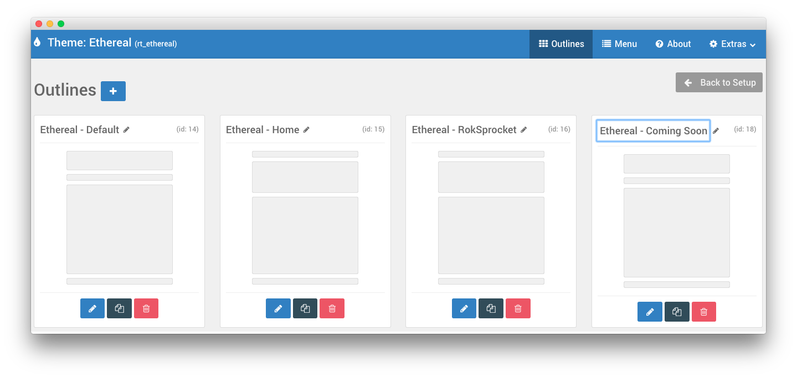
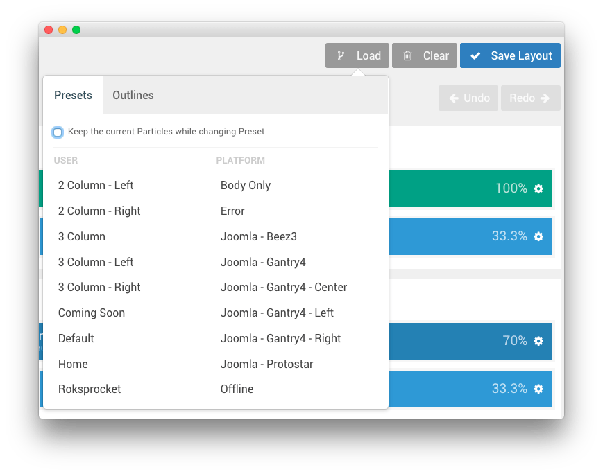
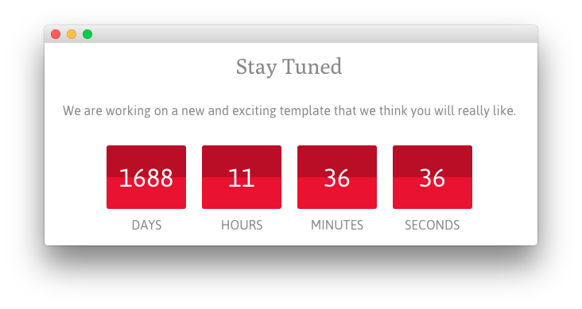
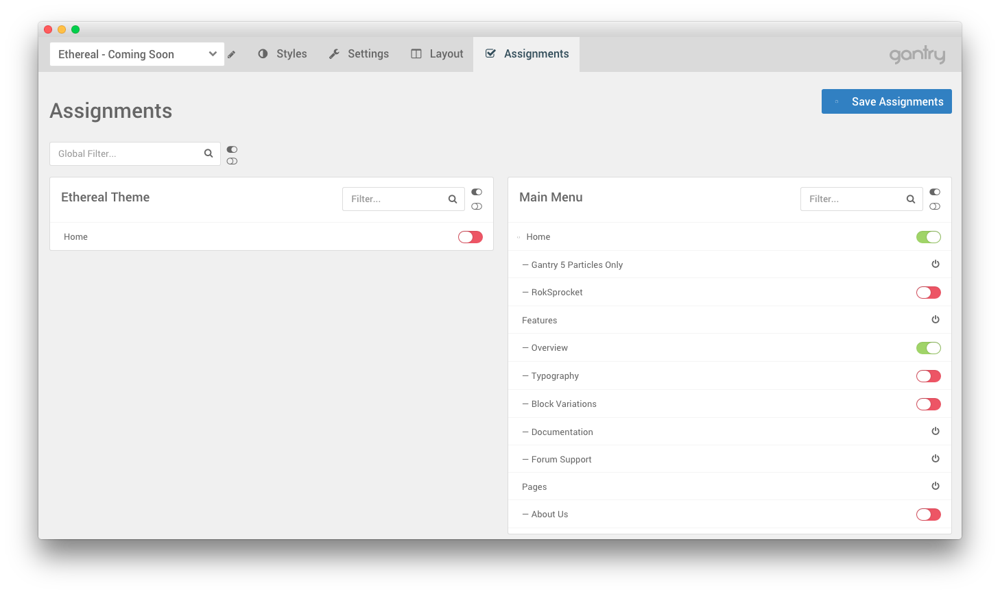
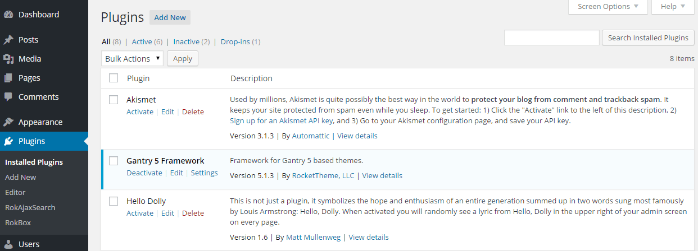
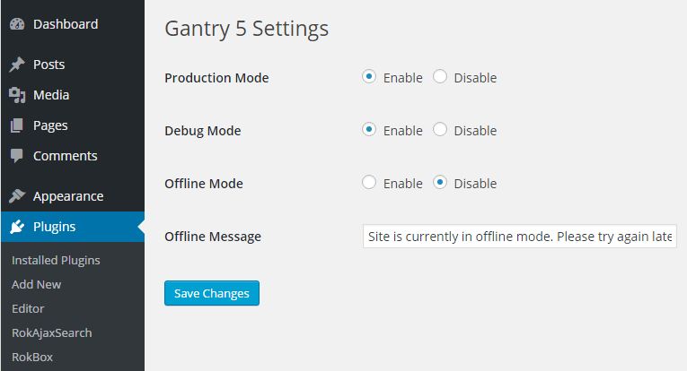

## Introduction

The **Coming Soon** example page demonstrates how you can create and assign a useful Coming Soon page for your theme. 

In this guide, we will go over how to create a new theme outline for the Coming Soon page, configure the **Simple Counter** particle, and assign the coming soon outline to your home page.

## Coming Soon Theme Outline

The first step to utilizing the Coming Soon page for your site is to create a **Coming Soon** theme outline. This outline is very easy to make, just create a new override via the **Outlines** administration panel, and navigate to the **Layout Manager**. 

From here, you will want to load the **Coming Soon** layout preset which is included in the **User** column. This preset includes everything you need to get started with the Coming Soon page.

>> Make sure that the **Keep the Current Particles While Changing Preset** option is unchecked.

## Simple Counter Particle

Along with everything in this preset layout, the most noticeable one in our demo that you will want to work with is the countdown timer. The **Simple Counter** particle should appear in the **Mainbar** section upon loading the **Coming Soon** preset layout. 

Here is a breakdown of the settings you can configure in this particle:

| Setting     | Description                                                                                                                                       |
| :-----      | :-----                                                                                                                                            |
| CSS Classes | Enables you to set a CSS class to the particle itself. This is a great way to customize its appearance.                                           |
| Title       | This is the title you wish to have displayed on the front end. For example: `Stay Tuned`.                                                         |
| Description | This description appears on the front end with your particle. It is where you would place any text (or custom HTML) that you want to have appear. |
| Date        | The day of the month you want to have the timer expire.                                                                                           |
| Month       | The month you would like to have the timer expire.                                                                                                |
| Year        | The year you would like to have the timer expire.                                                                                                 |

Once you have configured your countdown timer, everything else on the page is pretty straightforward. Arrange widgets and/or particles as you see fit. You will also want to configure your WordPress permissions settings to ensure that only logged-in folks have access to the rest of the site.

## Assign the Coming Soon Outline to Your Desired Pages

The next step is pretty simple. You want your coming soon page to be assigned to the home page, or any other specific page you wish you have the Coming Soon message appear. To do this, navigate to the **Assignments** administration panel within the Gantry 5 administrator, locate the desired pages you wish you have the Coming Soon page appear, and turn their toggles on.

Once you have saved your changes, you can navigate to the front end of your site to check the results.

## Set the Entire Site Offline

You can, alternatively set the entire front end of your site offline, displaying the **Offline** system Outline content on the front end. This is different than the Coming Soon page we've covered here in that it encompasses your entire site, and acts as a system action rather than simply an assigned outline.

Doing this is quite simple, you will need to navigate to **Admin > Plugins** and select the **Settings** link associated with the **Gantry 5 Framework** plugin.

Alternatively, you can access this page from the **Extras** menu within the **Gantry 5 Administrator**.

From here, you can put the site in **Offline Mode** by setting the **Offline Mode** option to **Enable**. This will trigger the **Offline** outline for your entire site.