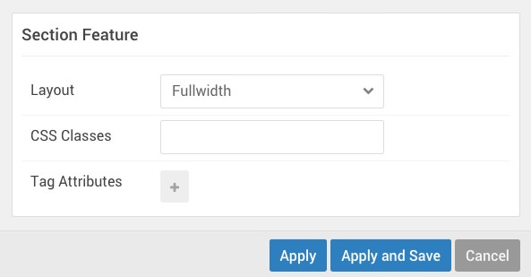
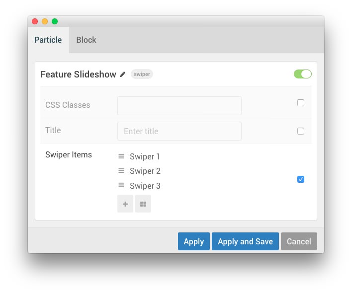
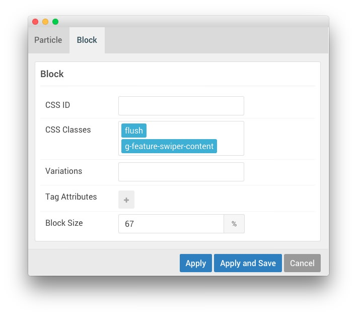
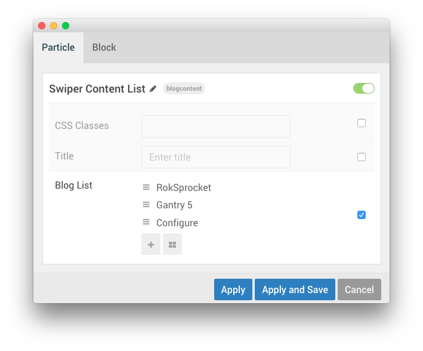
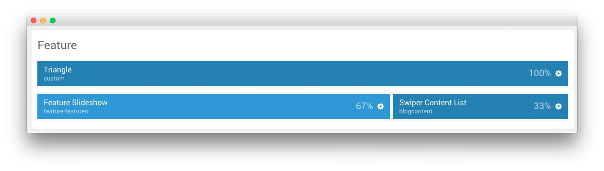
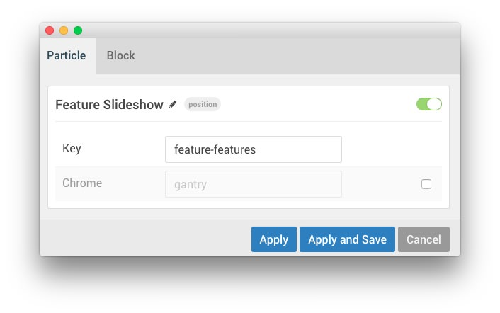
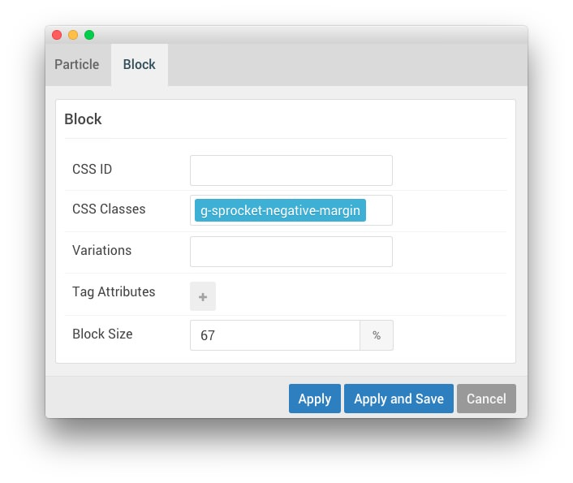
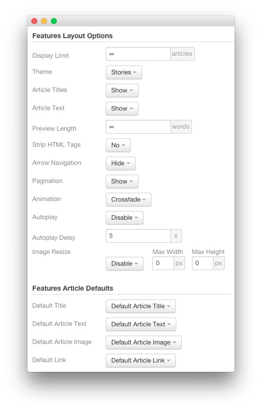

## Introduction

:   1. **Custom (Particle)** [17%, 47%, se]
    2. **Swiper (Particle)** [25%, 7%, se]
    3. **Content List (Particle)** [25%, 67%, se]

The **Feature** section contains three particles, a **Custom** particle creating the triangle, a **Swiper** particle, and a **Blog Content** particle. The **Swiper** particle has a RokSprocket alternative, detailed at the bottom of this page.

Here is a breakdown of the particles that appear in this section:

* [Custom (Particle)](#custom-(particle))
* [Swiper (Particle)](#swiper-(particle))
    - [Alternative: RokSprocket (Widget)](#alternative:-roksprocket)
* [Blog Content (Particle)](#blog-content-(particle))

Settings used in the demo for the particle used in this section can be found below.

## Section Settings

| Field          | Setting   |
| :-----         | :-----    |
| Layout         | Fullwidth |
| CSS Classes    | Blank     |
| Tag Attributes | Blank     |

## Custom (Particle)

### Particle Settings

| Field         | Setting    |
| :-----        | :-----     |
| Particle Name | `Triangle` |

**Custom HTML** 
~~~ .html

    
<a href="http://www.rockettheme.com/wordpress/themes/ethereal"><i class="fa fa-fw fa-3x fa-cloud-download"></i></a>

~~~

### Block Settings

| Field          | Setting                     |
| :-----         | :-----                      |
| CSS ID         | Blank                       |
| CSS Classes    | `flush`, `g-triangle-block` |
| Variations     | Center                      |
| Tag Attributes | Blank                       |
| Block Size     | `100%`                      |

## Swiper (Particle)

### Particle Settings

| Field               | Setting                                                    |
| :-----              | :-----                                                     |
| Particle Name       | `Feature Slideshow`                                        |
| CSS Classes         | Blank                                                      |
| Swiper Item 1 Title | `Swiper 1`                                                 |
| Swiper Item 1 Image | Custom                                                     |
| Swiper Item 1 Text  | `A professional design based on vibrancy and elegance`     |
| Swiper Item 2 Title | `Swiper 2`                                                 |
| Swiper Item 2 Image | Custom                                                     |
| Swiper Item 2 Text  | `A versatile and flexible in-built dropdown menu system`   |
| Swiper Item 3 Title | `Swiper 3`                                                 |
| Swiper Item 3 Image | Custom                                                     |
| Swiper Item 3 Text  | `Built on Gantry 5, a modern and flexible theme framework` |

**Item 1 Description**
~~~ .html
Ethereal is an exquisite design bursting with sharpness and bold, but complementary visuals; within a rich framework of emphasized typography and iconography.
~~~

**Item 2 Description**
~~~ .html
Gantry 5 benefits from a built-in navigation system. Dropdowns can be configured to be multiple columns with dynamic or configurable fixed widths.
~~~

**Item 3 Description**
~~~ .html
Gantry 5 is a revolutionary theme framework, built for the modern web, with features such as responsive designs, drag & drop layout and menu controls.
~~~

### Block Settings

| Field          | Setting                             |
| :-----         | :-----                              |
| CSS ID         | Blank                               |
| CSS Classes    | `flush`, `g-feature-swiper-content` |
| Variations     | Blank                               |
| Tag Attributes | Blank                               |
| Block Size     | `67%`                               |

## Blog Content (Particle)

### Particle Settings

| Field                        | Setting                                                                                              |
| :-----                       | :-----                                                                                               |
| Particle Name                | `Swiper Content List`                                                                                |
| CSS Classes                  | Blank                                                                                                |
| Title                        | Blank                                                                                                |
| Image                        | Custom                                                                                               |
| Image Tag                    | `Ethereal`                                                                                           |
| Headline                     | `Construct unique and dynamic content creations with RokSprocket` |
| Subtitle                     | `Intuitive and Versatile`                                                                            |
| Readmore Text                | `Read More`                                                                                          |
| Readmore Link                | `#`                                                                                                  |
| Grid Column                  | 2 Columns                                                                                            |
| Blog List Item 1 Title       | `RokSprocket`                                                                                        |
| Blog List Item 1 Headline    | `A powerful content setup and display plugin`                                                     |
| Blog List Item 1 Tag         | `RokSprocket`                                                                                        |
| Blog List Item 1 Description | `A content plugin with multiple layouts, themes and providers.`                                   |
| Blog List Item 1 Divider     | Bottom                                                                                               |
| Blog List Item 1 Icon Link   | Blank                                                                                                |
| Blog List Item 1 Icon 1      | Blank                                                                                                |
| Blog List Item 1 Icon 1 Text | Blank                                                                                                |
| Blog List Item 1 Icon 2      | Blank                                                                                                |
| Blog List Item 1 Icon 2 Text | Blank                                                                                                |
| Blog List Item 1 Icon 3      | Blank                                                                                                |
| Blog List Item 1 Icon 3 Text | Blank                                                                                                |
| Blog List Item 2 Title       | `Gantry 5`                                                                                           |
| Blog List Item 2 Headline    | `Versatile array of Gantry 5 only content particles`                                                 |
| Blog List Item 2 Tag         | `Gantry 5`                                                                                           |
| Blog List Item 2 Description | `Complex content creations purely with Gantry 5 particles.`                                          |
| Blog List Item 2 Divider     | Bottom                                                                                               |
| Blog List Item 2 Icon Link   | Blank                                                                                                |
| Blog List Item 2 Icon 1      | Blank                                                                                                |
| Blog List Item 2 Icon 1 Text | Blank                                                                                                |
| Blog List Item 2 Icon 2      | Blank                                                                                                |
| Blog List Item 2 Icon 2 Text | Blank                                                                                                |
| Blog List Item 2 Icon 3      | Blank                                                                                                |
| Blog List Item 2 Icon 3 Text | Blank                                                                                                |
| Blog List Item 3 Title       | `Configure`                                                                                          |
| Blog List Item 3 Headline    | `Ultimate control with the intuitive theme manager`                                               |
| Blog List Item 3 Tag         | `Configure`                                                                                          |
| Blog List Item 3 Description | `A highly user friendly interface, such as drag & drop functionality.`                               |
| Blog List Item 3 Divider     | None                                                                                                 |
| Blog List Item 3 Icon Link   | Blank                                                                                                |
| Blog List Item 3 Icon 1      | Blank                                                                                                |
| Blog List Item 3 Icon 1 Text | Blank                                                                                                |
| Blog List Item 3 Icon 2      | Blank                                                                                                |
| Blog List Item 3 Icon 2 Text | Blank                                                                                                |
| Blog List Item 3 Icon 3      | Blank                                                                                                |
| Blog List Item 3 Icon 3 Text | Blank                                                                                                |

### Block Settings

| Field          | Setting                                                 |
| :-----         | :-----                                                  |
| CSS ID         | Blank                                                   |
| CSS Classes    | `swiper-slide-content-list`, `g-feature-swiper-content` |
| Variations     | `Box White`                                             |
| Tag Attributes | Blank                                                   |
| Block Size     | `33%`                                                   |

# Alternative: RokSprocket

For folks that prefer **RokSprocket** to using a particle, we have included the instructions for creating this slideshow using RokSprocket below, as well. 

The first thing you will want to do is add a **Widget Position** particle to the layout manager, as pictured above.

## Widget Position (feature)

### Particle Settings

| Field         | Setting             |
| :-----        | :-----              |
| Particle Name | `Feature Slideshow` |
| Key           | `feature-features`  |
| Chrome        | `gantry`            |

### Block Settings

| Field          | Setting                      |
| :-----         | :-----                       |
| CSS ID         | Blank                        |
| CSS Classes    | `g-sprocket-negative-margin` |
| Variations     | Blank                        |
| Tag Attributes | Blank                        |
| Block Size     | `67%`                        |

## Assigned Widget(s)

The `feature-features` widget position is host to a single **RokSprocket** widget.

We utilized the **Simple** Content Provider, linking each item in the RokSprocket widget to an post. You can find examples of the **Simple** items used in this widget in the **Filtered Article List** section below.

### Details

| Option           | Setting              |
| :-----           | :-----               |
| Title            | `Features Slideshow` |
| Position         | `feature-features`   |
| Content Provider | Simple               |
| Type             | Features             |

### Filtered Article List

#### Item 1

| Option | Setting                                                |
| :----- | :-----                                                 |
| Title  | `A professional design based on vibrancy and elegance` |
| Image  | Custom                                                 |
| Link   | None                                                   |

**Description**
~~~ .html
Ethereal is an exquisite design bursting with sharpness and bold, but complementary visuals; within a rich framework of emphasized typography and iconography.
~~~

#### Item 2

| Option | Setting                                                  |
| :----- | :-----                                                   |
| Title  | `A versatile and flexible in-built dropdown menu system` |
| Image  | Custom                                                   |
| Link   | None                                                     |

**Description**
~~~ .html
Gantry 5 benefits from a built-in navigation system. Dropdowns can be configured to be multiple columns with dynamic or configurable fixed widths.
~~~

#### Item 3

| Option | Setting                                                    |
| :----- | :-----                                                     |
| Title  | `Built on Gantry 5, a modern and flexible theme framework` |
| Image  | Custom                                                     |
| Link   | None                                                       |

**Description**
~~~ .html
Gantry 5 is a revolutionary theme framework, built for the modern web, with features such as responsive designs, drag & drop layout and menu controls.
~~~

### Layout Options

| Option                | Setting               |
| :-----                | :-----                |
| Display Limit         | `∞`                   |
| Theme                 | Stories               |
| Article Titles        | Show                  |
| Article Text          | Show                  |
| Preview Length        | `∞`                   |
| Strip HTML Tags       | No                    |
| Arrow Navigation      | Hide                  |
| Pagination            | Show                  |
| Animation             | Crossfade             |
| Autoplay              | Disable               |
| Autoplay Delay        | `5`                   |
| Image Resize          | Disable               |
| Default Title         | Default Article Title |
| Default Article Text  | Default Article Text  |
| Default Article Image | Default Article Image |
| Default Link          | Default Article Link  |

