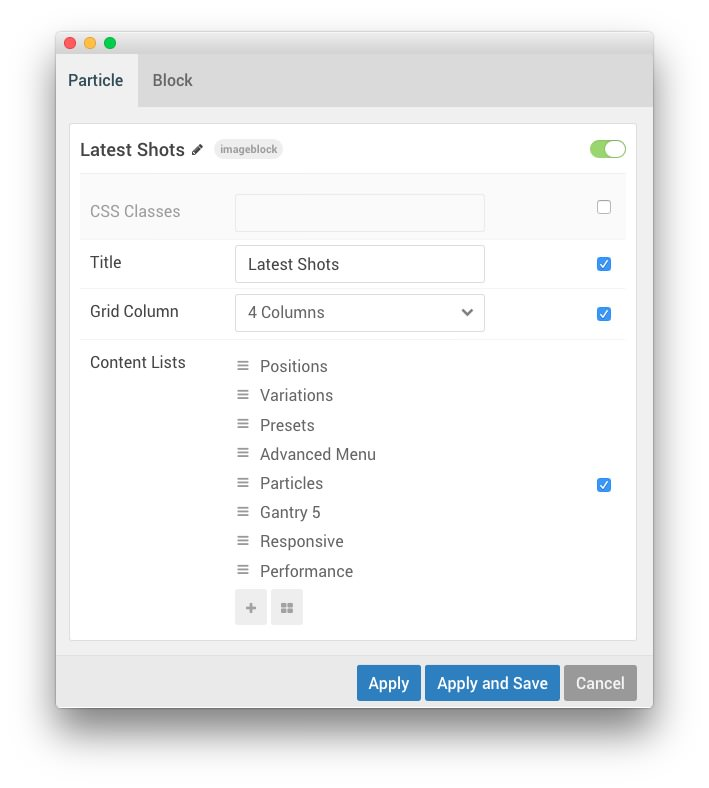
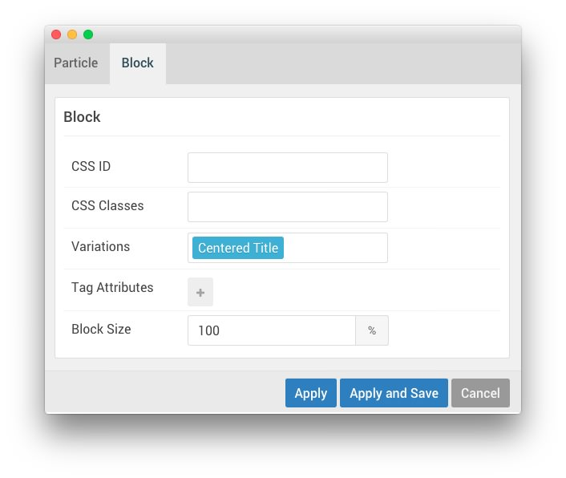
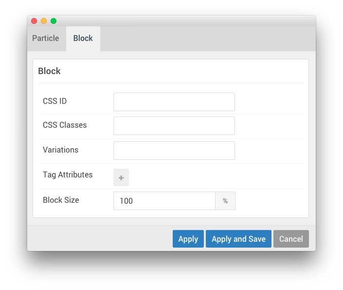
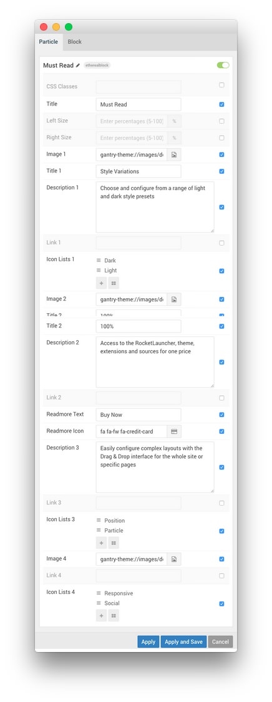
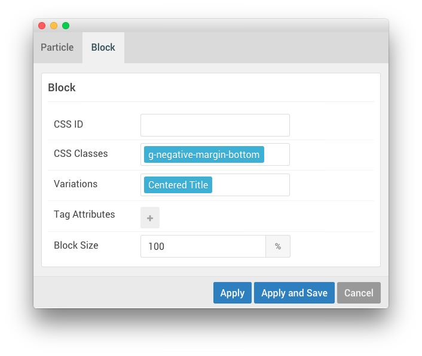
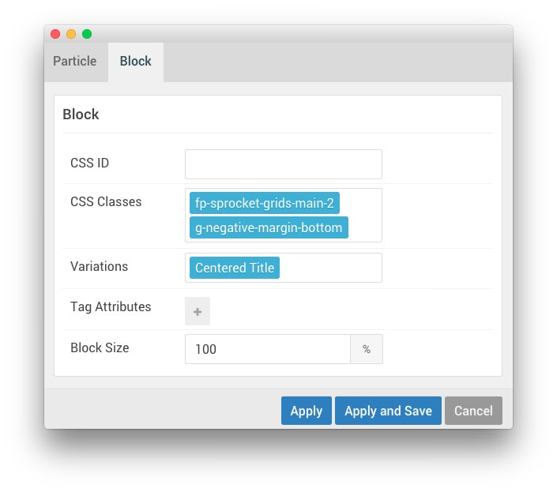

## Introduction

:   1. **Image Block (Particle)** [7%, 12%, se]
    2. **Custom HTML (Particle)** [35%, 12%, se]
    3. **Number Headline (Particle)** [45%, 12%, se]
    4. **Ethereal Block (Particle)** [65%, 12%, se]

The **Main** section contains four particles, a **Image Block** particle creating the triangle, a **Custom HTML** particle, **Number Headline** particle, and a **Ethereal Block** particle. 

Here is a breakdown of the particles that appear in this section:

* [Image Block (Particle)](#image-block-(particle))
    - [Alternative: RokSprocket (Grids)](#widget-position-(main-grids))
* [Custom HTML (Particle)](#custom-html-(particle))
* [Number Headline (Particle)](#number-headline-(particle))
    - [Alternative: RokSprocket (Mosaic)](#widget-position-(main-mosaic))
* [Ethereal Block (Particle)](#ethereal-block-(particle))
    - [Alternative: RokSprocket (Grids)](#widget-position-(main-grids-2))

Settings used in the demo for the particle used in this section can be found below.

## Section Settings

| Field          | Setting   |
| :-----         | :-----    |
| Layout         | Fullwidth |
| CSS Classes    | Blank     |
| Tag Attributes | Blank     |

## Image Block (Particle)

### Particle Settings

| Field                             | Setting                                                                                          |
| :-----                            | :-----                                                                                           |
| Particle Name                     | `Latest Shots`                                                                                   |
| CSS Classes                       | Blank                                                                                            |
| Title                             | `Latest Shots`                                                                                   |
| Grid Column                       | 4 Columns                                                                                        |
| Content List Item 1 Title         | `Positions`                                                                                      |
| Content List Item 1 Image         | Custom                                                                                           |
| Content List Item 1 Icon          | `fa fa-fw fa-camera`                                                                             |
| Content List Item 1 Headline      | Blank                                                                                            |
| Content List Item 1 Title Bottom  | `Positions`                                                                                      |
| Content List Item 1 Tag           | `Unlimited Choice`                                                                               |
| Content List Item 1 Box Variation | `Box 1`, `Spaced`, `No Padding`                                                                  |
| Content List Item 1 CSS Classes   | Blank                                                                                            |
| Content List Item 2 Title         | `Variations`                                                                                     |
| Content List Item 2 Image         | Custom                                                                                           |
| Content List Item 2 Icon          | `fa fa-fw fa-database`                                                                           |
| Content List Item 2 Headline      | Blank                                                                                            |
| Content List Item 2 Title Bottom  | `Variations`                                                                                     |
| Content List Item 2 Tag           | `Stylistic variations`                                                                           |
| Content List Item 2 Box Variation | `Box 1`, `Spaced`, `No Padding`                                                                  |
| Content List Item 2 CSS Classes   | Blank                                                                                            |
| Content List Item 3 Title         | `Presets`                                                                                        |
| Content List Item 3 Image         | Custom                                                                                           |
| Content List Item 3 Icon          | `fa fa-fw fa-comments`                                                                           |
| Content List Item 3 Headline      | Blank                                                                                            |
| Content List Item 3 Title Bottom  | `Presets`                                                                                        |
| Content List Item 3 Tag           | `Light & dark styles`                                                                            |
| Content List Item 3 Box Variation | `Box 1`, `Spaced`, `No Padding`                                                                  |
| Content List Item 3 CSS Classes   | Blank                                                                                            |
| Content List Item 4 Title         | `Advanced Menu`                                                                                  |
| Content List Item 4 Image         | Custom                                                                                           |
| Content List Item 4 Icon          | `fa fa-fw fa-heart`                                                                              |
| Content List Item 4 Headline      | `Advanced menu with dropdowns, columns and much more`         |
| Content List Item 4 Title Bottom  | Blank                                                                                            |
| Content List Item 4 Tag           | `Visual menu editor`                                                                             |
| Content List Item 4 Box Variation | `Box 3`, `Spaced`, `No Padding`                                                                  |
| Content List Item 4 CSS Classes   | Blank                                                                                            |
| Content List Item 5 Title         | `Particles`                                                                                      |
| Content List Item 5 Image         | Custom                                                                                           |
| Content List Item 5 Icon          | `fa fa-fw fa-paper-plane`                                                                        |
| Content List Item 5 Headline      | Blank                                                                                            |
| Content List Item 5 Title Bottom  | `Particles`                                                                                      |
| Content List Item 5 Tag           | `Range of options`                                                                               |
| Content List Item 5 Box Variation | `Box 3`, `Spaced`, `No Padding`                                                                  |
| Content List Item 5 CSS Classes   | Blank                                                                                            |
| Content List Item 6 Title         | `Gantry 5`                                                                                       |
| Content List Item 6 Image         | Custom                                                                                           |
| Content List Item 6 Icon          | `fa fa-fw fa-rocket`                                                                             |
| Content List Item 6 Headline      | Blank                                                                                            |
| Content List Item 6 Title Bottom  | `Gantry 5`                                                                                       |
| Content List Item 6 Tag           | `Modern Framework`                                                                               |
| Content List Item 6 Box Variation | `Box 1`, `Spaced`, `No Padding`                                                                  |
| Content List Item 6 CSS Classes   | Blank                                                                                            |
| Content List Item 7 Title         | `Responsive`                                                                                     |
| Content List Item 7 Image         | Custom                                                                                           |
| Content List Item 7 Icon          | `fa fa-fw fa-bus`                                                                                |
| Content List Item 7 Headline      | `Responsive Layout supporting mobiles, tablets and computers` |
| Content List Item 7 Title Bottom  | Blank                                                                                            |
| Content List Item 7 Tag           | `Adaptable design`                                                                               |
| Content List Item 7 Box Variation | `Box 3`, `Spaced`, `No Padding`                                                                  |
| Content List Item 7 CSS Classes   | Blank                                                                                            |
| Content List Item 8 Title         | `Performance`                                                                                    |
| Content List Item 8 Image         | Custom                                                                                           |
| Content List Item 8 Icon          | `fa fa-fw fa-bar-chart`                                                                          |
| Content List Item 8 Headline      | Blank                                                                                            |
| Content List Item 8 Title Bottom  | `Performance`                                                                                    |
| Content List Item 8 Tag           | `Built for speed`                                                                                |
| Content List Item 8 Box Variation | `Box 1`, `Spaced`, `No Padding`                                                                  |
| Content List Item 8 CSS Classes   | Blank                                                                                            |

### Block Settings

| Field          | Setting        |
| :-----         | :-----         |
| CSS ID         | Blank          |
| CSS Classes    | Blank          |
| Variations     | Centered Title |
| Tag Attributes | Blank          |
| Block Size     | `100%`         |

## Custom HTML (Particle)

### Particle Settings

| Field               | Setting                                                    |
| :-----              | :-----                                                     |
| Particle Name       | `Short Description`                                        |

**Custom HTML**
~~~ .html

Ethereal has been developed exclusively for the groundbreaking Gantry 5 Framework. Ethereal leverages the power and simplicity of Gantry 5 to provide a wide array of features and layout possibilities to make it the perfect theme for any site.

~~~

### Block Settings

| Field          | Setting |
| :-----         | :-----  |
| CSS ID         | Blank   |
| CSS Classes    | Blank   |
| Variations     | Blank   |
| Tag Attributes | Blank   |
| Block Size     | `100%`  |

## Number Headline (Particle)

### Particle Settings

| Field                               | Setting                                                       |
| :-----                              | :-----                                                        |
| Particle Name                       | `This Month`                                                  |
| CSS Classes                         | Blank                                                         |
| Title                               | `This Month`                                                  |
| Readmore Text                       | `All Articles`                                                |
| Readmore Icon                       | `fa fa-fw fa-arrow-circle-o-right`                            |
| Readmore Link                       | Blank                                                         |
| Grid Column                         | 3 Columns                                                     |
| Content List Item 1 Title           | `Particles`                                                   |
| Content List Item 1 Accent Style    | Accent 2                                                      |
| Content List Item 1 Number          | `1`                                                           |
| Content List Item 1 Headline        | `Particles, a quick and easy way to create complex content`   |
| Content List Item 1 Tag             | `Content`                                                     |
| Content List Item 1 Description     | `The Layout Manager supports particles, positions and atoms.` |
| Content List Item 1 Icon 1          | `fa fa-fw fa-camera`                                          |
| Content List Item 1 Icon 1 Text     | `Content`                                                     |
| Content List Item 1 Icon 2          | `fa fa-fw fa-list-alt`                                        |
| Content List Item 1 Icon 2 Text     | `Layout`                                                      |
| Content List Item 1 Block Variation | Bordered, No Margin                                           |
| Content List Item 1 CSS Classes     | Blank                                                         |
| Content List Item 2 Title           | `Intuitive`                                                   |
| Content List Item 2 Accent Style    | Accent 2                                                      |
| Content List Item 2 Number          | `2`                                                           |
| Content List Item 2 Headline        | ` An intuitive admin interface to configure the theme`     |
| Content List Item 2 Tag             | `Mobile`                                                      |
| Content List Item 2 Description     | `A custom, user friendly backend console for the theme.`   |
| Content List Item 2 Icon 1          | `fa fa-fw fa-camera`                                          |
| Content List Item 2 Icon 1 Text     | `Setup`                                                       |
| Content List Item 2 Icon 2          | `fa fa-fw fa-list-alt`                                        |
| Content List Item 2 Icon 2 Text     | `Efficient`                                                   |
| Content List Item 2 Block Variation | Bordered, No Margin                                           |
| Content List Item 2 CSS Classes     | Blank                                                         |
| Content List Item 3 Title           | `Offcanvas`                                                   |
| Content List Item 3 Accent Style    | Accent 2                                                      |
| Content List Item 3 Number          | `3`                                                           |
| Content List Item 3 Headline        | `Offcanvas section for adding blocks to the mobile sidemenu`  |
| Content List Item 3 Tag             | `Mobile`                                                      |
| Content List Item 3 Description     | `Configure the Offcanvas section in the Layout Manager.`      |
| Content List Item 3 Icon 1          | `fa fa-fw fa-camera`                                          |
| Content List Item 3 Icon 1 Text     | `Layout`                                                      |
| Content List Item 3 Icon 2          | `fa fa-fw fa-list-alt`                                        |
| Content List Item 3 Icon 2 Text     | `Setup`                                                       |
| Content List Item 3 Block Variation | Bordered, No Margin                                           |
| Content List Item 3 CSS Classes     | Blank                                                         |

### Block Settings

| Field          | Setting          |
| :-----         | :-----           |
| CSS ID         | Blank            |
| CSS Classes    | Blank            |
| Variations     | `Centered Title` |
| Tag Attributes | Blank            |
| Block Size     | `100%`           |

## Ethereal Block (Particle)

### Particle Settings

| Field                   | Setting                                                                                                |
| :-----                  | :-----                                                                                                 |
| Particle Name           | `Must Read`                                                                                            |
| CSS Classes             | Blank                                                                                                  |
| Title                   | `Must Read`                                                                                            |
| Left Size               | Blank                                                                                                  |
| Right Size              | Blank                                                                                                  |
| Image 1                 | Custom                                                                                                 |
| Title 1                 | `Style Variations`                                                                                     |
| Description 1           | `Choose and configure from a range of light and dark style presets`                                    |
| Link 1                  | Blank                                                                                                  |
| Icon List 1 Item 1 Name | `Dark`                                                                                                 |
| Icon List 1 Item 1 Icon | `fa fa-fw fa-circle`                                                                                   |
| Icon List 1 Item 1 Text | `Dark`                                                                                                 |
| Icon List 1 Item 2 Name | `Light`                                                                                                |
| Icon List 1 Item 2 Icon | `fa fa-fw fa-circle-o`                                                                                 |
| Icon List 1 Item 2 Text | `Light`                                                                                                |
| Image 2                 | Custom                                                                                                 |
| Title 2                 | `100%`                                                                                                 |
| Description 2           | `Access to the RocketLauncher, theme, plugins and sources for one price`                            |
| Link 2                  | Blank                                                                                                  |
| Readmore Text           | `Buy Now`                                                                                              |
| Readmore Icon           | `fa fa-fw fa-credit-card`                                                                              |
| Description 3           | `Easily configure complex layouts with the Drag & Drop interface for the whole site or specific pages` |
| Link 3                  | Blank                                                                                                  |
| Icon List 3 Item 1 Name | `Position`                                                                                             |
| Icon List 3 Item 1 Icon | `fa fa-fw fa-table`                                                                                    |
| Icon List 3 Item 1 Text | `Position`                                                                                             |
| Icon List 3 Item 2 Name | `Particle`                                                                                             |
| Icon List 3 Item 2 Icon | `fa fa-fw fa-cog`                                                                                      |
| Icon List 3 Item 2 Text | `Particle`                                                                                             |
| Image 4                 | Custom                                                                                                 |
| Link 4                  | Blank                                                                                                  |
| Icon List 4 Item 1 Name | `Responsive`                                                                                           |
| Icon List 4 Item 1 Icon | `fa fa-fw fa-exchange`                                                                                 |
| Icon List 4 Item 1 Text | `Responsive`                                                                                           |
| Icon List 4 Item 2 Name | `Social`                                                                                               |
| Icon List 4 Item 2 Icon | `fa fa-fw fa-facebook`                                                                                 |
| Icon List 4 Item 2 Text | `Social`                                                                                               |

### Block Settings

| Field          | Setting                    |
| :-----         | :-----                     |
| CSS ID         | Blank                      |
| CSS Classes    | `g-negative-margin-bottom` |
| Variations     | `Centered Title`           |
| Tag Attributes | Blank                      |
| Block Size     | `100%`                     |

# Alternative Widgets

For folks that prefer **RokSprocket** to using a particle, we have included the instructions for creating these particles using RokSprocket below. 

The first thing you will want to do is add a **Widget Position** particle to the layout manager, as pictured above.

## Widget Position (main-grids)

### Particle Settings

| Field         | Setting        |
| :-----        | :-----         |
| Particle Name | `Latest Shots` |
| Key           | `main-grids`   |
| Chrome        | `gantry`       |

### Block Settings

| Field          | Setting                 |
| :-----         | :-----                  |
| CSS ID         | Blank                   |
| CSS Classes    | `fp-sprocket-grids-main` |
| Variations     | Centered Title          |
| Tag Attributes | Blank                   |
| Block Size     | `100%`                  |

## Assigned Widget(s)

The `main-grids` widget position is host to a single **RokSprocket** widget.

We utilized the **Simple** Content Provider, linking each item in the RokSprocket widget to an article. You can find an example of the **Simple** items used in this widget in the **Filtered Article List** section below.

### Details

| Option           | Setting        |
| :-----           | :-----         |
| Title            | `Latest Shots` |
| Position         | `main-grids`   |
| Content Provider | Simple         |
| Type             | Grids          |

### Filtered Article List

#### Item 1

| Option | Setting                                              |
| :----- | :-----                                               |
| Title  | ` Positions` |
| Image  | Custom                                               |
| Link   | None                                                 |

**Description**
~~~ .html
Unlimited positions possibilities
~~~

### Layout Options

| Option                | Setting               |
| :-----                | :-----                |
| Theme                 | Basic                 |
| Display Limit         | `∞`                   |
| Columns               | 4                     |
| Preview Length        | `∞`                   |
| Strip HTML Tags       | No                    |
| Block Animation       | Fade, Scale, Rotate   |
| Image Resize          | Disable               |
| Default Title         | Default Article Title |
| Default Article Text  | Default Article Text  |
| Default Article Image | Default Article Image |
| Default Link          | Default Article Link  |

## Widget Position (main-mosaic)

### Particle Settings

| Field         | Setting       |
| :-----        | :-----        |
| Particle Name | `This Month`  |
| Key           | `main-mosaic` |
| Chrome        | `gantry`      |

### Block Settings

| Field          | Setting                                              |
| :-----         | :-----                                               |
| CSS ID         | Blank                                                |
| CSS Classes    | `fp-sprocket-mosaic-main`, `sprocket-mosaic-style-2` |
| Variations     | Centered Title                                       |
| Tag Attributes | Blank                                                |
| Block Size     | `100%`                                               |

## Assigned Widget(s)

The `main-grids` widget position is host to a single **RokSprocket** widget.

We utilized the **Simple** Content Provider, linking each item in the RokSprocket widget to an article. You can find an example of the **Simple** items used in this widget in the **Filtered Article List** section below.

### Details

| Option           | Setting       |
| :-----           | :-----        |
| Title            | `This Month`  |
| Position         | `main-mosaic` |
| Content Provider | Simple        |
| Type             | Mosaic        |

### Filtered Article List

#### Item 1

| Option      | Setting                                                                                                                                                                     |
| :-----      | :-----                                                                                                                                                                      |
| Title       | `1Particles, a quick and easy way to create complex content` |
| Description | `The Layout Manager supports particles, positions and atoms.`                                                                                                               |
| Image       | None                                                                                                                                                                        |
| Link        | None                                                                                                                                                                        |
| Tags        | `content`, `layout`                                                                                                                                                         |

### Layout Options

| Option                | Setting                      |
| :-----                | :-----                       |
| Theme                 | Default                      |
| Display Limit         | `∞`                          |
| Columns               | 3                            |
| Preview Length        | `∞`                          |
| Only Show Tags        | Blank                        |
| Strip HTML Tags       | No                           |
| Blocks per View       | `3`                          |
| Article Details       | Hide Author and Date         |
| Image Resize          | Disable                      |
| Block Animation       | Fade, Scale, Rotate          |
| Ordering              | Default, Title, Date, Random |
| Default Title         | Default Article Title        |
| Default Article Text  | Default Article Text         |
| Default Article Image | Default Article Image        |
| Default Link          | Default Article Link         |

## Widget Position (main-grids-2)

### Particle Settings

| Field         | Setting        |
| :-----        | :-----         |
| Particle Name | `Must Read`    |
| Key           | `main-grids-2` |
| Chrome        | `gantry`       |

### Block Settings

| Field          | Setting                                               |
| :-----         | :-----                                                |
| CSS ID         | Blank                                                 |
| CSS Classes    | `g-sprocket-grids-main-2`. `g-negative-margin-bottom` |
| Variations     | Centered Title                                        |
| Tag Attributes | Blank                                                 |
| Block Size     | `100%`                                                |

## Assigned Widget(s)

The `main-grids-2` widget position is host to a single **RokSprocket** widget.

We utilized the **Simple** Content Provider, linking each item in the RokSprocket widget to an article. You can find an example of the **Simple** items used in this widget in the **Filtered Article List** section below.

### Details

| Option           | Setting        |
| :-----           | :-----         |
| Title            | `Must Read`    |
| Position         | `main-grids-2` |
| Content Provider | Simple         |
| Type             | Grids          |

### Filtered Article List

#### Item 1

| Option | Setting            |
| :----- | :-----             |
| Title  | `Style Variations` |
| Image  | Custom             |
| Link   | None               |

**Description**
~~~ .html

Choose and configure from a range of light and dark style presets
<ul class="g-horizontalmenu"><li><a href="/"><i class="fa fa-fw fa-circle"></i> Dark</a></li><li><a href=""><i class="fa fa-fw fa-circle-o"></i> Light</a></li></ul>
~~~

### Layout Options

| Option                | Setting               |
| :-----                | :-----                |
| Theme                 | Basic                 |
| Display Limit         | `∞`                   |
| Columns               | 2                     |
| Preview Length        | `∞`                   |
| Strip HTML Tags       | No                    |
| Block Animation       | Fade, Scale, Rotate   |
| Image Resize          | Disable               |
| Default Title         | Default Article Title |
| Default Article Text  | Default Article Text  |
| Default Article Image | Default Article Image |
| Default Link          | Default Article Link  |
