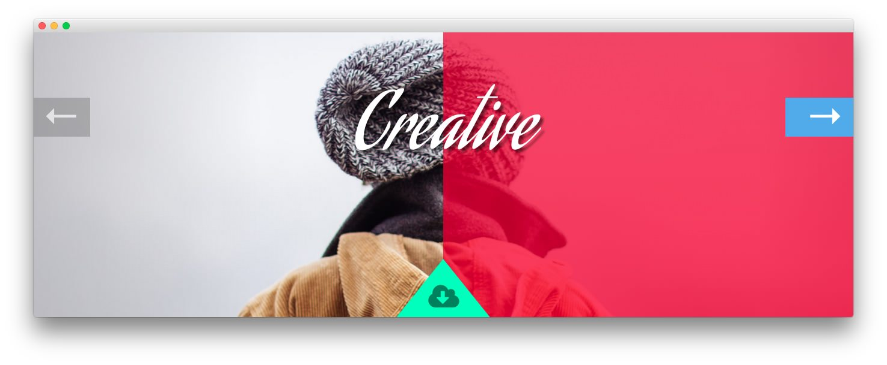
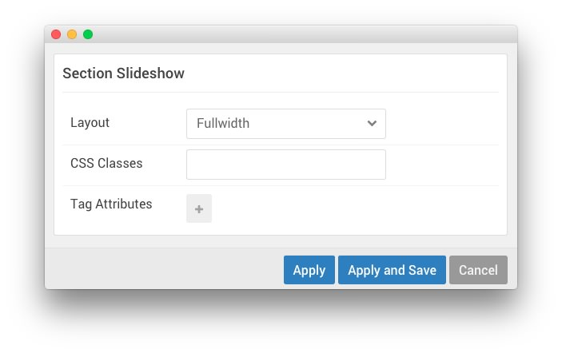

## Introduction

The **Slideshow** section is made up of one **Slideshow** particle. This position, once placed and set up in the **Layout Manager** makes it possible to assign Widgets to it that appear on your site.

Settings used in our demo for each of these particles can be found below.

## Section Settings

| Field          | Setting   |
| :-----         | :-----    |
| Layout         | Fullwidth |
| CSS Classes    | Blank     |
| Tag Attributes | Blank     |

## Slideshow (Particle)

### Particle Settings

| Field                        | Setting     |
| :-----                       | :-----      |
| Particle Name                | `Slideshow` |
| CSS Classes                  | Blank       |
| Title                        | Blank       |
| Slideshow Item 1 Name        | `Slide 01`  |
| Slideshow Item 1 Image       | Custom      |
| Slideshow Item 1 Text        | `Creative`  |
| Slideshow Item 1 Description | Blank       |
| Slideshow Item 1 Button Text | Blank       |
| Slideshow Item 1 Button Link | Blank       |
| Slideshow Item 2 Name        | `Slide 02`  |
| Slideshow Item 2 Image       | Custom      |
| Slideshow Item 2 Text        | `Elegant`   |
| Slideshow Item 2 Description | Blank       |
| Slideshow Item 2 Button Text | Blank       |
| Slideshow Item 2 Button Link | Blank       |
| Slideshow Item 3 Name        | `Slide 03`  |
| Slideshow Item 3 Image       | Custom      |
| Slideshow Item 3 Text        | `Artistic`  |
| Slideshow Item 3 Description | Blank       |
| Slideshow Item 3 Button Text | Blank       |
| Slideshow Item 3 Button Link | Blank       |

### Block Settings

| Field          | Setting |
| :-----         | :-----  |
| CSS ID         | Blank   |
| CSS Classes    | `flush` |
| Variations     | Blank   |
| Tag Attributes | Blank   |
| Block Size     | `100%`  |

# Alternative: RokSprocket

For folks that prefer **RokSprocket** to using a particle, we have included the instructions for creating this slideshow using RokSprocket below, as well. 

The first thing you will want to do is add a **Widget Position** particle to the layout manager, as pictured above.

## Section Settings

| Field          | Setting   |
| :-----         | :-----    |
| Layout         | Fullwidth |
| CSS Classes    | Blank     |
| Tag Attributes | Blank     |

## Widget Position (slideshow)

### Particle Settings

| Field         | Setting              |
| :-----        | :-----               |
| Particle Name | `Slideshow`          |
| Key           | `slideshow-features` |
| Chrome        | `gantry`             |

### Block Settings

| Field          | Setting |
| :-----         | :-----  |
| CSS ID         | Blank   |
| CSS Classes    | `flush` |
| Variations     | Blank   |
| Tag Attributes | Blank   |
| Block Size     | `100%`  |

## Assigned Widget(s)

The `slideshow` widget position is host to a single **RokSprocket** widget.

We utilized the **Simple** Content Provider, linking each item in the RokSprocket widget to an article. You can find examples of the **Simple** items used in this widget in the **Filtered Article List** section below.

### Details

| Option           | Setting              |
| :-----           | :-----               |
| Title            | `Slideshow`          |
| Show Title       | Hide                 |
| Access           | Public               |
| Position         | `slideshow-features` |
| Status           | Published            |
| Content Provider | Simple               |
| Type             | Features             |

### Filtered Article List

#### Item 1

| Option | Setting    |
| :----- | :-----     |
| Title  | `Creative` |
| Image  | Custom     |
| Link   | None       |

#### Item 2

| Option | Setting    |
| :----- | :-----     |
| Title  | `Elegant` |
| Image  | Custom     |
| Link   | None       |

#### Item 3

| Option | Setting    |
| :----- | :-----     |
| Title  | `Artistic` |
| Image  | Custom     |
| Link   | None       |

### Layout Options

| Option                | Setting               |
| :-----                | :-----                |
| Display Limit         | `∞`                   |
| Theme                 | Slideshow             |
| Article Titles        | Show                  |
| Article Text          | Hide                  |
| Preview Length        | `∞`                   |
| Strip HTML Tags       | Yes                   |
| Arrow Navigation      | Show                  |
| Pagination            | Hide                  |
| Animation             | Crossfade             |
| Autoplay              | Disable               |
| Autoplay Delay        | `5`                   |
| Image Resize          | Disable               |
| Default Title         | Default Article Title |
| Default Article Text  | Default Article Text  |
| Default Article Image | Default Article Image |
| Default Link          | Default Article Link  |

### Advanced

| Option              | Setting |
| :-----              | :-----  |
| Widget Class Suffix |         |

