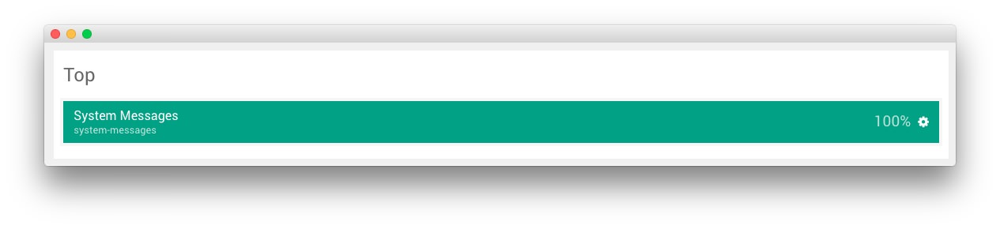
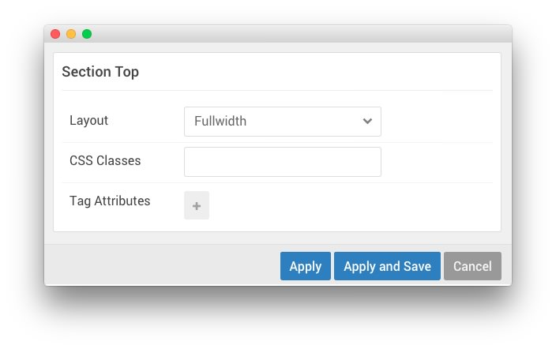

## Introduction

The **Top** section hosts the **System Messages** position particle, which is invisible in the front end of the site unless there is a system message being displayed.

The **System Messages** Position displays system messages in your layout. Always include this particle to all of your layouts. Otherwise users will not see important system messages like login failures.

## Section Settings

| Field          | Setting   |
| :-----         | :-----    |
| Layout         | Fullwidth |
| CSS Classes    | Blank     |
| Tag Attributes | Blank     |

## System Messages (Position)

### Particle Settings

### Block Settings

| Field          | Setting |
| :-----         | :-----  |
| CSS ID         | Blank   |
| CSS Classes    | Blank   |
| Variations     | Blank   |
| Tag Attributes | Blank   |
| Block Size     | `100%`  |
