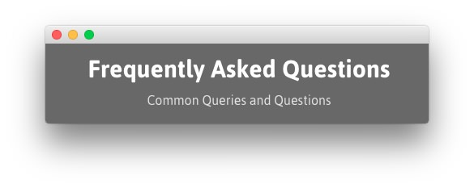
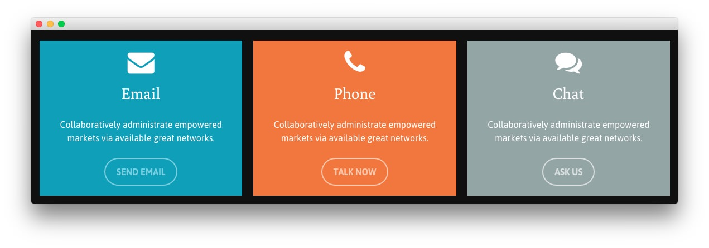
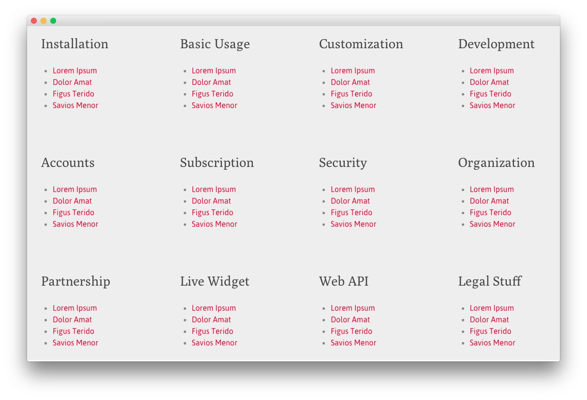

## Introduction

The **FAQ** example page demonstrates how you can create a beautiful page with the Ethereal theme. Here is some information to help you replicate this page as it appears in the demo.

## Widgets and Particles

Below is a brief rundown of the widgets and particles used to make up the demo page.

:   1. **Showcase - Custom HTML (Widget)** [8%, 40%, se]
    2. **Feature - Custom HTML (Widget)** [15%, 15% se]
    3. **Mainbar - Page Content** [25%, 15%, se]
    4. **Plugin - Custom HTML (Widget)** [40%, 15%, se]
    5. **Bottom - Custom HTML (Widget)** [65%, 35%, se]
    6. **Footer - Custom HTML (Widget)** [75%, 15%, se]
    7. **Footer - Custom HTML (Widget)** [75%, 38%, se]
    8. **Footer - Custom HTML (Widget)** [75%, 65%, se]

1. [Showcase](#showcase-section)
2. [Feature](#feature-section)
2. [Mainbar](#mainbar-section)
3. [Plugin](#plugin-section)
4. [Bottom](#bottom-section)
4. [Footer](#footer-section)

## Showcase Section

This area of the page is a **Text** widget. You will find the settings used in our demo below.

>> Any **mod_custom** (Custom HTML) widgets are best handled using either RokPad or no editor as a WYSIWYG editor can cause issues with any code that exists in the **Custom Output** field.

### Custom HTML (Widget)

### Details

| Field      | Setting             |
| :-----     | :-----              |
| Title      | `Frequently Asked Questions - Header` |
| Show Title | Hide                |
| Position   | `showcase-a`        |
| Status     | Published           |

### Custom Output

Enter the following in the **Custom Output** text editor.

~~~ .html

    <h2 class="g-layercontent-title">Frequently Asked Questions</h2>
    
Common Queries and Questions

~~~

### Basic

| Option                    | Setting     |
| :----------               | :---------- |
| Prepare Content           | No          |
| Select a Background Image | Blank       |

### Advanced

| Option              | Setting        |
| :----------         | :----------    |
| Widget Class Suffix | `flush center` |

## Feature Section

This area of the page is a **Text** widget. You will find the settings used in our demo below.

>> Any **mod_custom** (Custom HTML) widgets are best handled using either RokPad or no editor as a WYSIWYG editor can cause issues with any code that exists in the **Custom Output** field.

### Custom HTML (Widget)

### Details

| Field      | Setting                |
| :-----     | :-----                 |
| Title      | `Email - Phone - Chat` |
| Show Title | Hide                   |
| Position   | `feature-a`            |
| Status     | Published              |

### Custom Output

Enter the following in the **Custom Output** text editor.

~~~ .html

  

    

      
      <h2 class="g-title">Email</h2>
      
Collaboratively administrate empowered markets via available great networks.

      <a class="button button-3" href="">Send Email</a>
    

  

  

    

      
      <h2 class="g-title">Phone</h2>
      
Collaboratively administrate empowered markets via available great networks.

      <a class="button button-3" href="">Talk Now</a>
    

  

  

    

      
      <h2 class="g-title">Chat</h2>
      
Collaboratively administrate empowered markets via available great networks.

      <a class="button button-3" href="">Ask Us</a>
    

  

~~~

### Basic

| Option                    | Setting     |
| :----------               | :---------- |
| Prepare Content           | No          |
| Select a Background Image | Blank       |

### Advanced

| Option              | Setting     |
| :----------         | :---------- |
| Widget Class Suffix | Blank       |

## Mainbar Section

The **Mainbar** section includes the **Frequently Asked Questions** article, displayed through the **Page Content** particle. Here are the settings found in the **Frequently Asked Questions** article.

| Option   | Setting                      |
| :-----   | :-----                       |
| Title    | `Frequently Asked Questions` |
| Alias    | `frequently-asked-questions` |
| Status   | Published                    |
| Featured | No                           |
| Category | `Sample Pages`               |

**Content Body**

~~~ .html

  

    

      

        

          

            
<a href="">What prices are our services?</a>

            
Proactively envisioned multimedia based expertise and cross-media growth strategies. Seamlessly visualize quality intellectual capital without superior collaboration and idea-sharing.

          

        

        

          

            
<a href="">What is our refund policy?</a>

            
Proactively envisioned multimedia based expertise and cross-media growth strategies. Seamlessly visualize quality intellectual capital without superior collaboration and idea-sharing.

          

        

        

          

            
<a href="">What payments methods do we accept?</a>

            
Proactively envisioned multimedia based expertise and cross-media growth strategies. Seamlessly visualize quality intellectual capital without superior collaboration and idea-sharing.

          

        

      

    

  

  

    

      

        

          

            
<a href="">What delivery options do we offer?</a>

            
Proactively envisioned multimedia based expertise and cross-media growth strategies. Seamlessly visualize quality intellectual capital without superior collaboration and idea-sharing.

          

        

        

          

            
<a href="">What support options are available?</a>

            
Proactively envisioned multimedia based expertise and cross-media growth strategies. Seamlessly visualize quality intellectual capital without superior collaboration and idea-sharing.

          

        

        

          

            
<a href="">What additional services are available?</a>

            
Proactively envisioned multimedia based expertise and cross-media growth strategies. Seamlessly visualize quality intellectual capital without superior collaboration and idea-sharing.

          

        

      

    

  

~~~

## Plugin Section

This area of the page is a **Text** widget. You will find the settings used in our demo below.

>> Any **mod_custom** (Custom HTML) widgets are best handled using either RokPad or no editor as a WYSIWYG editor can cause issues with any code that exists in the **Custom Output** field.

### Custom HTML (Widget)

### Details

| Field      | Setting       |
| :-----     | :-----        |
| Title      | `FAQ List`    |
| Show Title | Hide          |
| Position   | `plugin-a` |
| Status     | Published     |

### Custom Output

Enter the following in the **Custom Output** text editor.

~~~ .html
<section id="g-mainbar">
  

    

      

        <h2 class="g-title">Installation</h2>
        <ul>
          <li><a href="">Lorem Ipsum</a></li>
          <li><a href="">Dolor Amat</a></li>
          <li><a href="">Figus Terido</a></li>
          <li><a href="">Savios Menor</a></li>
        </ul>
      

    

    

      

        <h2 class="g-title">Basic Usage</h2>
        <ul>
          <li><a href="">Lorem Ipsum</a></li>
          <li><a href="">Dolor Amat</a></li>
          <li><a href="">Figus Terido</a></li>
          <li><a href="">Savios Menor</a></li>
        </ul>
      

    

    

      

        <h2 class="g-title">Customization</h2>
        <ul>
          <li><a href="">Lorem Ipsum</a></li>
          <li><a href="">Dolor Amat</a></li>
          <li><a href="">Figus Terido</a></li>
          <li><a href="">Savios Menor</a></li>
        </ul>
      

    

    

      

        <h2 class="g-title">Development</h2>
        <ul>
          <li><a href="">Lorem Ipsum</a></li>
          <li><a href="">Dolor Amat</a></li>
          <li><a href="">Figus Terido</a></li>
          <li><a href="">Savios Menor</a></li>
        </ul>
      

    

  

  

    

      

        <h2 class="g-title">Accounts</h2>
        <ul>
          <li><a href="">Lorem Ipsum</a></li>
          <li><a href="">Dolor Amat</a></li>
          <li><a href="">Figus Terido</a></li>
          <li><a href="">Savios Menor</a></li>
        </ul>
      

    

    

      

        <h2 class="g-title">Subscription</h2>
        <ul>
          <li><a href="">Lorem Ipsum</a></li>
          <li><a href="">Dolor Amat</a></li>
          <li><a href="">Figus Terido</a></li>
          <li><a href="">Savios Menor</a></li>
        </ul>
      

    

    

      

        <h2 class="g-title">Security</h2>
        <ul>
          <li><a href="">Lorem Ipsum</a></li>
          <li><a href="">Dolor Amat</a></li>
          <li><a href="">Figus Terido</a></li>
          <li><a href="">Savios Menor</a></li>
        </ul>
      

    

    

      

        <h2 class="g-title">Organization</h2>
        <ul>
          <li><a href="">Lorem Ipsum</a></li>
          <li><a href="">Dolor Amat</a></li>
          <li><a href="">Figus Terido</a></li>
          <li><a href="">Savios Menor</a></li>
        </ul>
      

    

  

  

    

      

        <h2 class="g-title">Partnership</h2>
        <ul>
          <li><a href="">Lorem Ipsum</a></li>
          <li><a href="">Dolor Amat</a></li>
          <li><a href="">Figus Terido</a></li>
          <li><a href="">Savios Menor</a></li>
        </ul>
      

    

    

      

        <h2 class="g-title">Live Widget</h2>
        <ul>
          <li><a href="">Lorem Ipsum</a></li>
          <li><a href="">Dolor Amat</a></li>
          <li><a href="">Figus Terido</a></li>
          <li><a href="">Savios Menor</a></li>
        </ul>
      

    

    

      

        <h2 class="g-title">Web API</h2>
        <ul>
          <li><a href="">Lorem Ipsum</a></li>
          <li><a href="">Dolor Amat</a></li>
          <li><a href="">Figus Terido</a></li>
          <li><a href="">Savios Menor</a></li>
        </ul>
      

    

    

      

        <h2 class="g-title">Legal Stuff</h2>
        <ul>
          <li><a href="">Lorem Ipsum</a></li>
          <li><a href="">Dolor Amat</a></li>
          <li><a href="">Figus Terido</a></li>
          <li><a href="">Savios Menor</a></li>
        </ul>
      

    

  

</section>
~~~

### Basic

| Option                    | Setting     |
| :----------               | :---------- |
| Prepare Content           | No          |
| Select a Background Image | Blank       |

### Advanced

| Option              | Setting     |
| :----------         | :---------- |
| Widget Class Suffix | Blank       |

## Bottom Section

This area of the page is a **Text** widget. You will find the settings used in our demo below.

>> Any **mod_custom** (Custom HTML) widgets are best handled using either RokPad or no editor as a WYSIWYG editor can cause issues with any code that exists in the **Custom Output** field.

### Custom HTML (Widget)

### Details

| Field      | Setting                          |
| :-----     | :-----                           |
| Title      | `FAQ Didn't Solve Your Problem?` |
| Show Title | Hide                             |
| Position   | `bottom-a`                       |
| Status     | Published                        |

### Custom Output

Enter the following in the **Custom Output** text editor.

~~~ .html

    <h2 class="g-layercontent-title">FAQ Didn't Solve Your Problem?</h2>
    
Get Direct Access to the Team Via Phone, Email or Live Chat.

    <a href="http://www.rockettheme.com/wordpress/themes/ethereal" class="button button-2">Contact Us</a>

~~~

### Basic

| Option                    | Setting     |
| :----------               | :---------- |
| Prepare Content           | No          |
| Select a Background Image | Blank       |

### Advanced

| Option              | Setting        |
| :----------         | :----------    |
| Widget Class Suffix | `flush center` |

## Footer Section

:   1. **Custom HTML (Widget) 1** [20%, 5%, se]
    2. **Custom HTML (Widget) 2** [20%, 38%, se]
    3. **Custom HTML (Widget) 3** [20%, 65%, se]

This area of the page is made up of three **Text** widgets spanning three different widget positions: `footer-a`, `footer-b`, and `footer-c`. You will find the settings used in our demo below.

>> Any **mod_custom** (Custom HTML) widgets are best handled using either RokPad or no editor as a WYSIWYG editor can cause issues with any code that exists in the **Custom Output** field.

### Custom HTML (Widget) 1

### Details

| Field      | Setting          |
| :-----     | :-----           |
| Title      | `About Ethereal` |
| Show Title | Show             |
| Position   | `footer-a`       |
| Status     | Published        |

### Custom Output

Enter the following in the **Custom Output** text editor.

~~~ .html

All demo content is for sample purposes only, intended to represent a live site.

The sample pages are intended to show how Ethereal can be constructed on your site.

~~~

### Basic

| Option                    | Setting     |
| :----------               | :---------- |
| Prepare Content           | No          |
| Select a Background Image | Blank       |

### Advanced

| Option              | Setting     |
| :----------         | :---------- |
| Widget Class Suffix | Blank       |

### Custom HTML (Widget) 2

### Details

| Field      | Setting      |
| :-----     | :-----       |
| Title      | `Newsletter` |
| Show Title | Show         |
| Position   | `footer-b`   |
| Status     | Published    |

### Custom Output

Enter the following in the **Custom Output** text editor.

~~~ .html

  

    Subscribe to our newsletter and stay updated on the latest developments and special offers!
  

  <form onsubmit="window.open('http://feedburner.google.com/fb/a/mailverify?uri=rocketthemeblog', 'popupwindow', 'scrollbars=yes,width=550,height=520');return true" target="popupwindow" method="post" action="http://feedburner.google.com/fb/a/mailverify" class="g-newsletter-form">
    <input type="text" name="email" placeholder="Email Address" class="g-newsletter-inputbox"> <input type="hidden" name="uri" value="rocketthemeblog"> <input type="hidden" value="en_US" name="loc"> <input type="submit" value="Join" class="g-newsletter-button button button-3" name="Submit">
  </form>

~~~

### Basic

| Option                    | Setting     |
| :----------               | :---------- |
| Prepare Content           | No          |
| Select a Background Image | Blank       |

### Advanced

| Option              | Setting     |
| :----------         | :---------- |
| Widget Class Suffix | Blank       |

### Custom HTML (Widget) 3

### Details

| Field      | Setting          |
| :-----     | :-----           |
| Title      | `Sample Sitemap` |
| Show Title | Show             |
| Position   | `footer-c`       |
| Status     | Published        |

### Custom Output

Enter the following in the **Custom Output** text editor.

~~~ .html

    

        <ul class="nomarginall noliststyle">
            <li><a href="index.php">Home</a></li>
            <li><a href="index.php?option=com_content&amp;view=article&amp;id=1&amp;Itemid=105">Features</a></li>
            <li><a href="index.php?option=com_content&amp;view=article&amp;id=2&amp;Itemid=106">Typography</a></li>
            <li><a href="index.php?option=com_content&amp;view=article&amp;id=2&amp;Itemid=106">Particles</a></li>
            <li><a href="index.php?option=com_content&amp;view=article&amp;id=3&amp;Itemid=107">Variations</a></li>
        </ul>
    

    

        <ul class="nomarginall noliststyle">
            <li><a href="index.php?option=com_content&amp;view=article&amp;id=2&amp;Itemid=106">Buttons</a></li>
            <li><a href="index.php?option=com_content&amp;view=article&amp;id=4&amp;Itemid=111">Pages</a></li>
            <li><a href="http://www.rockettheme.com/docs/wordpress/themes/ethereal">Guide</a></li>
            <li><a href="http://www.rockettheme.com/forum/wordpress-theme-ethereal">Support</a></li>
            <li><a href="http://www.rockettheme.com/wordpress/themes/ethereal">Download</a></li>
        </ul>       
    
  

~~~

### Basic

| Option                    | Setting     |
| :----------               | :---------- |
| Prepare Content           | No          |
| Select a Background Image | Blank       |

### Advanced

| Option              | Setting     |
| :----------         | :---------- |
| Widget Class Suffix | Blank       |
