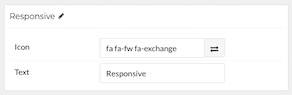

## Introduction

The **Ethereal Block** particle is a great way to create a clean and simple content block with images and text. 

Here are the topics covered in this guide:

* [Configuration](#configuration)
    - [Main Options](#main-options)
    - [Item Options](#item-options)

## Configuration

### Main Options 

| Option        | Description                                                                      |
| :-----        | :-----                                                                           |
| CSS Classes   | Enter any CSS class(es) you wish to have apply to the particle.                  |
| Title         | Enter a title to appear at the top of the particle.                              |
| Left Size     | Set the size (in percentage) you wish the left side of the particle to take up.  |
| Right Size    | Set the size (in percentage) you wish the right side of the particle to take up. |
| Image 1       | Select an image for the item                                                     |
| Title 1       | Enter a title for the item.                                                      |
| Description 1 | Enter a text description for the item.                                           |
| Link 1        | Enter a link you want the item to go to.                                         |
| Image 2       | Select an image for the item                                                     |
| Title 2       | Enter a title for the item.                                                      |
| Description 2 | Enter a text description for the item.                                           |
| Link 2        | Enter a link you want the item to go to.                                         |
| Image 3       | Select an image for the item                                                     |
| Title 3       | Enter a title for the item.                                                      |
| Description 3 | Enter a text description for the item.                                           |
| Link 3        | Enter a link you want the item to go to.                                         |
| Image 4       | Select an image for the item                                                     |
| Title 4       | Enter a title for the item.                                                      |
| Description 4 | Enter a text description for the item.                                           |
| Link 4        | Enter a link you want the item to go to.                                         |

### Item Options

These items make up the individual featured items in the particle.

| Option | Description                                                     |
| :----- | :-----                                                          |
| Icon   | Select an icon for the item.                                    |
| Text   | Enter any text you want to appear next to the icon in the item. |

