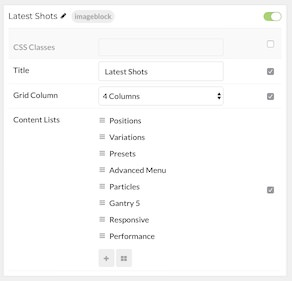

## Introduction

The **Image Block** particle is a great way to create a clean and simple content block with images and text. 

Here are the topics covered in this guide:

* [Configuration](#configuration)
    - [Main Options](#main-options)
    - [Item Options](#item-options)

## Configuration

### Main Options 

| Option      | Description                                                     |
| :-----      | :-----                                                          |
| CSS Classes | Enter any CSS class(es) you wish to have apply to the particle. |
| Title       | Enter a title to appear at the top of the particle.             |
| Grid Column | Select the number of columns to display items.                  |

### Item Options

These items make up the individual featured items in the particle.

| Option          | Description                                                   |
| :-----          | :-----                                                        |
| Name            | Enter a name for the item. This only appears on the back end. |
| Image           | Enter an image to appear in the item.                         |
| Icon            | Select an icon for the item.                                  |
| Item Link       | Enter a URL for the icon to link to.                          |
| Headline        | Enter a headline for the item.                                |
| Title Bottom    | Enter a title to appear below the image in the item.          |
| Tag             | Enter any tag(s) you wish to have display with the item.      |
| Block Variation | Enter any block variation(s) for the item.                    |
| CSS Classes     | Enter any CSS class(es) you wish to have apply to the item.   |

