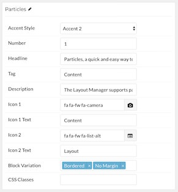

## Introduction

The **Number Headline** particle makes it easy to produce neatly organized numbered feature lists.

Here are the topics covered in this guide:

* [Configuration](#configuration)
    - [Main Options](#main-options)
    - [Item Options](#item-options)

## Configuration

### Main Options 

| Option        | Description                                                     |
| :-----        | :-----                                                          |
| CSS Classes   | Enter any CSS class(es) you wish to have apply to the particle. |
| Title         | Enter a title to appear at the top of the particle.             |
| Readmore Text | Add text for the primary readmore link.                         |
| Readmore Icon | Add an icon to the primary readmore link.                       |
| Readmore Link | Enter an URL for the primary link.                              |
| Grid Column   | Select the number of columns you wish items to appear in.       |

### Item Options

These items make up the individual featured items in the particle.

| Option          | Description                                                     |
| :-----          | :-----                                                          |
| Accent Style    | Choose between three preset accent styles.                      |
| Number          | Enter a number to display with the item.                        |
| Headline        | Enter any text you want to appear next to the icon in the item. |
| Tag             | Enter any tag(s) you wish to have apply to the item.            |
| Description     | Enter a text description to display with the item.              |
| Icon 1          | Select an icon to appear on the front end.                      |
| Icon 1 Text     | Enter text to accompany its associated icon.                    |
| Icon 2          | Select an icon to appear on the front end.                      |
| Icon 2 Text     | Enter text to accompany its associated icon.                    |
| Block Variation | Enter any block variation(s) for the item.                      |
| CSS Classes     | Enter any CSS class(es) you wish to have apply to the item.     |

