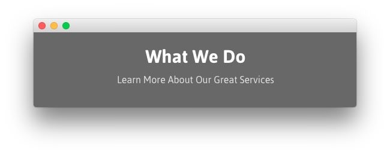
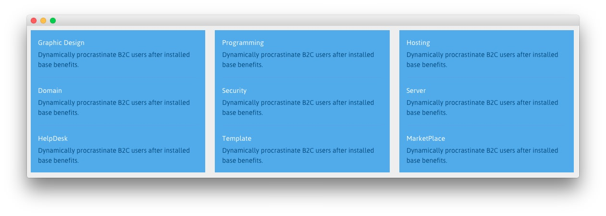
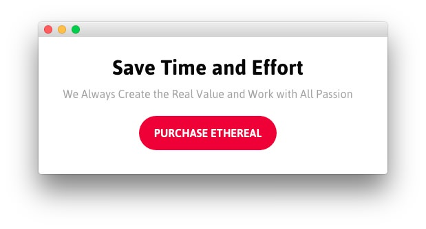

## Introduction

The **Services** example page demonstrates how you can create a beautiful page with the Ethereal theme. Here is some information to help you replicate this page as it appears in the demo.

## Widgets and Particles

Below is a brief rundown of the widgets and particles used to make up the demo page.

:   1. **Showcase - Custom HTML (Particle)** [11%, 45%, se]
    2. **Feature - Custom HTML (Particle)** [17%, 15%, se]
    3. **Mainbar - Page Content** [31%, 15%, se]
    4. **Extension - Custom HTML (Particle)** [46%, 15%, se]
    5. **Bottom - Custom HTML (Particle)** [60%, 40%, se]
    6. **Footer - Custom HTML (Widget)** [72%, 10%, se]
    7. **Footer - Custom HTML (Widget)** [72%, 38%, se]
    8. **Footer - Custom HTML (Widget)** [72%, 65%, se]

1. [Showcase](#showcase-section)
2. [Feature](#feature-section)
2. [Mainbar](#mainbar-section)
3. [Extension](#extension-section)
4. [Bottom](#bottom-section)
4. [Footer](#footer-section)

## Showcase Section

This area of the page is a **Custom HTML** particle. You will find the settings used in our demo below.

### Custom HTML (Particle)

### Particle Settings

| Field              | Setting       |
| :-----             | :-----        |
| Particle Name      | `Custom HTML` |
| Process Shortcodes | Unchecked     |

### Custom HTML

~~~ .html

  <h2 class="g-layercontent-title">What We Do</h2>
  
Learn More About Our Great Services

~~~

### Block Settings

| Option         | Setting          |
| :----------    | :----------      |
| CSS ID         | Blank            |
| CSS Classes    | `flush` `center` |
| Variations     | Blank            |
| Tag Attributes | Blank            |
| Fixed Size     | Unchecked        |
| Block Size     | `100%`           |

## Feature Section

This area of the page is a **Custom HTML** particle. You will find the settings used in our demo below.

### Custom HTML (Particle)

### Particle Settings

| Field              | Setting       |
| :-----             | :-----        |
| Particle Name      | `Custom HTML` |
| Process Shortcodes | Unchecked     |

### Custom HTML

~~~ .html

  

    

      <h2 class="g-title">
        Desktop Apps
      </h2>
      

        Collaboratively administrate empowered markets via available great networks.
      

    

  

  

    

      <h2 class="g-title">
        Mobile Apps
      </h2>
      

        Collaboratively administrate empowered markets via available great networks.
      

    

  

  

    

      <h2 class="g-title">
        Cloud Servers
      </h2>
      

        Collaboratively administrate empowered markets via available great networks.
      

    

  

  

    

      <h2 class="g-title">
        Databases
      </h2>
      

        Collaboratively administrate empowered markets via available great networks.
      

    

  

  

    

      <h2 class="g-title">
        Graphics
      </h2>
      

        Collaboratively administrate empowered markets via available great networks.
      

    

  

  

    

      <h2 class="g-title">
        Analyst
      </h2>
      

        Collaboratively administrate empowered markets via available great networks.
      

    

  

~~~

### Block Settings

| Option         | Setting     |
| :----------    | :---------- |
| CSS ID         | Blank       |
| CSS Classes    | Blank       |
| Variations     | Blank       |
| Tag Attributes | Blank       |
| Fixed Size     | Unchecked   |
| Block Size     | `100%`      |

## Mainbar Section

The **Mainbar** section includes the **Services** post, displayed through the **Page Content** particle. Here are the settings found in the **Services** post.

| Option   | Setting        |
| :-----   | :-----         |
| Title    | `Services`     |
| Alias    | `services`     |
| Status   | Published      |
| Featured | No             |
| Category | `Sample Pages` |

**Content Body**

~~~ .html

  

    

      

        

          

            

              Services
            

          

          

            

              <h3 class="g-contentlist-headline">
                Why Choose Us
              </h3>
              <h5 class="g-contentlist-subtitle">
                Absolutely Stunning Design and Functionality
              </h5>
              

                Efficiently unleash cross-media information without cross-media value. Quickly maximize timely deliverables for real-time schemas. Dramatically maintain clicks-and-mortar solutions without functional solutions. Collaboratively administrate empowered markets via plug-and-play networks. Dynamically procrastinate B2C users after installed base benefits. Dramatically visualize customer directed convergence without revolutionary ROI. Dynamically innovate resource-leveling customer service for state of the art customer service.
              
<a class="button button-2" href="#">Learn More</a>
            

          

        

      

    

  

~~~

## Extension Section

This area of the page is a **Custom HTML** particle. You will find the settings used in our demo below.

### Custom HTML (Particle)

### Particle Settings

| Field              | Setting       |
| :-----             | :-----        |
| Particle Name      | `Custom HTML` |
| Process Shortcodes | Unchecked     |

### Custom HTML

~~~ .html

  

    

      

        

          

            

              <a href="#">Graphic Design</a>
            

            

              Dynamically procrastinate B2C users after installed base benefits.
            

          

        

        

          

            

              <a href="#">Domain</a>
            

            

              Dynamically procrastinate B2C users after installed base benefits.
            

          

        

        

          

            

              <a href="#">HelpDesk</a>
            

            

              Dynamically procrastinate B2C users after installed base benefits.
            

          

        

      

    

  

  

    

      

        

          

            

              <a href="#">Programming</a>
            

            

              Dynamically procrastinate B2C users after installed base benefits.
            

          

        

        

          

            

              <a href="#">Security</a>
            

            

              Dynamically procrastinate B2C users after installed base benefits.
            

          

        

        

          

            

              <a href="#">Theme</a>
            

            

              Dynamically procrastinate B2C users after installed base benefits.
            

          

        

      

    

  

  

    

      

        

          

            

              <a href="#">Hosting</a>
            

            

              Dynamically procrastinate B2C users after installed base benefits.
            

          

        

        

          

            

              <a href="#">Server</a>
            

            

              Dynamically procrastinate B2C users after installed base benefits.
            

          

        

        

          

            

              <a href="#">MarketPlace</a>
            

            

              Dynamically procrastinate B2C users after installed base benefits.
            

          

        

      

    

  

~~~

### Block Settings

| Option         | Setting     |
| :----------    | :---------- |
| CSS ID         | Blank       |
| CSS Classes    | Blank       |
| Variations     | Blank       |
| Tag Attributes | Blank       |
| Fixed Size     | Unchecked   |
| Block Size     | `100%`      |

## Bottom Section

This area of the page is a **Custom HTML** particle. You will find the settings used in our demo below.

### Custom HTML (Particle)

### Particle Settings

| Field              | Setting       |
| :-----             | :-----        |
| Particle Name      | `Custom HTML` |
| Process Shortcodes | Unchecked     |

### Custom HTML

~~~ .html

  <h2 class="g-layercontent-title">Save Time and Effort</h2>
  
We Always Create the Real Value and Work with All Passion

  <a href="http://www.rockettheme.com/wordpress/themes/ethereal" class="button button-2">Purchase Ethereal</a>

~~~

### Block Settings

| Option         | Setting          |
| :----------    | :----------      |
| CSS ID         | Blank            |
| CSS Classes    | `flush` `center` |
| Variations     | Blank            |
| Tag Attributes | Blank            |
| Fixed Size     | Unchecked        |
| Block Size     | `100%`           |

## Footer Section

:   1. **Custom HTML (Widget) 1** [20%, 5%, se]
    2. **Custom HTML (Widget) 2** [20%, 38%, se]
    3. **Custom HTML (Widget) 3** [20%, 65%, se]

This area of the page is made up of three **Text** widgets spanning three different widget positions: `footer-a`, `footer-b`, and `footer-c`. You will find the settings used in our demo below.

### Custom HTML (Widget) 1

### Details

| Field      | Setting          |
| :-----     | :-----           |
| Title      | `About Ethereal` |
| Show Title | Show             |
| Position   | `footer-a`       |
| Status     | Published        |

### Custom Output

Enter the following in the **Custom Output** text editor.

~~~ .html

All demo content is for sample purposes only, intended to represent a live site.

The sample pages are intended to show how Ethereal can be constructed on your site.

~~~

### Basic

| Option                    | Setting     |
| :----------               | :---------- |
| Prepare Content           | No          |
| Select a Background Image | Blank       |

### Advanced

| Option              | Setting     |
| :----------         | :---------- |
| Widget Class Suffix | Blank       |

### Custom HTML (Widget) 2

### Details

| Field      | Setting      |
| :-----     | :-----       |
| Title      | `Newsletter` |
| Show Title | Show         |
| Position   | `footer-b`   |
| Status     | Published    |

### Custom Output

Enter the following in the **Custom Output** text editor.

~~~ .html

  

    Subscribe to our newsletter and stay updated on the latest developments and special offers!
  

  <form onsubmit="window.open('http://feedburner.google.com/fb/a/mailverify?uri=rocketthemeblog', 'popupwindow', 'scrollbars=yes,width=550,height=520');return true" target="popupwindow" method="post" action="http://feedburner.google.com/fb/a/mailverify" class="g-newsletter-form">
    <input type="text" name="email" placeholder="Email Address" class="g-newsletter-inputbox"> <input type="hidden" name="uri" value="rocketthemeblog"> <input type="hidden" value="en_US" name="loc"> <input type="submit" value="Join" class="g-newsletter-button button button-3" name="Submit">
  </form>

~~~

### Basic

| Option                    | Setting     |
| :----------               | :---------- |
| Prepare Content           | No          |
| Select a Background Image | Blank       |

### Advanced

| Option              | Setting     |
| :----------         | :---------- |
| Widget Class Suffix | Blank       |

### Custom HTML (Widget) 3

### Details

| Field      | Setting          |
| :-----     | :-----           |
| Title      | `Sample Sitemap` |
| Show Title | Show             |
| Position   | `footer-c`       |
| Status     | Published        |

### Custom Output

Enter the following in the **Custom Output** text editor.

~~~ .html

    

        <ul class="nomarginall noliststyle">
            <li><a href="index.php">Home</a></li>
            <li><a href="index.php?option=com_content&amp;view=article&amp;id=1&amp;Itemid=105">Features</a></li>
            <li><a href="index.php?option=com_content&amp;view=article&amp;id=2&amp;Itemid=106">Typography</a></li>
            <li><a href="index.php?option=com_content&amp;view=article&amp;id=2&amp;Itemid=106">Particles</a></li>
            <li><a href="index.php?option=com_content&amp;view=article&amp;id=3&amp;Itemid=107">Variations</a></li>
        </ul>
    

    

        <ul class="nomarginall noliststyle">
            <li><a href="index.php?option=com_content&amp;view=article&amp;id=2&amp;Itemid=106">Buttons</a></li>
            <li><a href="index.php?option=com_content&amp;view=article&amp;id=4&amp;Itemid=111">Pages</a></li>
            <li><a href="http://www.rockettheme.com/docs/wordpress/themes/ethereal">Guide</a></li>
            <li><a href="http://www.rockettheme.com/forum/wordpress-theme-ethereal">Support</a></li>
            <li><a href="http://www.rockettheme.com/wordpress/themes/ethereal">Download</a></li>
        </ul>       
    
  

~~~

### Basic

| Option                    | Setting     |
| :----------               | :---------- |
| Prepare Content           | No          |
| Select a Background Image | Blank       |

### Advanced

| Option              | Setting     |
| :----------         | :---------- |
| Widget Class Suffix | Blank       |
