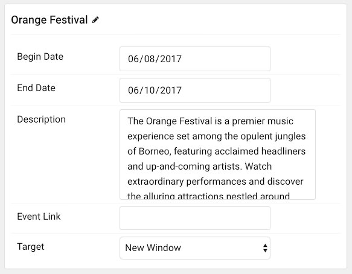

## Introduction

The **Calendar** particle enables you to create a calendar, complete with events and HTML descriptions, with ease.

>> NOTE: Certain elements of the calendar, including which day of the week a week starts on, are based on the language pack assigned to the page the calendar is displayed in. For example, `en-US` results in Sunday appearing as the first day of the calendar week.

Here are the topics covered in this guide:

* [Configuration](#configuration)
    - [Main Options](#main-options)
    - [Item Options](#item-options)

## Configuration

### Main Options 

These options affect the main area of the particle, and not the individual items within.

| Option        | Description                                                                                 |
| :-----        | :-----                                                                                      |
| Particle Name | Enter the name you would like to assign to the particle. This only appears in the back end. |
| CSS Classes   | Add any CSS class(es) you want to have added to the particle.                               |
| Title         | Enter a title for the particle.                                                             |
| Events Header | Enter header text to appear over displayed events.                                          |

### Item Options

These items make up the individual featured items in the particle.

| Option      | Description                                                                                                   |
| :-----      | :-----                                                                                                        |
| Item Name   | Enter the name you would like to assign to the item. This appears on the front end as the title of the event. |
| Begin Date  | Enter a date to begin the event.                                                                              |
| End Date    | Enter a date to end the event.                                                                                |
| Description | Enter a HTML description. This can be plain text, or text with HTML elements added for extra functionality.   |
| Event Link  | Enter a link for the event.                                                                                   |
| Target      | Choose between **Self** and **New Window** for the event's link to open into.                                 |

