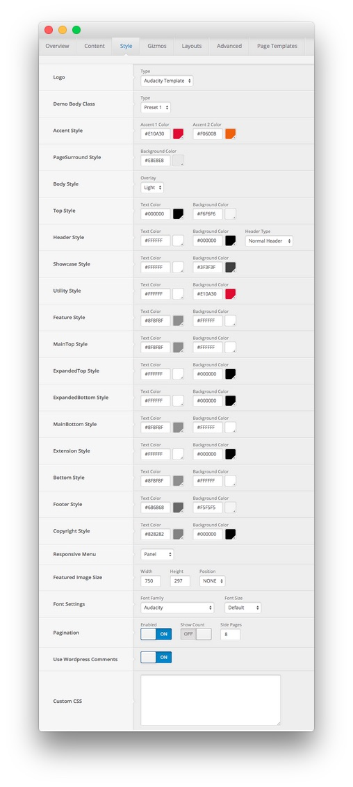
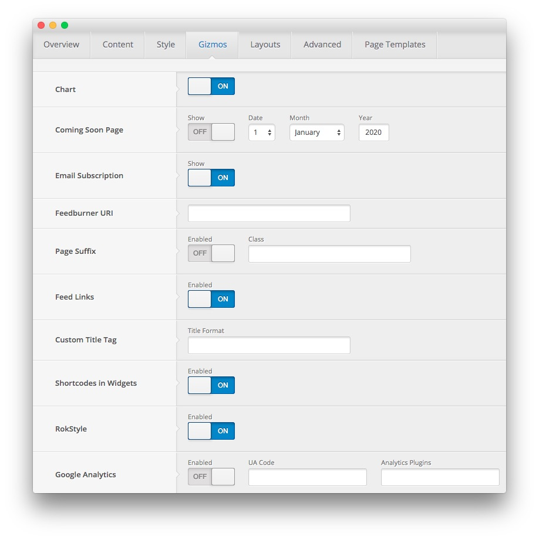
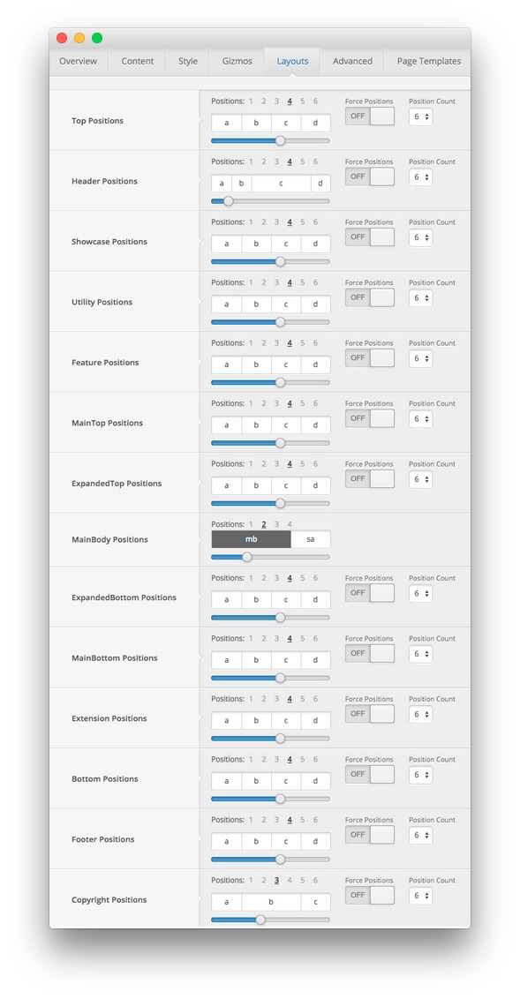

Theme Override Settings
-----

One of the most important central features of any Gantry theme is the ability to be set up within the Theme Settings menu. These settings can be adjusted by navigating to **Administration -> Audacity Theme**. To replicate the demo, the main changes being made will happen within the Style, Gizmos, Layouts, and Advanced tabs.

This table will break down the various settings you may need to adjust in order to recreate the demo. Most of the settings under **Style** are adjusted automatically with the selection of a theme preset. You can set presets using the **Presets** button located next to the **Save** option at the top of the Theme Settings page.

Once you have selected a Preset, these options can be further adjusted to match the demo. Keep in mind that the override indicated here relates to the theme override in this menu. More information about how overrides work can be found in our [Gantry documentation](http://docs.gantry.org/gantry4/configure).

### Style

| Style   | Option                 | Setting                                                                        |
| :------ | :--------------------- | :----------------------------------------------------------------------------- |
| Default | Logo                   | Type: Audacity Theme                                                        |
| Default | Demo Body Class        | Preset 1                                                                       |
| Default | Accent Style           | Accent 1 Color: `#e10a30`, Accent 2 Color: `#f0600b`                           |
| Default | PageSurround Style     | Background Color: `#e8e8e8`                                                    |
| Default | Body Style             | Overlay: Light                                                                 |
| Default | Header Style           | Text Color: `#ffffff`, Background Color: `#000000`, Header Type: Normal Header |
| Default | Showcase Style         | Text Color: `#ffffff`, Background Color: `#3f3f3f`                             |
| Default | Utility Style          | Text Color: `#ffffff`, Background Color: `#e10a30`                             |
| Default | Feature Style          | Text Color: `#8f8f8f`, Background Color: `#ffffff`                             |
| Default | MainTop Style          | Text Color: `#8f8f8f`, Background Color: `#ffffff`                             |
| Default | MainBottom Style       | Text Color: `#8f8f8f`, Background Color: `#ffffff`                             |
| Default | Extension Style        | Text Color: `#ffffff`, Background Color: `#000000`                             |
| Default | Bottom Style           | Text Color: `#8f8f8f`, Background Color: `#ffffff`                             |
| Default | Footer Style           | Text Color: `#686868`, Background Color: `#f5f5f5`                             |
| Default | Copyright Style        | Text Color: `#828282`, Background Color: `#000000`                             |
| Default | Responsive Menu        | Panel                                                                          |
| Default | Featured Image Size    | Width: `750`, Height: `297`, Position: NONE                                    |
| Default | Font Settings          | Font Family: Audacity, Font Size: Default                                      |
| Default | Pagination             | Enabled: On, Show Count: Off, Side Pages: `8`                                  |
| Default | Use WordPress Comments | On                                                                             |
| Default | Custom CSS             | Blank                                                                          |

### Gizmos

| Override   | Option                | Setting                                        |
| :--------- | :-------------------- | :--------------------------------------------- |
| Default    | Chart                 | On                                             |
| Default    | Coming Soon Page      | Show: Off, Date: 1, Month: January, Year: 2020 |
| Default    | Email Subscription    | Show: On                                       |
| Defualt    | Feedburner URI        | Blank                                          |
| Default    | Page Suffix           | Enabled: Off, Class: Blank                     |
| Default    | Feed Links            | On                                             |
| Default    | Custom Title Tag      | Blank                                          |
| Default    | Shortcodes in Widgets | On                                             |
| Default    | RokStyle              | On                                             |
| Default    | Google Analytics      | Enabled: Off, UA Code: Blank                   |
| Front Page | Page Suffix           | `rt-menu-home -rt-audacity-home`                |

### Layouts

| Style      | Option                   | Setting                   |
| :------    | :----------------------- | :--------------------     |
| Default    | Top Positions            | Positions: 4, 3:3:3:3     |
| Default    | Header Positions         | Positions: 4, 2:2:6:2     |
| Default    | Showcase Positions       | Positions: 1, 12          |
| Default    | Utility Positions        | Positions: 1, 12          |
| Default    | Feature Positions        | Positions: 2, 6:6         |
| Default    | MainTop Positions        | Positions: 2, 6:6         |
| Default    | ExpandedTop Positions    | Positions: 4, 3:3:3:3     |
| Default    | MainBody Positions       | Positions: 1, 12          |
| Default    | ExpandedBottom Positions | Positions: 4, 3:3:3:3     |
| Default    | MainBottom Positions     | Positions: 4, 3:3:3:3     |
| Default    | Extension Positions      | Positions: 1, 12          |
| Default    | Bottom Positions         | Positions: 3, 4:4:4       |
| Default    | Footer Positions         | Positions: 6, 2:2:2:2:2:2 |
| Default    | Copyright Positions      | Positions: 3, 3:6:3       |
| Front Page | Feature Positions        | Positions: 2, 9:3         |
| Front Page | MainTop Positions        | Positions: 2, 9:3         |

### Advanced

| Override   | Option                  | Setting                                     |
| :--------- | :---------------------- | :------------------------------------------ |
| Default    | Layout Mode             | Responsive                                  |
| Default    | Maintenance Mode        | Off                                         |
| Default    | Display Content         | On                                          |
| Default    | Display Mainbody        | On                                          |
| Default    | RTL Support             | Off                                         |
| Default    | Disable Auto Paragraphs | Enabled: On, Content Type: Both             |
| Default    | Disable Texturize       | Off                                         |
| Default    | Selectivizr             | On                                          |
| Default    | Less Compiler           | CSS Compression: On, Compile: 2, Debug: Off |
| Default    | IE7 Redirect            | On                                          |
| Default    | Demo Styling            | On                                          |
| Default    | Animate                 | Off                                         |
| Front Page | Display Mainbody        | Off                                         |

### Assignments

| Override    | Option             | Setting     |
| :---------- | :----------        | :---------- |
| Front Page  | Theme Page Type | Front Page  |
| Front Page  | Theme Page Type | Home Page   |
