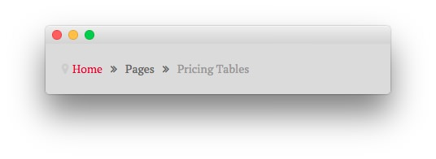
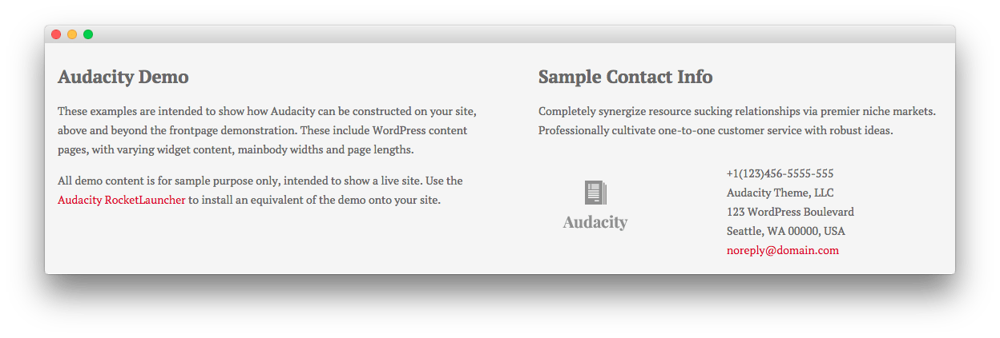

Introduction
-----

The **Pricing Tables** example page demonstrates how you can create a beautiful page with the Audacity theme. Here is some information to help you replicate this page as it appears in the demo.

Theme Override Options
-----

The **Pricing Tables** page is a regular **Page**. To recreate the layout the way it appears in our demo, enter `menu-pricing-tables` in the **Page Suffix** field in the **Gizmos** page inside the **Audacity** theme settings. This suffix is tied to a class in the demo.less file that sets the page up so it appears the way it does in the demo.

In order for this to work, you should have the **Page Suffix** option set to **On** in **Admin > Audacity > Gizmos**. You will likely need to create a theme override specifically for the page before assigning that suffix to it. For more information on creating theme overrides, visit our [Gantry Documentation](http://docs.gantry.org/gantry4/configure).

Mainbody
-----

The page's content body is set in the **Pricing Tables** page. You will find the content used in the page below.

~~~ .html

    

    

        

            <h3>Simple Plans and Pricing</h3>
            
Globally incubate standards compliant channels before scalable benefits. Quickly disseminate superior deliverables whereas web-enabled applications.

            
Dynamically procrastinate B2C users after installed base benefits. Dramatically visualize customer directed convergence without revolutionary ROI.

            
<a href="http://www.rockettheme.com/wordpress-themes/audacity" class="readon">Sign Up</a>

        

    

    

        

            <h3>Top Audacity Features</h3>
            <ul>
                <li>Powered by Gantry Framework</li>
                <li>CSS Dropdown Menu and Split Menu</li>
                <li>Multiple Widget Variations</li>
            </ul>
            
Want to use Audacity for your clients? <a href="http://www.rockettheme.com/wordpress-themes/audacity">Purchase Single Package Now</a>.

        

    

~~~

Widgets
-----

Below is a brief rundown of the widgets used to make up the demo page. Widgets in the [**Header**](demo_header.md) and [**Copyright**](demo_copyright.md) positions are outlined in the main demo replication area of this guide.

:   1. **Showcase - Text** [10%, 45%, se]
    2. **Breadcrumbs** [14%, 12%, se]
    3. **Feature - Text** [19%, 12%, se]
    4. **Mainbody** [53%, 12%, se]
    5. **Extension - Text** [68%, 35%, se]
    6. **Footer - Text** [76%, 12%, se]
    7. **Footer - Text** [76%, 52%, se]

1. [Showcase - Text](pricing.md#showcase-section)
2. [Breadcrumbs](pricing.md#breadcrumbs-section)
3. [Mainbody](pricing.md#mainbody)
4. [Feature - Text](pricing.md#feature-section)
5. [Extension - Text](pricing.md#extension-section)
6. [Footer - Text](pricing.md#footer-section)
7. [Footer - Text](pricing.md#footer-section)

Showcase Section
-----

Here is the widget breakdown for the Showcase section:

#### Text

This section of the page is a standard text widget. You will need to enter the following in the main text field.

~~~ .html
&nbsp;
~~~

Here is a breakdown of options changes you will want to make to match the demo.

|       Option      |                              Setting                              |
| :---------------- | :---------------------------------------------------------------- |
| Title             | `Pricing[span class="rt-title-tag"]Pick a Plan that Fits You[/span]` |
| Widget Variations | RT-Center, No Margin All                                          |
| Custom Variations | `rt-title-large rt-nomodulecontent rt-top-large-padding`          |

Leaving everything else at its default setting, select **Save**.

Breadcrumbs Section
-----

#### Gantry Breadcrumbs

The **Gantry Breadcrumbs** widget gives you the ability to present page-aware breadcrumbs on the page. All you need to do to add them is to drag the **Gantry Breadcrumbs** widget from the **Available Widgets** area to the **Breadcrumbs** widget position.

Feature Section
-----

Here is a breakdown for the **Feature** section:

#### Text

This section of the page is a standard text widget. You will need to enter the following in the main text field.

~~~ .html

    
All plans come with awesome support by email and phone. There is no hidden fee!

    

    <ul class="rt-table">
        <li class="rt-table-title">Basic</li>
        <li class="rt-table-price">$28</li>
        <li class="rt-table-description">Globally incubate standards compliant channels</li>
        <li class="rt-table-item">5GB Storage</li>
        <li class="rt-table-item">10 Users</li>
        <li class="rt-table-item">20 Emails</li>
        <li class="rt-table-cta-button"><a class="readon" href="http://www.rockettheme.com/wordpress-themes/audacity">Sign Up</a></li>
    </ul>

    <ul class="rt-table">
        <li class="rt-table-title">Standard</li>
        <li class="rt-table-price">$58</li>
        <li class="rt-table-description">Globally incubate standards compliant channels</li>
        <li class="rt-table-item">25GB Storage</li>
        <li class="rt-table-item">20 Users</li>
        <li class="rt-table-item">30 Emails</li>
        <li class="rt-table-cta-button"><a class="readon" href="http://www.rockettheme.com/wordpress-themes/audacity">Sign Up</a></li>
    </ul>

    <ul class="rt-table">
        <li class="rt-table-title">Titanium</li>
        <li class="rt-table-price">$88</li>
        <li class="rt-table-description">Globally incubate standards compliant channels</li>
        <li class="rt-table-item">50GB Storage</li>
        <li class="rt-table-item">30 Users</li>
        <li class="rt-table-item">40 Emails</li>
        <li class="rt-table-cta-button"><a class="readon" href="http://www.rockettheme.com/wordpress-themes/audacity">Sign Up</a></li>
    </ul>

    <ul class="rt-table rt-table-last-col">
        <li class="rt-table-title">Platinum</li>
        <li class="rt-table-price">$288</li>
        <li class="rt-table-description">Globally incubate standards compliant channels</li>
        <li class="rt-table-item">500GB Storage</li>
        <li class="rt-table-item">100 Users</li>
        <li class="rt-table-item">200 Emails</li>
        <li class="rt-table-cta-button"><a class="readon" href="http://www.rockettheme.com/wordpress-themes/audacity">Sign Up</a></li>
    </ul>

    
Free <strong>10 days trial</strong> on all plans. No credit card needed! Need a bigger plan? <a href="http://www.rockettheme.com/wordpress-themes/audacity">View Professional Plan</a>.

~~~

Here is a breakdown of options changes you will want to make to match the demo.

| Option            | Setting                         |
| :---------------- | :------------------------------ |
| Title             | `Try it Out for 10 Days Free`   |
| Widget Variations | RT-Center, No Margin All        |

Leaving everything else at its default setting, select **Save**.

Extension Section
-----

Here is a breakdown for the **Extension** section:

#### Text

This section of the page is a standard text widget. You will need to enter the following in the main text field.

~~~ .html

No Credit Card Required and No Long-Term Contracts

<a href="http://www.rockettheme.com/wordpress-themes/audacity" class="readon">Sign Up</a>

~~~

Here is a breakdown of options changes you will want to make to match the demo.

|       Option      |                         Setting                          |
| :---------------- | :------------------------------------------------------- |
| Title             | `No Hidden Fee`                                          |
| Widget Variations | RT-Center                                                |

Leaving everything else at its default setting, select **Save**.

Footer Section
-----

:   1. **Text 1** [20%, 5%, se]
    2. **Text 2** [20%, 52%, se]

Here is a breakdown of the widgets in the **Footer** section:

* Text
* Gantry Divider
* Text

#### Text 1

This section of the page is a standard text widget. You will need to enter the following in the main text field.

~~~ .html

These examples are intended to show how Audacity can be constructed on your site, above and beyond the frontpage demonstration. These include WordPress content with varying widgetized content, mainbody widths and page lengths.

All demo content is for sample purpose only, intended to show a live site. Use the <a href="http://www.rockettheme.com/wordpress/themes/audacity">Audacity RocketLauncher</a> to install an equivalent of the demo onto your site.

~~~

Here is a breakdown of options changes you will want to make to match the demo.

| Option            | Setting           |
| :---------------- | :---------------- |
| Title             | `Audacity Demo`   |
| Custom Variations | `rt-phone-center` |

Leaving everything else at its default setting, select **Save**.

#### Gantry Divider

This widget tells WordPress to start a new widget column beginning with the widget placed directly below the divider in the section.

#### Text 2

This section of the page is a standard text widget. You will need to enter the following in the main text field.

~~~ .html

Completely synergize resource sucking relationships via premier niche markets. Professionally cultivate one-to-one customer service with robust ideas.

    

        

            
        
  
    

    

        

            +1(123)456-5555-555 
            Audacity Theme, LLC 
            123 WordPress Boulevard 
            Seattle, WA 00000, USA 
            <a href="#">noreply@domain.com</a>
        

    

~~~

Here is a breakdown of options changes you will want to make to match the demo.

|       Option      |        Setting        |
| :---------------- | :-------------------- |
| Title             | `Sample Contact Info` |
| Custom Variations | `rt-phone-center`     |

Leaving everything else at its default setting, select **Save**.