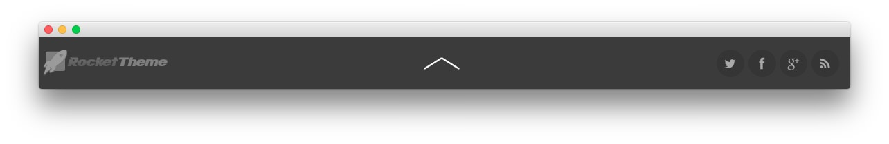

Copyright Section
-----

:   1. **Gantry Branding** [30%, 5%, se]
    2. **Gantry Copyright** [30%, 45%, se]
    3. **Gantry To Top** [30%, 78%, se]

Here is the widget breakdown for the Footer section:

* Gantry Branding
* Gantry Divider
* Gantry To Top
* Gantry Divider
* Gantry Social Buttons

#### Gantry Branding

The Gantry Branding widget does little more than display our logo at the bottom of the page. Simply click and drag the **Gantry Branding** widget into the widget section for this to appear.

#### Gantry Divider

This widget tells WordPress to start a new widget column beginning with the widget placed directly below the divider in the section.

#### Gantry To Top

The Gantry To Top widget is a simple indicator which allows users to jump to the top of a page with a single click. Just click and drag this widget into the section to activate it.

#### Gantry Social Buttons

The Gantry Social Buttons widget creates a set of social buttons on the top of the page. Filling this out is fairly straightforward. Once you have clicked and dragged the **Gantry Social Buttons** widget in place, you will want to add your various social URLs to their respective fields. Once this is done, simply hit **Save** and check the site.

Here is a breakdown of the settings we used:

| Field       | Setting                                          |
| :---------- | :----------                                      |
| Icon 1      | `fa fa-twitter`                                  |
| Text 1      |                                                  |
| Link 1      | `https://twitter.com/rockettheme`                |
| Icon 2      | `fa fa-facebook`                                 |
| Text 2      |                                                  |
| Link 2      | `https://www.facebook.com/RocketTheme`           |
| Icon 3      | `fa fa-rss`                                      |
| Text 3      |                                                  |
| Link 3      | `http://www.rockettheme.com/product-updates?rss` |
| Icon 4      | `fa fa-google-plus`                              |
| Text 4      |                                                  |
| Link 4      | `https://plus.google.com/+rockettheme`           |
