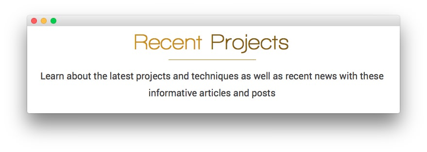

Main Top Section
-----

Here is the widget breakdown for the Main Top section:

#### Text

This section of the page is a standard text widget. You will need to enter the following in the main text field.

~~~ .html
<h4>Learn about the latest projects and techniques as well as recent news with these informative posts and posts</h4>
~~~

Here is a breakdown of options changes you will want to make to match the demo.

* Set the **Title** to `[div class="wow pulse"]Recent [span]Projects[/span][/div]`.
* Switch the **Widget Variations** setting to **RT-Center, No Padding Bottom, No Margin Bottom**.
* Enter `rt-heading-title` in the **Custom Variations** field.
* Leaving everything else at its default setting, select **Save**.
